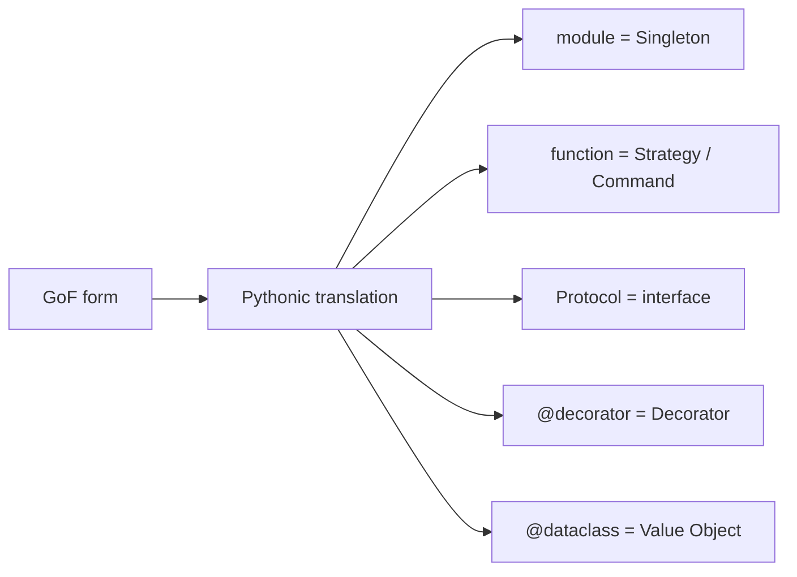

# Python에 어울리는 패턴

GoF 패턴을 처음 배우면 언어가 달라도 같은 구조를 그대로 옮기고 싶어집니다. 하지만 Python에서는 모듈, 일급 함수, Protocol, 데코레이터 같은 기본 도구만으로도 상당수 패턴을 더 짧고 읽기 쉬운 형태로 풀 수 있습니다.

이 글은 Design Patterns 101 시리즈의 마지막 글입니다.

이번 글에서는 GoF 패턴을 Python에 그대로 이식하는 대신, Python 언어 자체가 이미 제공하는 도구로 더 가볍게 표현하는 방법을 정리하겠습니다. 핵심은 패턴 이름보다 언어의 기본기를 먼저 믿는 것입니다.

## 이 글에서 다룰 문제

- 왜 Python에서는 모듈이 이미 Singleton 역할을 할까요?
- Strategy와 Command를 함수로 표현하면 무엇이 좋아질까요?
- 인터페이스를 Protocol로 표현하는 이유는 무엇일까요?
- `@dataclass`는 왜 값 객체에 잘 맞을까요?
- 데코레이터 문법은 Decorator 패턴을 어떻게 자연스럽게 녹여 낼까요?

> 멘탈 모델: Python다운 패턴은 GoF 패턴을 버리는 것이 아니라, 같은 의도를 더 적은 코드로 표현하는 일입니다. 언어가 이미 주는 도구를 먼저 쓰고, 그래도 부족할 때만 더 무거운 패턴 형태로 올라갑니다.

## 왜 중요한가

Python은 모듈 로딩, 함수 전달, 구조적 타이핑, 데코레이터 문법처럼 많은 패턴을 언어 수준에서 지원합니다. 같은 문제를 Java식 클래스 계층으로 그대로 옮기면, Python 코드가 불필요하게 무거워지고 읽는 사람도 언어의 장점을 잃게 됩니다.

실무에서는 “패턴을 얼마나 충실히 재현했는가”보다 “언어에 맞게 얼마나 읽히게 풀었는가”가 더 중요합니다. Pythonic 설계는 패턴을 무시하는 태도가 아니라, 패턴의 의도를 Python다운 문법으로 번역하는 태도입니다.

## 한눈에 보는 개념



같은 의도라도 Python에서는 더 가벼운 표현이 가능합니다. 패턴의 이름은 같아도 구현 무게는 훨씬 달라질 수 있습니다.

## 핵심 용어

- **Module-as-singleton**: 모듈은 한 번 로드되어 Singleton처럼 동작합니다.
- **First-class function**: 전달, 반환, 저장이 가능한 함수입니다.
- **Protocol**: 정적 검사까지 가능한 구조적 타이핑입니다.
- **Decorator (`@`)**: 함수나 클래스에 동작을 감싸 추가하는 문법입니다.
- **dataclass**: 값 객체에 필요한 동등성, repr, 불변성 표현을 쉽게 제공합니다.

## Before / After

**Before (GoF as-is)**

```python
class SingletonConfig:
    _inst = None
    def __new__(cls):
        if cls._inst is None:
            cls._inst = super().__new__(cls)
        return cls._inst
```

**After (Pythonic)**

```python
# config.py
DEBUG = True
DB_URL = "postgres://..."
# elsewhere: from config import DEBUG, DB_URL
```

Python에서는 모듈이 이미 한 번만 로드됩니다. 굳이 Singleton 클래스를 재구현하는 순간 오히려 불필요한 복잡성이 생깁니다.

## Pythonic 패턴을 익히는 5단계

### 1단계 — 모듈을 Singleton처럼 씁니다

```python
# 1_module_singleton.py
# settings.py
import os
ENV = os.getenv("ENV", "dev")
SECRET = os.getenv("SECRET", "x")
```

어디서 import하든 같은 값을 공유합니다. Python에서는 이것만으로도 많은 Singleton 요구를 충분히 충족합니다.

### 2단계 — Strategy와 Command를 함수로 표현합니다

```python
# 2_function_strategy.py
def asc(d): return sorted(d)
def desc(d): return sorted(d, reverse=True)

def run(strategy, data): return strategy(data)
print(run(desc, [3, 1, 2]))
```

명확성이 유지된다면 함수가 가장 자연스러운 Strategy입니다. 클래스를 만들지 않아도 역할과 교체 가능성이 충분히 살아납니다.

### 3단계 — 인터페이스는 Protocol로 표현합니다

```python
# 3_protocol.py
from typing import Protocol

class Mailer(Protocol):
    def send(self, to: str, body: str) -> None: ...

class SmtpMailer:
    def send(self, to, body): ...   # satisfies without inheritance
```

상속 계층을 만들지 않고도 계약을 표현할 수 있다는 점이 중요합니다. 덕 타이핑의 유연성과 정적 검사의 안정성을 함께 가져갈 수 있습니다.

### 4단계 — 값 객체는 `@dataclass`로 간단히 만듭니다

```python
# 4_dataclass.py
from dataclasses import dataclass

@dataclass(frozen=True)
class Money:
    amount: int
    currency: str
```

값 객체에 필요한 비교, 표현, 불변성 설정을 짧은 문법으로 얻을 수 있습니다. Python에서 값 객체를 손으로 장황하게 만들 이유가 많이 줄어듭니다.

### 5단계 — Decorator 패턴은 `@` 문법으로 녹여 냅니다

```python
# 5_decorator.py
import time, functools

def timed(fn):
    @functools.wraps(fn)
    def wrap(*a, **k):
        t = time.time()
        try: return fn(*a, **k)
        finally: print(fn.__name__, time.time()-t)
    return wrap

@timed
def work(): time.sleep(0.1)
```

책에 나오는 Decorator 클래스를 그대로 옮기지 않아도 됩니다. Python은 이미 감싸기 구조를 언어 문법으로 제공하고 있습니다.

## 이 코드에서 주목할 점

- 클래스 계층이 거의 자라지 않습니다.
- 패턴의 의도가 언어 기본 도구 위에서 자연스럽게 드러납니다.
- 같은 목적을 더 적은 줄 수로 표현합니다.

## 자주 하는 실수 5가지

1. **Java식 GoF 구조를 그대로 옮기는 경우**: Python에 필요 없는 무게를 추가합니다.
2. **모듈이면 될 것을 Singleton 클래스로 만드는 경우**: 두 번째 인스턴스 가능성까지 열어 둡니다.
3. **Protocol로 충분한데 ABC를 강제하는 경우**: 불필요한 상속 구조가 생깁니다.
4. **데코레이터를 과하게 겹치고 `functools.wraps`를 빼먹는 경우**: 호출 흐름과 메타데이터가 흐려집니다.
5. **값 객체를 손코딩하는 경우**: `__eq__`, `__repr__` 같은 기본 기능을 놓치기 쉽습니다.

## 실무에서는 이렇게 드러납니다

`logging` 모듈은 모듈 Singleton처럼 읽히고, `sorted(key=...)`는 함수 Strategy이며, `typing.Protocol`은 인터페이스 역할을 하고, `@app.route(...)`는 Decorator의 일상적인 예입니다. Python 표준 라이브러리와 주요 프레임워크 자체가 Pythonic 패턴의 살아 있는 예시입니다.

## 시니어 엔지니어는 이렇게 판단합니다

- 패턴보다 언어 도구를 먼저 봅니다.
- Singleton 클래스보다 모듈, ABC보다 Protocol을 먼저 떠올립니다.
- 함수로 충분하면 클래스를 만들지 않습니다.
- 데코레이터에는 항상 `functools.wraps`를 붙입니다.
- 결국 패턴은 가독성을 위해 존재한다고 봅니다.

## 체크리스트

- [ ] 모듈이면 충분한데 Singleton 클래스를 만들지 않았는가?
- [ ] 함수로 충분한데 Strategy 클래스를 만들지 않았는가?
- [ ] Protocol로 충분한데 ABC를 강제하지 않았는가?
- [ ] 값 객체에 `dataclass`를 활용했는가?
- [ ] 데코레이터에 `functools.wraps`를 사용했는가?

## 연습 문제

1. Singleton 클래스를 하나 골라 모듈 기반 구성으로 접어 봅니다.
2. Strategy 클래스를 하나 함수 기반으로 단순화해 봅니다.
3. ABC 기반 인터페이스 하나를 Protocol로 바꾸고 정적 타입 검사까지 통과시켜 봅니다.

## 정리 및 다음 글

GoF 패턴은 어휘이지 매뉴얼이 아닙니다. Python에서는 언어가 이미 많은 패턴을 더 가볍게 표현할 수 있게 도와줍니다. Design Patterns 101 시리즈는 여기서 마무리하겠습니다. 앞으로는 패턴 이름을 구현 강박이 아니라 사고 단위로 사용해 보시기 바랍니다.

<!-- toc:begin -->
- [디자인 패턴이란 무엇인가?](./01-what-are-design-patterns.md)
- [Creational 패턴](./02-creational-patterns.md)
- [Structural 패턴](./03-structural-patterns.md)
- [Behavioral 패턴](./04-behavioral-patterns.md)
- [Strategy 패턴](./05-strategy-pattern.md)
- [Adapter 패턴](./06-adapter-pattern.md)
- [Observer 패턴](./07-observer-pattern.md)
- [Factory와 의존성 주입](./08-factory-and-di.md)
- [패턴을 남용하지 않는 법](./09-avoiding-pattern-overuse.md)
- **Python에 어울리는 패턴 (현재 글)**
<!-- toc:end -->

## 참고 자료

- [PEP 544 — Protocols](https://peps.python.org/pep-0544/)
- [dataclasses (Python docs)](https://docs.python.org/3/library/dataclasses.html)
- [functools.wraps (Python docs)](https://docs.python.org/3/library/functools.html#functools.wraps)
- [Python 3 Patterns, Recipes and Idioms (Bruce Eckel)](https://python-3-patterns-idioms-test.readthedocs.io/)

Tags: Computer Science, DesignPatterns, Python, Idioms, Protocols, Decorators