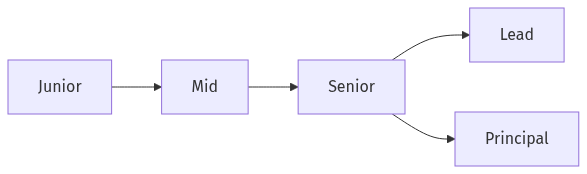

# What Is a Developer Career

People often start by mapping a developer career to company names, years of experience, or the next title. In practice, two engineers with the same title can be operating at very different levels because the real difference shows up in problem scope, judgment, and how much leverage they create for other people.

This is the first post in the Developer Career 101 series.

## Questions this chapter answers

- Why is a developer career easier to manage when you treat it as a growth structure rather than a title ladder?
- What actually changes between junior, mid-level, senior, and staff-like expectations?
- Why do skill, influence, and written evidence matter together instead of separately?
- What should you track over the next six months if you want your growth to stay visible?

> A developer career is not a chronological list of titles. It is the compound growth of role, skill, and impact.

## What You Will Learn

- The *three axes* of a career
- Expectations *by stage*
- The *T-shaped* engineer
- *Radius* of impact
- Why *records* matter

## Why It Matters

Without direction, five years later you are still at square one.

## Concept at a Glance



*Career stages and expanding impact radius*

## Key Terms

- **junior**: Works from instructions.
- **mid**: Self-directed.
- **senior**: Defines problems.
- **lead**: Owns team outcomes.
- **principal**: Shapes org direction.

## Before/After

**Before**: "I work only for the next promotion."

**After**: "I sketch a skill curve and grow my impact."

## Hands-on: Plot Your Career Coordinate

### Step 1 — Current Stage

```text
one of: junior / mid / senior
```

### Step 2 — Core Skills

```text
- technical
- collaborative
- domain
```

### Step 3 — Impact Radius

```text
- self
- team
- org
- industry
```

### Step 4 — Six-Month Goals

```markdown
- one technical depth
- one new domain
- one talk delivered
```

### Step 5 — Quarterly Retro

```markdown
## Q2 retro
- went well
- gaps
- one thing for next quarter
```

## Decision frame for reading your own career

| Axis | Question to ask now | Useful next move |
| --- | --- | --- |
| Role | Are you mostly executing assigned work, or are you defining the work too? | Review the last four weeks and count how many tasks included framing, not just implementation. |
| Skill | Which of technical depth, collaboration, or domain understanding is weakest? | Pick the weakest axis and connect one concrete deliverable to it this quarter. |
| Impact | Who gets faster or safer because of your work besides you? | Leave one reusable artifact behind: a doc, review pattern, template, or automation. |
| Record | Could you prove your growth in the next review loop? | Start a weekly work log and a monthly retro. |

## What to Notice in This Code

- Stages are continuous.
- Axes are plural.
- Retros set direction.

## Five Common Mistakes

1. **Treating titles as the only goal.**
2. **Going deep only on tech.**
3. **Skipping impact measurement.**
4. **No retrospectives.**
5. **No written record.**

## How This Shows Up in Production

Career ladders at companies make role, impact, and responsibility explicit on multiple axes.

## How a Senior Engineer Thinks

- Career is a marathon.
- Skills compound.
- Impact must be documented.
- T-shape stays flexible.
- Feedback is fuel.

## Checklist

- [ ] Current stage defined.
- [ ] Six-month goals written.
- [ ] Quarterly retro scheduled.
- [ ] Records started.

## Practice Problems

1. One line: define a T-shaped engineer.
2. One line: example of impact radius.
3. One line: purpose of a quarterly retro.

## Wrap-up and Next Steps

Next post covers *Understanding Roles*.

<!-- toc:begin -->
- **What Is a Developer Career (current)**
- Understanding Roles (upcoming)
- Building a Learning Plan (upcoming)
- Resume and Portfolio (upcoming)
- Preparing for Coding Interviews (upcoming)
- System Design Interviews (upcoming)
- Settling into the First Job (upcoming)
- Side Projects and Learning (upcoming)
- Mentoring and Networking (upcoming)
- The Path to Senior (upcoming)
<!-- toc:end -->

## References

- [Progression.fyi — Engineering career ladders](https://www.progression.fyi/)
- [Dropbox Engineering Career Framework](https://dropbox.github.io/dbx-career-framework/)
- [Staff Engineer: The Path](https://staffeng.com/guides/staff-engineer-path/)
- [The Pragmatic Engineer — Career ladders and scope](https://newsletter.pragmaticengineer.com/)

Tags: Career, Developer, Growth, Junior, Beginner
