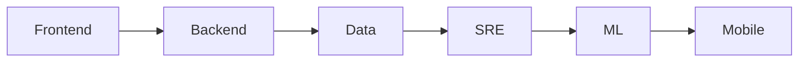

# Understanding Roles

This is post 2 in the Developer Career 101 series.

> Developer Career 101 series (2/10)

<!-- a-grade-intro:begin -->

**Core question**: How do you decide which developer *role* fits you?

> Compare responsibilities, tools, and metrics — three axes.

<!-- a-grade-intro:end -->

## What You Will Learn

- Six common roles
- Per-role *responsibilities*
- Per-role *tools*
- Per-role *metrics*
- What to weigh when *switching*

## Why It Matters

A bad role fit shortens the path to burnout.

## Concept at a Glance



## Key Terms

- **frontend**: User experience.
- **backend**: System logic.
- **SRE**: Operational reliability.
- **data**: Analytics and pipelines.
- **ML**: Model-driven prediction.

## Before/After

**Before**: "Roles look more or less alike."

**After**: "Responsibilities and tools differ completely."

## Hands-on: Compare the Roles

### Step 1 — Frontend

```text
responsibility: UX
tools: React, CSS
metrics: LCP, INP
```

### Step 2 — Backend

```text
responsibility: data flow
tools: Python, SQL
metrics: p95, error rate
```

### Step 3 — Data

```text
responsibility: pipelines
tools: Airflow, dbt
metrics: freshness, accuracy
```

### Step 4 — SRE

```text
responsibility: operations
tools: Prometheus, K8s
metrics: SLO, MTTR
```

### Step 5 — ML

```text
responsibility: model quality
tools: PyTorch, MLflow
metrics: AUC, latency
```

## What to Notice in This Code

- Responsibility defines the role.
- Metrics define the culture.
- Tools are just tools.

## Five Common Mistakes

1. **Choosing role by tool.**
2. **Not knowing the metrics.**
3. **Crossing role boundaries impulsively.**
4. **Switching on a whim.**
5. **Ignoring the domain.**

## How This Shows Up in Production

Companies recommend roughly six months of onboarding when switching roles.

## How a Senior Engineer Thinks

- A role is a responsibility.
- Metrics are a language.
- Switch strategically.
- Domain is depth.
- Boundaries enable collaboration.

## Checklist

- [ ] Three metrics for current role.
- [ ] Responsibilities of target role written.
- [ ] Learning plan for switch.

## Practice Problems

1. One line: define p95.
2. One line: define SLO.
3. One line: meaning of frontend LCP.

## Wrap-up and Next Steps

Next post covers *Building a Learning Plan*.

<!-- toc:begin -->
- [What Is a Developer Career](./01-what-is-developer-career.md)
- **Understanding Roles (current)**
- Building a Learning Plan (upcoming)
- Resume and Portfolio (upcoming)
- Preparing for Coding Interviews (upcoming)
- System Design Interviews (upcoming)
- Settling into the First Job (upcoming)
- Side Projects and Learning (upcoming)
- Mentoring and Networking (upcoming)
- The Path to Senior (upcoming)
<!-- toc:end -->

## References

- [Web Vitals](https://web.dev/vitals/)
- [Google SRE Book](https://sre.google/books/)
- [State of Data Engineering](https://www.lakefs.io/blog/state-of-data-engineering-2024/)
- [MLOps Maturity](https://ml-ops.org/)

Tags: Career, Roles, Frontend, Backend, Beginner
