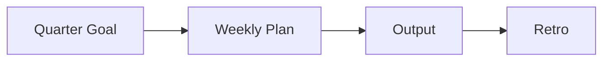

# Building a Learning Plan

> Developer Career 101 series (3/10)

<!-- a-grade-intro:begin -->

**Core question**: How do you keep *learning* sustainable inside a busy life?

> Quarterly goals, a weekly routine, and measurable outputs.

<!-- a-grade-intro:end -->

## What You Will Learn

- Setting a *quarterly goal*
- A *weekly routine*
- Choosing *learning materials*
- Producing an *output*
- Running a *retrospective*

## Why It Matters

Learning without a plan disperses.

## Concept at a Glance



## Key Terms

- **goal**: A target.
- **routine**: A weekly cadence.
- **output**: A deliverable.
- **retro**: Reflection.
- **deliberate practice**: Focused, structured practice.

## Before/After

**Before**: "I buy books and never read them."

**After**: "I ship one deliverable each quarter."

## Hands-on: A Learning Routine

### Step 1 — Quarterly Goal

```markdown
2026 Q2: Build a CLI tool in Rust
```

### Step 2 — Weekly Routine

```text
Tue/Thu 21:00-22:00 (60 min)
Sat 09:00-11:00 (120 min)
```

### Step 3 — Pick Materials

```text
- 1 book
- 1 course
- 1 codebase
```

### Step 4 — Output

```text
- repo URL
- blog post
- talk slides
```

### Step 5 — Quarterly Retro

```markdown
- achieved: 90%
- blocker: ownership
- next quarter: async/await depth
```

## What to Notice in This Code

- Goals manifest as outputs.
- Routine is a time block.
- Retros are chances to adjust.

## Five Common Mistakes

1. **Vague goals.**
2. **Routine that depends on mood.**
3. **Too much input only.**
4. **No deliverables.**
5. **Skipping the retro.**

## How This Shows Up in Production

Even PIPs and promotions are evaluated against quarterly goals plus outputs.

## How a Senior Engineer Thinks

- Learning is a plan.
- Outputs are evidence.
- Time blocks become habits.
- Retros are an editing tool.
- Depth compounds.

## Checklist

- [ ] One quarterly goal.
- [ ] Weekly time blocks.
- [ ] Output defined.
- [ ] Quarterly retro scheduled.

## Practice Problems

1. One line: define deliberate practice.
2. One line: effect of time blocking.
3. One question to ask in a retro.

## Wrap-up and Next Steps

Next post covers *Resume and Portfolio*.

<!-- toc:begin -->
- [What Is a Developer Career](./01-what-is-developer-career.md)
- [Understanding Roles](./02-understanding-roles.md)
- **Building a Learning Plan (current)**
- Resume and Portfolio (upcoming)
- Preparing for Coding Interviews (upcoming)
- System Design Interviews (upcoming)
- Settling into the First Job (upcoming)
- Side Projects and Learning (upcoming)
- Mentoring and Networking (upcoming)
- The Path to Senior (upcoming)
<!-- toc:end -->

## References

- [Atomic Habits](https://jamesclear.com/atomic-habits)
- [Deep Work](https://www.calnewport.com/books/deep-work/)
- [Deliberate Practice](https://www.psychologytoday.com/us/basics/deliberate-practice)
- [OKR Examples](https://www.whatmatters.com/)

Tags: Career, Learning, Plan, Habits, Beginner
