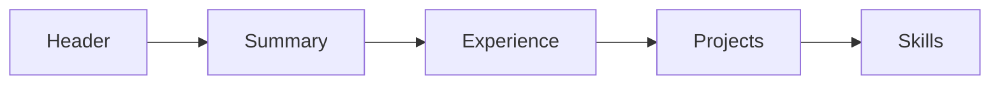

# Resume and Portfolio

> Developer Career 101 series (4/10)

<!-- a-grade-intro:begin -->

**Core question**: How do you make a recruiter understand you in *thirty seconds*?

> Express role, results, and impact with numbers.

<!-- a-grade-intro:end -->

## What You Will Learn

- *Resume* structure
- Writing *bullets*
- Linking to a *portfolio*
- Keywords and *ATS*
- The *application flow*

## Why It Matters

A resume is the ticket into the interview.

## Concept at a Glance



## Key Terms

- **summary**: A three-line elevator pitch.
- **bullet**: A result sentence.
- **STAR**: Situation, Task, Action, Result.
- **ATS**: Applicant Tracking System.
- **portfolio**: Collected evidence.

## Before/After

**Before**: "I list my responsibilities."

**After**: "I write results and impact with numbers."

## Hands-on: Build the Resume

### Step 1 — Header

```text
Name | Email | GitHub | LinkedIn
```

### Step 2 — Summary

```text
Backend, 3 yrs. Cut payment p95 from 200ms to 80ms.
```

### Step 3 — Experience Bullets (STAR)

```markdown
- Cut p95 latency from 200ms to 80ms by introducing read replicas, serving 5M req/day.
```

### Step 4 — Projects

```markdown
- tinytool: 1.2k stars, used by 30 orgs
```

### Step 5 — Skills

```text
Python, PostgreSQL, AWS, Kubernetes
```

## What to Notice in This Code

- Bullets are results.
- Numbers are evidence.
- STAR provides narrative.

## Five Common Mistakes

1. **Listing only responsibilities.**
2. **No numbers.**
3. **Mismatch with the portfolio.**
4. **Formats that ATS cannot read.**
5. **Resume longer than three pages.**

## How This Shows Up in Production

Big companies require a short internal resume even for internal transfers.

## How a Senior Engineer Thinks

- The resume is an ad.
- Numbers are king.
- STAR is the frame.
- ATS is reality.
- Portfolio is evidence.

## Checklist

- [ ] Three-line summary.
- [ ] Five bullets with numbers.
- [ ] Portfolio link.
- [ ] PDF and text format.

## Practice Problems

1. One line: define STAR.
2. One line: define ATS.
3. One line: example of a numeric bullet.

## Wrap-up and Next Steps

Next post covers *Preparing for Coding Interviews*.

<!-- toc:begin -->
- [What Is a Developer Career](./01-what-is-developer-career.md)
- [Understanding Roles](./02-understanding-roles.md)
- [Building a Learning Plan](./03-learning-plan.md)
- **Resume and Portfolio (current)**
- Preparing for Coding Interviews (upcoming)
- System Design Interviews (upcoming)
- Settling into the First Job (upcoming)
- Side Projects and Learning (upcoming)
- Mentoring and Networking (upcoming)
- The Path to Senior (upcoming)
<!-- toc:end -->

## References

- [Tech Resume Inside Out](https://thetechresume.com/)
- [Google Resume Tips](https://careers.google.com/how-we-hire/)
- [STAR method](https://en.wikipedia.org/wiki/Situation,_task,_action,_result)
- [ATS-friendly resume](https://www.jobscan.co/resume-writing-guide)

Tags: Career, Resume, Portfolio, Hiring, Beginner
