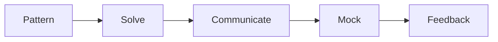

# Preparing for Coding Interviews

This is post 5 in the Developer Career 101 series.

> Developer Career 101 series (5/10)

<!-- a-grade-intro:begin -->

**Core question**: Is *practice problems* alone enough to be ready for the interview?

> Patterns, communication, and time management must move together.

<!-- a-grade-intro:end -->

## What You Will Learn

- *Eight problem patterns*
- The *UMPIRE* procedure
- A *mock interview* routine
- *Time management*
- Absorbing *feedback*

## Why It Matters

Without patterns, you waste time.

## Concept at a Glance



## Key Terms

- **pattern**: Recurring solution shape.
- **UMPIRE**: Understand, Match, Plan, Implement, Review, Evaluate.
- **mock**: Mock interview.
- **edge case**: Boundary condition.
- **complexity**: Time and space cost.

## Before/After

**Before**: "I solve problems at random."

**After**: "I drill three problems per pattern, deeply."

## Hands-on: Interview Routine

### Step 1 — Eight Patterns

```text
two pointers, sliding window,
binary search, BFS/DFS,
heap, dp, greedy, backtracking
```

### Step 2 — UMPIRE Procedure

```text
Understand → Match → Plan
Implement → Review → Evaluate
```

### Step 3 — Sample Solution

```python
def two_sum(nums, target):
    seen = {}
    for i, n in enumerate(nums):
        if target - n in seen:
            return [seen[target - n], i]
        seen[n] = i
```

### Step 4 — Mock Interviews

```text
- twice a week, 45 minutes
- a friend or pramp.com
```

### Step 5 — Retro

```markdown
- stuck pattern: dp
- next week: 5 dp problems + voice recording
```

## What to Notice in This Code

- Patterns are shortcuts.
- Talking is evaluation.
- Mocks are real practice.

## Five Common Mistakes

1. **Coding silently.**
2. **Missing edge cases.**
3. **Not stating complexity.**
4. **Skipping mock interviews.**
5. **Refusing feedback.**

## How This Shows Up in Production

Companies run periodic coding assessments for internal leveling too.

## How a Senior Engineer Thinks

- Patterns are strategy.
- Talking is evidence.
- Time is a constraint.
- Mocks build muscle.
- Feedback is an editing tool.

## Checklist

- [ ] Three problems per eight patterns.
- [ ] UMPIRE applied.
- [ ] Two mocks per week.
- [ ] Complexity stated.

## Practice Problems

1. One line: define two pointers.
2. One line: an O(n log n) example.
3. One line: an edge case example.

## Wrap-up and Next Steps

Next post covers *System Design Interviews*.

<!-- toc:begin -->
- [What Is a Developer Career](./01-what-is-developer-career.md)
- [Understanding Roles](./02-understanding-roles.md)
- [Building a Learning Plan](./03-learning-plan.md)
- [Resume and Portfolio](./04-resume-and-portfolio.md)
- **Preparing for Coding Interviews (current)**
- System Design Interviews (upcoming)
- Settling into the First Job (upcoming)
- Side Projects and Learning (upcoming)
- Mentoring and Networking (upcoming)
- The Path to Senior (upcoming)
<!-- toc:end -->

## References

- [Cracking the Coding Interview](http://www.crackingthecodinginterview.com/)
- [LeetCode patterns](https://seanprashad.com/leetcode-patterns/)
- [Pramp](https://www.pramp.com/)
- [Interviewing.io](https://interviewing.io/)

Tags: Career, Interview, Algorithms, Practice, Beginner
