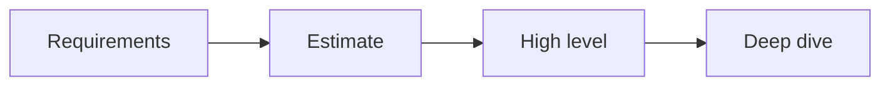

# System Design Interviews

> Developer Career 101 series (6/10)

<!-- a-grade-intro:begin -->

**Core question**: What does the interviewer actually look for in a *system design* interview?

> Requirement framing, trade-offs, and a scaling strategy.

<!-- a-grade-intro:end -->

## What You Will Learn

- The *four-step* procedure
- Eliciting *requirements*
- *Back-of-envelope* estimates
- *Component* design
- *Deep dive* and trade-offs

## Why It Matters

Design is the senior-level filter.

## Concept at a Glance



## Key Terms

- **functional**: Feature requirements.
- **non-functional**: Performance and availability.
- **estimate**: Rough calculation.
- **trade-off**: Cost of a choice.
- **bottleneck**: The limiting component.

## Before/After

**Before**: "I just sketch boxes."

**After**: "I walk requirements, estimate, design, deep dive — in order."

## Hands-on: Design a URL Shortener

### Step 1 — Requirements

```text
functional: shorten, redirect, analytics
non-functional: 100M URLs, 99.99% availability
```

### Step 2 — Estimate

```text
QPS: 1000 reads/s, 10 writes/s
storage: 100M * 500 bytes = 50 GB
```

### Step 3 — Components

```text
LB → API → KV store
analytics → Kafka → DW
```

### Step 4 — Deep Dive

```text
- collision: base62 + counter
- cache: redis (LRU)
- DR: multi-AZ
```

### Step 5 — Trade-offs

```text
SQL vs KV: consistency vs performance
```

## What to Notice in This Code

- Requirements come first.
- Estimates ground the design.
- Deep dive shows seniority.

## Five Common Mistakes

1. **Skipping requirements.**
2. **No estimates.**
3. **Not stating trade-offs.**
4. **Not knowing the bottleneck.**
5. **Bad time management.**

## How This Shows Up in Production

Companies use the same frame when writing internal RFCs.

## How a Senior Engineer Thinks

- Design is a conversation.
- Estimation is muscle.
- Trade-offs are a language.
- Deep dive is depth.
- Time management is training.

## Checklist

- [ ] Functional and non-functional split.
- [ ] Estimates explicit.
- [ ] Trade-offs stated.
- [ ] One bottleneck deep dive.

## Practice Problems

1. One line: define QPS.
2. One line: example of a non-functional requirement.
3. One line: example of a bottleneck.

## Wrap-up and Next Steps

Next post covers *Settling into the First Job*.

<!-- toc:begin -->
- [What Is a Developer Career](./01-what-is-developer-career.md)
- [Understanding Roles](./02-understanding-roles.md)
- [Building a Learning Plan](./03-learning-plan.md)
- [Resume and Portfolio](./04-resume-and-portfolio.md)
- [Preparing for Coding Interviews](./05-coding-interview.md)
- **System Design Interviews (current)**
- Settling into the First Job (upcoming)
- Side Projects and Learning (upcoming)
- Mentoring and Networking (upcoming)
- The Path to Senior (upcoming)
<!-- toc:end -->

## References

- [Designing Data-Intensive Applications](https://dataintensive.net/)
- [System Design Primer](https://github.com/donnemartin/system-design-primer)
- [Grokking the System Design Interview](https://www.educative.io/courses/grokking-the-system-design-interview)
- [High Scalability](http://highscalability.com/)

Tags: Career, Interview, SystemDesign, Architecture, Beginner
