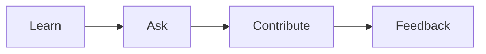

# Settling into the First Job

This is post 7 in the Developer Career 101 series.

> Developer Career 101 series (7/10)

<!-- a-grade-intro:begin -->

**Core question**: What do you do in the *first ninety days* to last for the long run?

> Ask, record, and ship small contributions.

<!-- a-grade-intro:end -->

## What You Will Learn

- *Onboarding* strategy
- The *question* technique
- Small *contributions*
- The *feedback loop*
- Building *relationships*

## Why It Matters

The first impression frames the next eighteen months.

## Concept at a Glance



## Key Terms

- **onboarding**: Adaptation period.
- **buddy**: Peer mentor.
- **1:1**: One-on-one meeting.
- **shadow**: Observe alongside.
- **psychological safety**: Sense of safety to speak up.

## Before/After

**Before**: "I study by myself only."

**After**: "I batch questions weekly and ship a PR."

## Hands-on: A Ninety-Day Plan

### Step 1 — Day 30: Learn

```text
- explore the codebase
- shadow an oncall
- write a glossary
```

### Step 2 — Day 60: Curate Questions

```markdown
## question notebook
- why is X faster than Y?
- what is Z's retention policy?
```

### Step 3 — Day 90: First PR

```bash
git checkout -b first-fix
# small, scoped change
```

### Step 4 — Use 1:1s

```text
weekly with manager, biweekly with mentor
```

### Step 5 — Retro

```markdown
- went well: code reading
- gap: question frequency
- next: one question per day
```

## What to Notice in This Code

- Questions accelerate learning.
- Small PRs build trust.
- 1:1s are feedback.

## Five Common Mistakes

1. **Hiding what you do not know.**
2. **Questions too large.**
3. **No PRs.**
4. **Skipping 1:1s.**
5. **No notes.**

## How This Shows Up in Production

Many companies use ninety-day goals and a first PR as official onboarding metrics.

## How a Senior Engineer Thinks

- Asking is courtesy.
- Small PRs are progress.
- 1:1s are trust.
- Notes are career.
- Observation is learning.

## Checklist

- [ ] Glossary written.
- [ ] Question notebook.
- [ ] First PR.
- [ ] 1:1s established.

## Practice Problems

1. One line: define psychological safety.
2. One line: difference between buddy and mentor.
3. One line: example of a small PR.

## Wrap-up and Next Steps

Next post covers *Side Projects and Learning*.

<!-- toc:begin -->
- [What Is a Developer Career](./01-what-is-developer-career.md)
- [Understanding Roles](./02-understanding-roles.md)
- [Building a Learning Plan](./03-learning-plan.md)
- [Resume and Portfolio](./04-resume-and-portfolio.md)
- [Preparing for Coding Interviews](./05-coding-interview.md)
- [System Design Interviews](./06-system-design-interview.md)
- **Settling into the First Job (current)**
- Side Projects and Learning (upcoming)
- Mentoring and Networking (upcoming)
- The Path to Senior (upcoming)
<!-- toc:end -->

## References

- [The First 90 Days](https://hbr.org/books/watkins)
- [Stripe Engineering Onboarding](https://stripe.com/blog/engineering-principles)
- [Will Larson — Onboarding](https://lethain.com/onboarding-checklist/)
- [Psychological Safety](https://rework.withgoogle.com/blog/five-keys-to-a-successful-google-team/)

Tags: Career, FirstJob, Onboarding, Junior, Beginner
