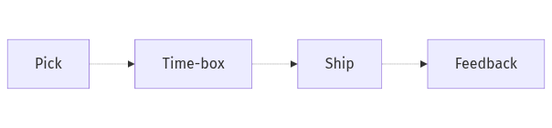

# Side Projects and Learning

The hardest part of side projects is usually not finding ideas. It is choosing a scope that can survive real life. A project that competes with your day job, drifts without a finish line, or ignores IP boundaries often becomes a source of fatigue instead of a source of growth.

This is post 8 in the Developer Career 101 series.

## Questions this chapter answers

- What makes a side project compatible with a full-time job?
- Why does a small MVP beat a grand vision for long-term learning?
- How do time boxes, public releases, and feedback loops keep the work sustainable?
- Why should IP, company assets, and conflict-of-interest rules be checked early?

> The value of a side project comes from finishing small, learning fast, and keeping the boundaries clean.

## What You Will Learn

- Picking the *project*
- *Time boxing*
- *Releasing* and gathering *feedback*
- *Separation* from work
- A *sustainability* strategy

## Why It Matters

A side project leaves both learning and evidence behind.

## Concept at a Glance



*Side-project flow from idea selection to release and feedback*

## Key Terms

- **side project**: Hobbyist or supplemental project.
- **time-box**: Bounded time slot.
- **MVP**: Minimum viable product.
- **moonlighting**: Undisclosed second job.
- **conflict of interest**: Conflicting obligations.

## Before/After

**Before**: "Lots of ideas, none finished."

**After**: "One small MVP shipped each quarter."

## Hands-on: Run the Side Project

### Step 1 — Pick the Idea

```text
criteria:
- interest
- learning value
- no conflict with day job
```

### Step 2 — Time Box

```text
4 hours/week (Sat 09-13)
```

### Step 3 — Define MVP

```markdown
- 1 core feature
- 1 command
- 1 README
```

### Step 4 — Publish

```bash
gh repo create --public
# README + LICENSE + first release
```

### Step 5 — Separation Policy

```text
- no company assets
- IP review with employer
```

## A scorecard for choosing side projects

| Criterion | High score looks like | Warning sign |
| --- | --- | --- |
| Learning value | Closes a real career gap | Repeats only what you already know |
| Finishability | MVP fits in four to six weeks | Core scope already has three major features |
| Publishability | Easy to explain with README and demo | Output stays invisible |
| Boundary safety | Clean separation from employer assets and IP | Contract language is unclear |

## A scorecard for choosing side projects

| Criterion | High score looks like | Warning sign |
| --- | --- | --- |
| Learning value | Closes a real career gap | Repeats only what you already know |
| Finishability | MVP fits in four to six weeks | Core scope already has three major features |
| Publishability | Easy to explain with README and demo | Output stays invisible |
| Boundary safety | Clean separation from employer assets and IP | Contract language is unclear |

## A scorecard for choosing side projects

| Criterion | High score looks like | Warning sign |
| --- | --- | --- |
| Learning value | Closes a real career gap | Repeats only what you already know |
| Finishability | MVP fits in four to six weeks | Core scope already has three major features |
| Publishability | Easy to explain with README and demo | Output stays invisible |
| Boundary safety | Clean separation from employer assets and IP | Contract language is unclear |

## What to Notice in This Code

- A time box is sustainable.
- MVP is the finish line.
- Separation is safety.

## Five Common Mistakes

1. **Mixing in company code.**
2. **Spending unlimited time.**
3. **An MVP too large.**
4. **No license.**
5. **Never shipping.**

## How This Shows Up in Production

Companies spell out open source contribution rules in employment contracts.

## How a Senior Engineer Thinks

- Start small.
- Shipping is motivation.
- Time boxes protect health.
- Separation is job safety.
- Sustainment compounds.

## Checklist

- [ ] Four-hour weekly box.
- [ ] MVP defined.
- [ ] Release procedure.
- [ ] IP review.

## Practice Problems

1. One line: define moonlighting.
2. One line: example of conflict of interest.
3. One line: criteria for an MVP.

## Wrap-up and Next Steps

Next post covers *Mentoring and Networking*.

<!-- toc:begin -->
- [What Is a Developer Career](./01-what-is-developer-career.md)
- [Understanding Roles](./02-understanding-roles.md)
- [Building a Learning Plan](./03-learning-plan.md)
- [Resume and Portfolio](./04-resume-and-portfolio.md)
- [Preparing for Coding Interviews](./05-coding-interview.md)
- [System Design Interviews](./06-system-design-interview.md)
- [Settling into the First Job](./07-first-job.md)
- **Side Projects and Learning (current)**
- Mentoring and Networking (upcoming)
- The Path to Senior (upcoming)
<!-- toc:end -->

## References

- [GitHub Docs — Licensing a repository](https://docs.github.com/en/repositories/managing-your-repositorys-settings-and-features/customizing-your-repository/licensing-a-repository)
- [Open Source Guides — Legal](https://opensource.guide/legal/)
- [Indie Hackers](https://www.indiehackers.com/)
- [Time blocking method](https://todoist.com/productivity-methods/time-blocking)

Tags: Career, SideProject, Learning, Portfolio, Beginner
