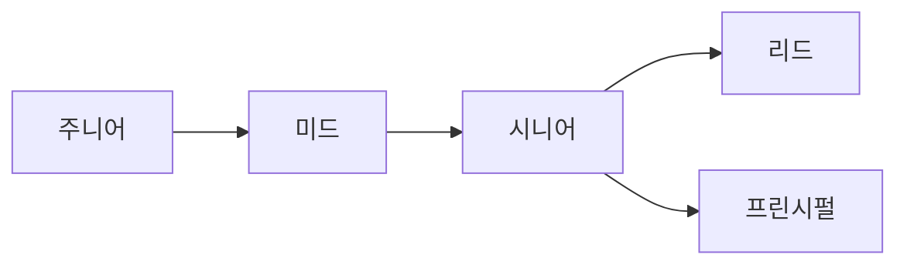

# 개발자 커리어란 무엇인가

## 이 글에서 다룰 문제

- 개발자 커리어를 직함의 연속이 아니라 성장의 좌표로 봐야 하는 이유는 무엇일까요?
- 주니어, 미드, 시니어 같은 단계는 실제로 무엇이 달라질 때 바뀔까요?
- 기술 역량만 키우면 충분하지 않고 영향 반경과 기록이 함께 중요한 이유는 무엇일까요?
- 앞으로 6개월 동안 어떤 기준으로 커리어 목표를 세워야 흔들리지 않을까요?

> Developer Career 101 시리즈 (1/10)

커리어를 처음 생각할 때 가장 흔한 오해는 연차와 직함만 보면 된다고 믿는 일입니다. 하지만 실제 현업에서는 같은 3년 차라도 문제를 받는 방식, 협업하는 방식, 결과를 남기는 방식이 크게 다릅니다. 커리어는 시간이 흐른 결과라기보다 역할, 역량, 영향력이 함께 자라는 과정에 가깝습니다.

이 글은 그 출발점을 정리합니다. 지금 내가 어느 단계에 있는지, 다음 단계로 가려면 무엇을 늘려야 하는지, 그리고 왜 기록이 커리어의 속도를 바꾸는지를 한 번에 잡아 보겠습니다.

## 왜 이 주제가 중요한가

방향 없이 공부하면 열심히 해도 제자리걸음처럼 느껴질 때가 많습니다. 반대로 성장 축을 분명히 잡아 두면 승진, 이직, 학습, 프로젝트 선택이 하나의 맥락으로 이어집니다. 커리어는 단거리 달리기가 아니라 누적 게임이기 때문에, 초반에 프레임을 잘 잡는 일이 생각보다 중요합니다.

> 개발자 커리어는 직함의 목록이 아니라 역할, 실력, 영향력의 합성 곡선입니다.

## 핵심 개념 한눈에 보기



단계가 올라간다고 해서 이전 역할이 사라지는 것은 아닙니다. 주니어 때 익힌 실행력이 미드에서 자기 주도성으로 확장되고, 시니어에서는 문제 정의와 의사결정으로 넓어집니다. 결국 커리어는 계단이라기보다 축적된 능력이 겹겹이 쌓이는 구조로 이해하는 편이 정확합니다.

## 핵심 용어

- **주니어**: 비교적 명확한 안내를 바탕으로 일을 완수하는 단계입니다.
- **미드**: 우선순위를 스스로 정하고, 작업을 자기 주도적으로 끝까지 끌고 가는 단계입니다.
- **시니어**: 문제를 정의하고, 해결 방향의 트레이드오프를 설명할 수 있는 단계입니다.
- **T자형 엔지니어**: 한 분야의 깊이와 여러 분야를 이해하는 넓이를 함께 갖춘 엔지니어입니다.
- **영향 반경**: 내 일이 나 자신, 팀, 조직, 바깥 커뮤니티까지 어디에 영향을 미치는지 보여 주는 범위입니다.

## Before / After

**Before**: 다음 승진이나 연봉 협상만 바라보며 커리어를 생각합니다.

**After**: 내가 어떤 역량을 깊게 만들고, 어떤 범위까지 영향을 넓힐지 좌표를 그리며 움직입니다.

## 직접 해보기: 내 커리어 좌표 그리기

### 1단계 — 현재 단계 적기

```text
one of: junior / mid / senior
```

직함이 아니라 현재 업무 방식 기준으로 적어 보세요. 지시를 받아 움직이는지, 스스로 일감을 구조화하는지, 문제 정의까지 하는지가 더 중요합니다.

### 2단계 — 핵심 역량 나누기

```text
- technical
- collaborative
- domain
```

기술, 협업, 도메인 이해를 따로 적으면 내 성장이 한쪽으로만 쏠렸는지 보입니다. 기술만 강하고 협업이 약할 수도 있고, 반대로 설명과 조율은 좋은데 깊이가 부족할 수도 있습니다.

### 3단계 — 영향 반경 확인하기

```text
- self
- team
- org
- industry
```

내 일이 지금 어디까지 영향을 주는지 표시해 보세요. 혼자 해결하는 수준인지, 팀의 생산성을 높이는지, 조직의 기준을 바꾸는지에 따라 다음 목표가 달라집니다.

### 4단계 — 6개월 목표 쓰기

```markdown
- one technical depth
- one new domain
- one talk delivered
```

목표는 추상적으로 적지 않는 편이 좋습니다. 기술 깊이 하나, 새 도메인 하나, 외부로 드러나는 결과물 하나처럼 서로 성격이 다른 목표를 섞으면 성장 균형이 좋아집니다.

### 5단계 — 분기 회고 틀 만들기

```markdown
## Q2 retro
- went well
- gaps
- one thing for next quarter
```

회고는 감상문이 아니라 다음 행동을 정하는 문서입니다. 잘된 점, 빈틈, 다음 분기에 바꿀 한 가지를 적기만 해도 커리어가 훨씬 덜 흔들립니다.

## 이 예시에서 읽어야 할 포인트

- 커리어 단계는 끊어진 칸이 아니라 연속적인 성장 흐름입니다.
- 성장 축은 하나가 아니라 기술, 협업, 도메인처럼 복수입니다.
- 기록과 회고가 있어야 다음 분기의 방향이 선명해집니다.

## 자주 하는 실수 5가지

1. **직함만 목표로 삼는 실수**: 승진만 바라보면 왜 성장해야 하는지가 흐려집니다.
2. **기술만 깊게 파는 실수**: 협업과 문제 정의가 따라오지 않으면 영향력이 넓어지지 않습니다.
3. **영향력을 측정하지 않는 실수**: 잘했다는 감각만 남고, 설득 가능한 근거가 사라집니다.
4. **회고를 건너뛰는 실수**: 같은 시행착오를 다음 분기에도 반복하게 됩니다.
5. **기록을 남기지 않는 실수**: 나중에 이직이나 평가 시즌이 와도 보여 줄 증거가 부족해집니다.

## 실무에서는 이렇게 이어집니다

대부분의 회사 커리어 래더는 단순히 연차를 세지 않습니다. 역할 범위, 의사결정 수준, 협업 기여, 비즈니스 영향처럼 여러 축을 동시에 봅니다. 그래서 커리어를 숫자 하나로 이해하면 평가 기준과 계속 어긋나게 됩니다.

## 시니어는 이렇게 생각합니다

- 커리어는 속도보다 방향이 중요합니다.
- 기술은 쌓을수록 복리로 돌아옵니다.
- 영향력은 설명 가능해야 인정받습니다.
- T자형 구조는 변화를 버티게 해 줍니다.
- 피드백과 회고는 성장을 교정하는 장치입니다.

## 체크리스트

- [ ] 현재 단계를 업무 방식 기준으로 적었다.
- [ ] 6개월 목표를 세 축 이상으로 나누어 적었다.
- [ ] 분기 회고 일정이나 문서 틀을 만들었다.
- [ ] 커리어 기록을 남길 저장소나 문서를 시작했다.

## 연습 문제

1. T자형 엔지니어를 한 줄로 설명해 보세요.
2. 영향 반경이 팀 수준으로 넓어진 사례를 한 가지 떠올려 보세요.
3. 분기 회고가 커리어에 필요한 이유를 한 줄로 적어 보세요.

## 정리 및 다음 글

개발자 커리어는 직함을 모으는 게임이 아니라, 어떤 문제를 다루고 어떤 범위에 영향을 주는지 넓혀 가는 과정입니다. 오늘 바로 할 일은 어렵지 않습니다. 현재 단계, 세 가지 역량 축, 영향 반경, 6개월 목표, 회고 틀만 적어도 커리어의 지도는 생깁니다.

다음 글에서는 다양한 개발자 직무를 비교하면서, 어떤 역할이 나와 맞는지 판단하는 기준을 정리하겠습니다.

<!-- toc:begin -->
- **개발자 커리어란 무엇인가 (현재 글)**
- 직무 이해하기 (예정)
- 학습 계획 세우기 (예정)
- 이력서와 포트폴리오 (예정)
- 코딩 인터뷰 준비 (예정)
- 시스템 디자인 인터뷰 (예정)
- 첫 직장 적응 (예정)
- 사이드 프로젝트와 학습 (예정)
- 멘토링과 네트워킹 (예정)
- 시니어로 가는 길 (예정)
<!-- toc:end -->

## 참고 자료

- [Career Ladders for Software Engineers](https://www.progression.fyi/)
- [Dropbox Engineering Career Framework](https://dropbox.github.io/dbx-career-framework/)
- [Staff Engineer's Path](https://noidea.dog/staff)
- [Developer roadmap](https://roadmap.sh/)

Tags: Career, Developer, Growth, Junior, Beginner
