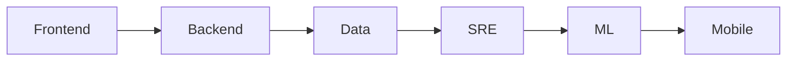

# 직무 이해하기

> Developer Career 101 시리즈 (2/10)


## 이 글에서 다룰 문제

*직무* 가 *맞지* *않으면* *번아웃* 이 *빠릅니다*.

## 개념 한눈에 보기



## Before/After

**Before**: "*직무* 는 *비슷비슷* 하다."

**After**: "*책임* 과 *도구* 가 *완전히* *다르다*."

## 실습: 직무 비교

### 1단계 — Frontend

```text
책임: UX
도구: React, CSS
지표: LCP, INP
```

### 2단계 — Backend

```text
책임: 데이터 흐름
도구: Python, SQL
지표: p95, error rate
```

### 3단계 — Data

```text
책임: 파이프라인
도구: Airflow, dbt
지표: freshness, accuracy
```

### 4단계 — SRE

```text
책임: 운영
도구: Prometheus, K8s
지표: SLO, MTTR
```

### 5단계 — ML

```text
책임: 모델 품질
도구: PyTorch, MLflow
지표: AUC, latency
```

## 이 코드에서 주목할 점

- *책임* 이 *직무*.
- *지표* 가 *문화*.
- *도구* 는 *도구*.

## 자주 하는 실수 5가지

1. ***도구* 로 *직무* 를 *정한다*.**
2. ***지표* 를 *모른다*.**
3. ***경계* 를 *침범* 한다.**
4. ***전환* 을 *충동* 적으로 *한다*.**
5. ***도메인* 을 *무시* 한다.**

## 실무에서는 이렇게 쓰입니다

기업도 *직무 전환* 시 *6개월* 의 *온보딩* 을 *권장* 합니다.

## 체크리스트

- [ ] *현재 직무* 의 *지표* 3개.
- [ ] *관심 직무* 의 *책임* 정리.
- [ ] *전환* 시 *학습 계획*.

## 정리 및 다음 단계

다음 글은 *학습 계획 세우기* 입니다.

<!-- toc:begin -->
- [개발자 커리어란 무엇인가](./01-what-is-developer-career.md)
- **직무 이해하기 (현재 글)**
- 학습 계획 세우기 (예정)
- 이력서와 포트폴리오 (예정)
- 코딩 인터뷰 준비 (예정)
- 시스템 디자인 인터뷰 (예정)
- 첫 직장 적응 (예정)
- 사이드 프로젝트와 학습 (예정)
- 멘토링과 네트워킹 (예정)
- 시니어로 가는 길 (예정)
<!-- toc:end -->

## 참고 자료

- [Web Vitals](https://web.dev/vitals/)
- [Google SRE Book](https://sre.google/books/)
- [State of Data Engineering](https://www.lakefs.io/blog/state-of-data-engineering-2024/)
- [MLOps Maturity](https://ml-ops.org/)

Tags: Career, Roles, Frontend, Backend, Beginner
