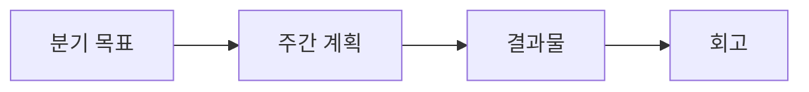

# 학습 계획 세우기

## 이 글에서 다룰 문제

- 바쁜 일상 속에서도 학습을 오래 지속하려면 어떤 구조가 필요할까요?
- 분기 목표와 주간 루틴은 어떻게 연결되어야 할까요?
- 책, 강의, 코드베이스를 고를 때 어떤 기준이 있어야 입력만 쌓이지 않을까요?
- 학습의 끝을 결과물과 회고로 묶는 이유는 무엇일까요?

> Developer Career 101 시리즈 (3/10)

많은 개발자가 학습 의지는 충분한데 계획이 없습니다. 강의를 저장하고 책을 사 두지만 끝까지 가지 못하는 이유도 대개 여기서 나옵니다. 시간이 없어서라기보다 학습이 생활 속 리듬으로 연결되지 않았기 때문입니다.

지속 가능한 학습은 의욕보다 구조에 가깝습니다. 분기 목표, 주간 시간 블록, 결과물, 회고가 하나로 이어져야 입력이 실제 성장으로 바뀝니다. 이 글에서는 그 틀을 간단하지만 실무적으로 쓸 수 있게 정리해 보겠습니다.

## 왜 이 주제가 중요한가

계획 없는 학습은 흩어지기 쉽습니다. 반대로 작고 분명한 목표를 잡고 시간을 고정해 두면, 바쁜 시기에도 최소한의 진전이 쌓입니다. 개발자 커리어에서는 이 누적이 매우 중요합니다. 한 번의 몰입보다 매주 반복되는 학습 루틴이 더 오래 갑니다.

> 학습은 기분이 좋을 때만 하는 이벤트가 아니라, 미리 예약된 시간과 결과물로 운영하는 시스템입니다.

## 핵심 개념 한눈에 보기



이 흐름이 중요한 이유는 학습을 추상적인 결심에서 구체적인 산출로 바꿔 주기 때문입니다. 목표만 있고 루틴이 없으면 실행이 흔들리고, 루틴만 있고 결과물이 없으면 성장이 눈에 보이지 않으며, 회고가 없으면 같은 문제를 반복합니다.

## 핵심 용어

- **목표**: 분기 단위로 달성하려는 구체적인 학습 방향입니다.
- **루틴**: 매주 반복되는 학습 시간과 리듬입니다.
- **결과물**: 저장소, 글, 발표처럼 바깥에서 확인할 수 있는 산출물입니다.
- **회고**: 지난 학습을 돌아보고 다음 조정을 정하는 과정입니다.
- **의도적 연습**: 잘하는 것 반복이 아니라 부족한 부분을 집중해서 훈련하는 방식입니다.

## Before / After

**Before**: 책과 강의를 모으지만 끝까지 읽지 못하고, 배운 것도 오래 남지 않습니다.

**After**: 분기마다 하나의 결과물을 내고, 주간 루틴과 회고로 학습을 계속 조정합니다.

## 직접 해보기: 학습 루틴 설계하기

### 1단계 — 분기 목표 정하기

```markdown
2026 Q2: Build a CLI tool in Rust
```

분기 목표는 하나로 좁히는 편이 좋습니다. 여러 주제를 동시에 잡으면 학습이 분산되고, 무엇을 끝냈는지 판단하기도 어려워집니다.

### 2단계 — 주간 루틴 고정하기

```text
Tue/Thu 21:00-22:00 (60 min)
Sat 09:00-11:00 (120 min)
```

시간은 남을 때 하는 방식보다 먼저 막아 두는 방식이 훨씬 잘 작동합니다. 공부 의지가 아니라 달력에 예약된 시간이 루틴을 지켜 줍니다.

### 3단계 — 학습 자료 고르기

```text
- 1 book
- 1 course
- 1 codebase
```

자료는 많이 모으기보다 서로 역할이 다른 세 종류 정도면 충분합니다. 책은 개념을, 강의는 빠른 맥락을, 코드베이스는 실제 구현 감각을 채워 줍니다.

### 4단계 — 결과물 정하기

```text
- repo URL
- blog post
- talk slides
```

결과물이 있어야 학습이 정리됩니다. 배운 내용을 글이나 저장소로 바꾸는 순간, 이해가 얕은 부분이 바로 드러납니다.

### 5단계 — 분기 회고 쓰기

```markdown
- achieved: 90%
- blocker: ownership
- next quarter: async/await depth
```

회고는 완벽하게 길게 쓸 필요가 없습니다. 무엇을 달성했는지, 무엇이 막았는지, 다음 분기에 어디를 더 깊게 볼지만 적어도 다음 계획이 쉬워집니다.

## 이 예시에서 읽어야 할 포인트

- 목표는 결과물로 연결될 때 비로소 현실성이 생깁니다.
- 루틴은 남는 시간을 기다리는 것이 아니라 시간 블록을 선점하는 일입니다.
- 회고는 실패 기록이 아니라 계획을 미세 조정하는 도구입니다.

## 자주 하는 실수 5가지

1. **목표가 모호한 실수**: 막연히 많이 공부하겠다는 다짐은 실행 기준이 되지 못합니다.
2. **루틴이 기분에 의존하는 실수**: 피곤한 날마다 밀리면 학습은 쉽게 끊깁니다.
3. **입력만 쌓는 실수**: 책과 강의를 보는 시간만 많고 직접 만드는 결과가 없으면 기억도 빨리 흐려집니다.
4. **산출물이 없는 실수**: 성장했다는 감각은 있어도 증거가 남지 않습니다.
5. **회고를 생략하는 실수**: 무엇이 잘 먹혔는지 알 수 없어 다음 분기에도 같은 시행착오가 이어집니다.

## 실무에서는 이렇게 이어집니다

회사에서의 목표 관리도 비슷합니다. 분기 목표와 결과물, 그리고 회고가 승진 자료나 성과 평가의 핵심 근거가 됩니다. 개인 학습 계획을 잘 세우는 사람은 회사 안에서도 성장 흐름을 더 잘 관리합니다.

## 시니어는 이렇게 생각합니다

- 학습은 의지가 아니라 운영 방식입니다.
- 결과물이 있어야 배움이 증거가 됩니다.
- 시간 블록은 습관을 만들어 줍니다.
- 회고는 방향 수정 장치입니다.
- 깊이는 반복에서 나옵니다.

## 체크리스트

- [ ] 이번 분기의 학습 목표를 하나로 적었다.
- [ ] 주간 시간 블록을 달력에 넣었다.
- [ ] 결과물 형태를 미리 정했다.
- [ ] 분기 회고 날짜를 예약했다.

## 연습 문제

1. 의도적 연습을 한 줄로 설명해 보세요.
2. 시간 블로킹이 학습에 주는 효과를 한 줄로 적어 보세요.
3. 회고에서 꼭 물어야 할 질문 하나를 적어 보세요.

## 정리 및 다음 글

학습 계획은 거창할 필요가 없습니다. 분기 목표 하나, 주간 루틴 몇 칸, 결과물 하나, 회고 하나면 충분합니다. 중요한 것은 이 네 가지가 연결되어 계속 돌아가게 만드는 일입니다.

다음 글에서는 이렇게 쌓은 경험과 결과물을 채용 문서로 바꾸는 방법, 즉 이력서와 포트폴리오를 정리해 보겠습니다.

<!-- toc:begin -->
- [개발자 커리어란 무엇인가](./01-what-is-developer-career.md)
- [직무 이해하기](./02-understanding-roles.md)
- **학습 계획 세우기 (현재 글)**
- 이력서와 포트폴리오 (예정)
- 코딩 인터뷰 준비 (예정)
- 시스템 디자인 인터뷰 (예정)
- 첫 직장 적응 (예정)
- 사이드 프로젝트와 학습 (예정)
- 멘토링과 네트워킹 (예정)
- 시니어로 가는 길 (예정)
<!-- toc:end -->

## 참고 자료

- [Atomic Habits](https://jamesclear.com/atomic-habits)
- [Deep Work](https://www.calnewport.com/books/deep-work/)
- [Deliberate Practice](https://www.psychologytoday.com/us/basics/deliberate-practice)
- [OKR Examples](https://www.whatmatters.com/)

Tags: Career, Learning, Plan, Habits, Beginner
