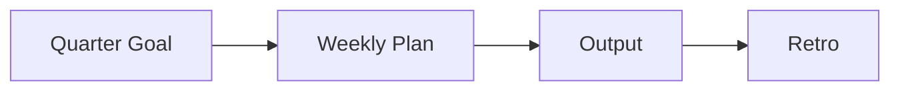

# 학습 계획 세우기

배워야 할 기술은 계속 늘어나는데 일상은 늘 바쁩니다. 그래서 많은 사람이 좋은 책과 강의를 잔뜩 모아 두고도 실제로는 끝까지 가져가지 못합니다.

이 글은 Developer Career 101 시리즈의 3번째 글입니다.

## 이 글에서 다룰 문제

- 바쁜 일상 속에서도 학습을 오래 지속하려면 어떤 구조가 필요할까요?
- 분기 목표와 주간 루틴은 어떻게 연결되어야 할까요?
- 책, 강의, 코드베이스를 고를 때 어떤 기준이 있어야 입력만 쌓이지 않을까요?
- 결과물과 회고를 왜 학습 계획의 끝에 붙여야 할까요?

## 이 글에서 배울 것

- 분기 목표를 세우는 법
- 주간 루틴을 고정하는 법
- 학습 자료를 고르는 기준
- 결과물을 만드는 방식
- 회고를 운영하는 법

## 왜 중요한가

계획 없는 학습은 쉽게 흩어집니다. 반대로 분기 목표와 주간 시간 블록, 결과물, 회고가 연결되어 있으면 바쁜 시기에도 학습이 끊기지 않습니다.

> 학습은 의욕이 생길 때만 하는 이벤트가 아니라, 미리 예약된 시간과 결과물로 굴리는 시스템입니다.

## 핵심 개념 한눈에 보기



학습은 입력을 많이 넣는다고 자동으로 쌓이지 않습니다. 목표가 주간 루틴으로 내려오고, 그 루틴이 결과물로 이어지며, 결과물이 다시 회고로 연결될 때 비로소 다음 분기의 학습이 더 정교해집니다.

## 핵심 용어

- 목표: 도달하려는 지점입니다.
- 루틴: 주 단위로 반복되는 리듬입니다.
- 결과물: 바깥에 남는 산출물입니다.
- 회고: 과정을 돌아보는 점검입니다.
- **의도적 연습**: 구조화된 집중 훈련입니다.

## Before/After

**Before**: “책과 강의를 사 두기만 하고 끝냅니다.”

**After**: “분기마다 하나의 결과물을 실제로 내보냅니다.”

## 직접 해보기: 학습 루틴 만들기

### 1단계 — 분기 목표

```markdown
2026 Q2: Build a CLI tool in Rust
```

목표는 막연한 공부가 아니라 끝이 있는 문장이어야 합니다. “Rust 공부하기”보다 “Rust로 CLI 도구 하나 만들기”가 훨씬 운영하기 쉽습니다.

### 2단계 — 주간 루틴

```text
Tue/Thu 21:00-22:00 (60 min)
Sat 09:00-11:00 (120 min)
```

시간 블록은 기분이 아니라 일정에 붙여야 합니다. 평일 짧은 집중과 주말 긴 몰입을 조합하면 지속성이 훨씬 높아집니다.

### 3단계 — 학습 자료 고르기

```text
- 1 book
- 1 course
- 1 codebase
```

자료를 많이 고르는 것이 능사는 아닙니다. 책 하나, 강의 하나, 실제 코드베이스 하나처럼 성격이 다른 자료를 조합하면 입력이 서로 보완됩니다.

### 4단계 — 결과물

```text
- repo URL
- blog post
- talk slides
```

결과물은 학습을 증거로 바꿉니다. 저장소, 글, 발표 자료처럼 바깥에 남는 형태가 있어야 학습이 커리어 자산으로 연결됩니다.

### 5단계 — 분기 회고

```markdown
- achieved: 90%
- blocker: ownership
- next quarter: async/await depth
```

회고는 잘했는지 못했는지만 적는 문서가 아닙니다. 달성률, 방해 요인, 다음 분기 보정 방향을 함께 적어야 다음 사이클이 더 좋아집니다.

## 이 예시에서 먼저 볼 점

- 목표는 결과물로 드러나야 합니다.
- 루틴은 추상적 의지가 아니라 시간 블록입니다.
- 회고는 계획을 고치는 장치입니다.

## 자주 하는 실수 5가지

1. **목표를 모호하게 잡는 일입니다.**
2. **기분에 따라 움직이는 루틴을 만드는 일입니다.**
3. **입력만 쌓는 일입니다.**
4. **결과물을 정하지 않는 일입니다.**
5. **회고를 건너뛰는 일입니다.**

## 실무에서는 이렇게 드러납니다

승진 준비나 성과 개선 계획도 결국 분기 목표와 결과물로 평가되는 경우가 많습니다. 학습 계획을 운영하는 습관은 일상 업무 평가 구조와도 자연스럽게 이어집니다.

## 시니어 엔지니어는 이렇게 생각합니다

- 학습은 계획입니다.
- 결과물은 증거입니다.
- 시간 블록은 습관이 됩니다.
- 회고는 편집 도구입니다.
- 깊이는 누적됩니다.

## 체크리스트

- [ ] 분기 목표 하나를 적었습니다.
- [ ] 주간 시간 블록을 잡았습니다.
- [ ] 결과물을 정했습니다.
- [ ] 분기 회고 일정을 잡았습니다.

## 연습 문제

1. 의도적 연습을 한 줄로 설명해 보세요.
2. 시간 블로킹의 효과를 한 줄로 적어 보세요.
3. 회고에서 던질 질문 하나를 적어 보세요.

## 정리

지속 가능한 학습 계획은 의욕보다 구조에 더 많이 의존합니다. 분기 목표를 세우고, 주간 시간을 예약하고, 결과물을 만들고, 회고로 조정하는 흐름이 생기면 바쁜 시기에도 학습이 사라지지 않습니다. 다음 글에서는 이 학습과 경험을 채용 담당자가 빠르게 이해할 수 있는 이력서와 포트폴리오로 어떻게 바꾸는지 정리하겠습니다.

<!-- toc:begin -->
- [개발자 커리어란 무엇인가](./01-what-is-developer-career.md)
- [직무 이해하기](./02-understanding-roles.md)
- **학습 계획 세우기 (현재 글)**
- 이력서와 포트폴리오 (예정)
- 코딩 인터뷰 준비 (예정)
- 시스템 디자인 인터뷰 (예정)
- 첫 직장 적응 (예정)
- 사이드 프로젝트와 학습 (예정)
- 멘토링과 네트워킹 (예정)
- 시니어로 가는 길 (예정)
<!-- toc:end -->

## 참고 자료

- [Atomic Habits](https://jamesclear.com/atomic-habits)
- [Deep Work](https://www.calnewport.com/books/deep-work/)
- [Deliberate Practice](https://www.psychologytoday.com/us/basics/deliberate-practice)
- [OKR Examples](https://www.whatmatters.com/)

Tags: Career, Learning, Plan, Habits, Beginner
