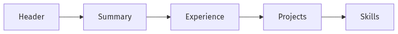

# 이력서와 포트폴리오

좋은 경험이 있어도 짧은 시간 안에 전달하지 못하면 기회로 이어지지 않는 경우가 많습니다. 채용 담당자는 수많은 지원서를 빠르게 훑기 때문에, 내가 무엇을 했는지보다 어떤 결과를 냈는지가 먼저 보여야 합니다.

이 글은 Developer Career 101 시리즈의 4번째 글입니다.

## 이 글에서 다룰 문제

- 채용 담당자가 짧은 시간 안에 나를 이해하려면 이력서는 어떤 구조여야 할까요?
- 담당 업무 나열이 아니라 결과와 영향 중심으로 쓰려면 무엇이 달라져야 할까요?
- 숫자와 STAR 구조는 왜 강한 설득 도구가 될까요?
- 포트폴리오는 이력서와 어떻게 연결되어야 신뢰를 높일 수 있을까요?

## 이 글에서 배울 것

- 이력서의 기본 구조
- 불릿을 쓰는 방식
- 포트폴리오를 연결하는 법
- 키워드와 ATS를 고려하는 법
- 지원 흐름 전체에서 이력서가 맡는 역할

## 왜 중요한가

이력서는 면접으로 들어가는 입장권입니다. 같은 경험이라도 결과와 영향이 잘 드러나면 읽는 사람이 이해하는 속도와 신뢰도가 크게 달라집니다.

> 이력서는 내가 어떤 사람인지 길게 설명하는 문서가 아니라, 면접을 열어 주는 짧은 광고입니다.

## 핵심 개념 한눈에 보기



*이력서에서 포트폴리오로 이어지는 검토 흐름*

좋은 이력서는 위에서 아래로 읽히는 흐름이 자연스럽습니다. 누구인지, 무엇을 잘하는지, 어떤 결과를 냈는지, 그 결과를 어디서 검증할 수 있는지가 짧은 시간 안에 이어져야 합니다.

## 핵심 용어

- 요약문: 세 줄 안팎의 짧은 소개입니다.
- 불릿: 결과를 담는 한 문장입니다.
- **STAR**: Situation, Task, Action, Result 구조입니다.
- **ATS**: 지원서를 자동 분류하는 시스템입니다.
- 포트폴리오: 경험을 증명하는 자료 묶음입니다.

## Before/After

**Before**: “무슨 일을 했는지 나열합니다.”

**After**: “숫자와 함께 결과와 영향을 씁니다.”

## 직접 해보기: 이력서 만들기

### 1단계 — Header

```text
Name | Email | GitHub | LinkedIn
```

헤더는 단순해야 합니다. 연락 가능 정보와 검증 가능한 링크만 빠르게 보이게 두는 편이 좋습니다.

### 2단계 — Summary

```text
Backend, 3 yrs. Cut payment p95 from 200ms to 80ms.
```

요약문은 경력 소개가 아니라 핵심 성과의 압축본입니다. 역할과 연차, 가장 강한 숫자 하나만 있어도 인상이 달라집니다.

### 3단계 — Experience Bullets (STAR)

```markdown
- Cut p95 latency from 200ms to 80ms by introducing read replicas, serving 5M req/day.
```

불릿은 업무 설명보다 결과 문장이어야 합니다. 어떤 상황에서 무엇을 했고, 결과가 어떻게 달라졌는지 숫자로 보여 주면 읽는 사람이 바로 이해할 수 있습니다.

### 4단계 — Projects

```markdown
- tinytool: 1.2k stars, used by 30 orgs
```

프로젝트는 취미 목록이 아니라 증거입니다. 사용 조직 수, 스타 수, 배포 링크처럼 검증 가능한 단서가 들어가면 포트폴리오의 신뢰도가 올라갑니다.

### 5단계 — Skills

```text
Python, PostgreSQL, AWS, Kubernetes
```

기술 스택은 경험과 분리되어 떠 있으면 약합니다. 앞선 경력과 프로젝트 섹션에서 실제로 등장한 기술만 묶어 적는 편이 훨씬 강합니다.

## 서류 검토 흐름에서 먼저 보는 지점

| 검토 단계 | 읽는 사람이 보는 것 | 내가 준비할 증거 |
| --- | --- | --- |
| 30초 스캔 | 역할, 연차, 가장 강한 숫자 | 요약문 3줄, 대표 성과 1개 |
| 3분 정독 | 결과 문장의 밀도와 재현 가능성 | STAR 구조 불릿, 수치 근거 |
| 포트폴리오 검증 | 링크가 실제로 열리고 주장과 맞는가 | README, 배포 링크, 발표 자료 |
| 면접 연결 | 어떤 질문을 던지면 될지가 보이는가 | 장애 대응, 성능 개선, 협업 사례 |

## 서류 검토 흐름에서 먼저 보는 지점

| 검토 단계 | 읽는 사람이 보는 것 | 내가 준비할 증거 |
| --- | --- | --- |
| 30초 스캔 | 역할, 연차, 가장 강한 숫자 | 요약문 3줄, 대표 성과 1개 |
| 3분 정독 | 결과 문장의 밀도와 재현 가능성 | STAR 구조 불릿, 수치 근거 |
| 포트폴리오 검증 | 링크가 실제로 열리고 주장과 맞는가 | README, 배포 링크, 발표 자료 |
| 면접 연결 | 어떤 질문을 던지면 될지가 보이는가 | 장애 대응, 성능 개선, 협업 사례 |

## 서류 검토 흐름에서 먼저 보는 지점

| 검토 단계 | 읽는 사람이 보는 것 | 내가 준비할 증거 |
| --- | --- | --- |
| 30초 스캔 | 역할, 연차, 가장 강한 숫자 | 요약문 3줄, 대표 성과 1개 |
| 3분 정독 | 결과 문장의 밀도와 재현 가능성 | STAR 구조 불릿, 수치 근거 |
| 포트폴리오 검증 | 링크가 실제로 열리고 주장과 맞는가 | README, 배포 링크, 발표 자료 |
| 면접 연결 | 어떤 질문을 던지면 될지가 보이는가 | 장애 대응, 성능 개선, 협업 사례 |

## 이 예시에서 먼저 볼 점

- 불릿은 결과 문장입니다.
- 숫자는 증거입니다.
- STAR 구조가 짧은 서사를 만들어 줍니다.

## 자주 하는 실수 5가지

1. **담당 업무만 나열하는 일입니다.**
2. **숫자를 전혀 쓰지 않는 일입니다.**
3. **포트폴리오와 이력서가 어긋나는 일입니다.**
4. **ATS가 읽기 어려운 형식을 쓰는 일입니다.**
5. **이력서가 세 페이지를 넘는 일입니다.**

## 실무에서는 이렇게 드러납니다

큰 회사는 내부 이동 때도 짧은 내부용 이력서를 요구하는 경우가 많습니다. 이력서를 잘 쓰는 능력은 외부 지원에만 필요한 기술이 아닙니다.

## 시니어 엔지니어는 이렇게 생각합니다

- 이력서는 광고입니다.
- 숫자가 가장 강합니다.
- STAR는 결과를 정리하는 틀입니다.
- ATS는 현실입니다.
- 포트폴리오는 증거입니다.

## 체크리스트

- [ ] 세 줄 요약문이 있습니다.
- [ ] 숫자가 들어간 불릿 다섯 개를 적었습니다.
- [ ] 포트폴리오 링크를 넣었습니다.
- [ ] PDF와 텍스트 친화 형식을 준비했습니다.

## 연습 문제

1. STAR를 한 줄로 설명해 보세요.
2. ATS를 한 줄로 설명해 보세요.
3. 숫자가 들어간 불릿 예시를 한 줄로 적어 보세요.

## 정리

좋은 이력서와 포트폴리오는 경험을 예쁘게 포장하는 문서가 아니라, 결과와 증거를 빠르게 전달하는 문서입니다. 역할, 숫자, 결과, 링크가 선명하게 보이면 읽는 사람이 다음 질문을 떠올리기 쉬워집니다. 다음 글에서는 이렇게 얻은 기회를 실제 면접으로 연결하는 코딩 인터뷰 준비 방법을 정리하겠습니다.

<!-- toc:begin -->
- [개발자 커리어란 무엇인가](./01-what-is-developer-career.md)
- [직무 이해하기](./02-understanding-roles.md)
- [학습 계획 세우기](./03-learning-plan.md)
- **이력서와 포트폴리오 (현재 글)**
- 코딩 인터뷰 준비 (예정)
- 시스템 디자인 인터뷰 (예정)
- 첫 직장 적응 (예정)
- 사이드 프로젝트와 학습 (예정)
- 멘토링과 네트워킹 (예정)
- 시니어로 가는 길 (예정)
<!-- toc:end -->

## 참고 자료

- [Google Careers — Resume tips](https://careers.google.com/how-we-hire/)
- [LinkedIn Talent Blog](https://business.linkedin.com/talent-solutions/blog)
- [The Muse — STAR method overview](https://www.themuse.com/advice/star-interview-method)
- [GitHub Docs — Profile README basics](https://docs.github.com/en/account-and-profile/setting-up-and-managing-your-github-profile/customizing-your-profile/about-your-profile)

Tags: Career, Resume, Portfolio, Hiring, Beginner
