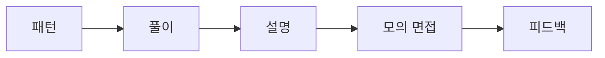

# 코딩 인터뷰 준비

## 이 글에서 다룰 문제

- 문제를 많이 푸는 것만으로 코딩 인터뷰 준비가 충분하지 않은 이유는 무엇일까요?
- 자주 나오는 문제 패턴을 어떻게 묶어 공부해야 시간 낭비를 줄일 수 있을까요?
- 풀이 과정에서 말하기, 복잡도 설명, 시간 관리가 왜 점수에 큰 영향을 줄까요?
- 모의 면접과 회고를 어떻게 루틴으로 만들면 실전 감각이 붙을까요?

> Developer Career 101 시리즈 (5/10)

코딩 인터뷰를 준비할 때 많은 사람이 문제 수를 늘리는 데 집중합니다. 물론 반복은 필요합니다. 다만 아무 기준 없이 많이 푸는 방식은 효율이 낮습니다. 실전에서는 정답만 맞히는 것보다, 제한된 시간 안에 문제를 구조화하고 생각을 설명하는 능력이 함께 평가되기 때문입니다.

그래서 준비 방법도 바뀌어야 합니다. 패턴 중심으로 묶고, 풀이 절차를 언어화하고, 모의 면접으로 실전 압박을 연습해야 합니다. 이 글에서는 그 흐름을 한 번에 정리해 보겠습니다.

## 왜 이 주제가 중요한가

패턴이 없으면 같은 종류의 문제를 매번 처음 보는 문제처럼 풀게 됩니다. 그러면 시간도 오래 걸리고 자신감도 떨어집니다. 반대로 패턴과 절차가 몸에 익으면, 새로운 문제를 봐도 어디서부터 시작해야 할지 감이 생깁니다.

> 코딩 인터뷰 실력은 문제 수집량보다 패턴 인식, 설명 능력, 시간 감각이 함께 움직일 때 올라갑니다.

## 핵심 개념 한눈에 보기



이 순서는 실전 준비의 최소 단위입니다. 패턴을 알고, 절차대로 풀고, 입으로 설명하고, 모의 면접에서 피드백을 받아야 약점이 보입니다. 혼자 조용히 코드만 치는 연습은 실제 평가 상황과 꽤 다릅니다.

## 핵심 용어

- **패턴**: 반복해서 등장하는 풀이 구조입니다.
- **UMPIRE**: 문제 이해, 패턴 매칭, 계획, 구현, 검토, 평가 순서로 진행하는 풀이 절차입니다.
- **모의 면접**: 실제 면접처럼 시간을 재고 진행하는 연습입니다.
- **엣지 케이스**: 입력 경계나 예외 상황처럼 실수를 유발하는 조건입니다.
- **복잡도**: 시간과 메모리 비용을 설명하는 기준입니다.

## Before / After

**Before**: 보이는 문제를 닥치는 대로 풀고, 왜 틀렸는지도 깊게 복기하지 않습니다.

**After**: 패턴별로 묶어 연습하고, 풀이와 설명, 회고까지 하나의 루틴으로 운영합니다.

## 직접 해보기: 인터뷰 준비 루틴 만들기

### 1단계 — 핵심 패턴 여덟 가지 정리

```text
two pointers, sliding window,
binary search, BFS/DFS,
heap, dp, greedy, backtracking
```

처음부터 모든 유형을 다루려 하지 말고, 자주 나오는 대표 패턴을 먼저 묶어 두는 편이 좋습니다. 패턴별로 세 문제씩 깊게 푸는 방식이 무작정 스무 문제를 푸는 것보다 효율적일 때가 많습니다.

### 2단계 — UMPIRE 절차 적용

```text
Understand → Match → Plan
Implement → Review → Evaluate
```

문제를 읽자마자 바로 코드를 치지 않는 습관이 중요합니다. 문제를 다시 말하고, 어떤 패턴인지 짚고, 자료구조와 접근을 말로 정리한 뒤 구현하는 흐름이 실전에서 안정적입니다.

### 3단계 — 예시 풀이 읽기

```python
def two_sum(nums, target):
    seen = {}
    for i, n in enumerate(nums):
        if target - n in seen:
            return [seen[target - n], i]
        seen[n] = i
```

짧은 코드라도 왜 해시맵을 택했는지, 시간 복잡도가 왜 O(n)인지, 중복 값은 어떻게 처리되는지를 말로 설명해 보세요. 인터뷰에서는 이 설명이 빠지면 정답 코드만으로는 부족할 수 있습니다.

### 4단계 — 모의 면접 넣기

```text
- twice a week, 45 minutes
- a friend or pramp.com
```

모의 면접은 긴장감과 말하기를 함께 훈련해 줍니다. 혼자 풀 때는 보이지 않던 버릇, 예를 들어 질문을 확인하지 않고 바로 구현하는 습관이나 복잡도 설명을 빼먹는 습관이 드러납니다.

### 5단계 — 주간 회고 쓰기

```markdown
- stuck pattern: dp
- next week: 5 dp problems + voice recording
```

회고는 약한 패턴을 찾는 데 특히 유용합니다. 막힌 유형, 설명이 꼬인 지점, 시간 초과가 난 이유를 적어 두면 다음 주 연습 방향이 선명해집니다.

## 이 예시에서 읽어야 할 포인트

- 패턴은 문제 풀이의 지름길이 아니라 사고의 출발점을 마련해 줍니다.
- 말하기는 부가 요소가 아니라 평가 대상 자체입니다.
- 모의 면접은 실전 감각을 만드는 가장 현실적인 연습입니다.

## 자주 하는 실수 5가지

1. **아무 설명 없이 코딩하는 실수**: 면접관은 생각 과정을 함께 보고 싶어 합니다.
2. **엣지 케이스를 놓치는 실수**: 빈 배열, 중복 값, 경계 입력을 확인하지 않으면 작은 실수가 크게 보입니다.
3. **복잡도를 말하지 않는 실수**: 왜 이 풀이가 적절한지 설명이 빠집니다.
4. **모의 면접을 생략하는 실수**: 실전 긴장감과 시간 압박을 따로 연습하지 못합니다.
5. **피드백을 흘려보내는 실수**: 같은 약점을 계속 반복하게 됩니다.

## 실무에서는 이렇게 이어집니다

코딩 평가는 외부 채용뿐 아니라 내부 레벨링이나 승진 심사 과정에서도 쓰입니다. 결국 문제 풀이 실력은 면접 이벤트가 아니라, 사고를 구조화하고 설명하는 능력의 일부라고 볼 수 있습니다.

## 시니어는 이렇게 생각합니다

- 패턴은 전략입니다.
- 설명은 실력을 증명하는 증거입니다.
- 시간은 항상 제약 조건입니다.
- 모의 면접은 근육을 만들어 줍니다.
- 피드백은 풀이 습관을 다듬는 도구입니다.

## 체크리스트

- [ ] 여덟 가지 핵심 패턴을 정리했다.
- [ ] 풀이마다 UMPIRE 절차를 적용했다.
- [ ] 주 2회 모의 면접 일정을 잡았다.
- [ ] 시간 복잡도와 공간 복잡도를 설명하는 연습을 했다.

## 연습 문제

1. 투 포인터 패턴을 한 줄로 설명해 보세요.
2. O(n log n) 알고리즘 예시를 한 줄로 적어 보세요.
3. 인터뷰에서 확인해야 할 엣지 케이스 예시를 하나 적어 보세요.

## 정리 및 다음 글

코딩 인터뷰 준비의 핵심은 많이 푸는 데만 있지 않습니다. 패턴을 묶고, 절차를 익히고, 말로 설명하고, 피드백으로 수정하는 루틴이 함께 돌아가야 합니다. 그렇게 준비하면 문제 풀이 실력뿐 아니라 사고 전달력도 같이 올라갑니다.

다음 글에서는 시스템 디자인 인터뷰에서 면접관이 실제로 무엇을 보는지, 그리고 어떻게 구조적으로 답해야 하는지 살펴보겠습니다.

<!-- toc:begin -->
- [개발자 커리어란 무엇인가](./01-what-is-developer-career.md)
- [직무 이해하기](./02-understanding-roles.md)
- [학습 계획 세우기](./03-learning-plan.md)
- [이력서와 포트폴리오](./04-resume-and-portfolio.md)
- **코딩 인터뷰 준비 (현재 글)**
- 시스템 디자인 인터뷰 (예정)
- 첫 직장 적응 (예정)
- 사이드 프로젝트와 학습 (예정)
- 멘토링과 네트워킹 (예정)
- 시니어로 가는 길 (예정)
<!-- toc:end -->

## 참고 자료

- [Cracking the Coding Interview](http://www.crackingthecodinginterview.com/)
- [LeetCode patterns](https://seanprashad.com/leetcode-patterns/)
- [Pramp](https://www.pramp.com/)
- [Interviewing.io](https://interviewing.io/)

Tags: Career, Interview, Algorithms, Practice, Beginner
