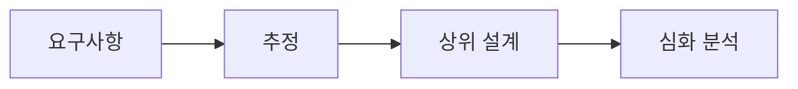

# 시스템 디자인 인터뷰

## 이 글에서 다룰 문제

- 시스템 디자인 인터뷰에서 면접관은 무엇을 실제로 평가할까요?
- 요구사항 확인, 추정, 상위 설계, 심화 설명은 어떤 순서로 진행해야 할까요?
- 트레이드오프와 병목을 말하지 못하면 왜 답변이 얕아 보일까요?
- URL 단축기 같은 고전 문제를 어떤 틀로 설명하면 안정적일까요?

> Developer Career 101 시리즈 (6/10)

시스템 디자인 인터뷰를 처음 준비하면 멋진 아키텍처 그림을 빨리 그리는 데 집중하기 쉽습니다. 하지만 면접관이 보고 싶은 것은 그림 자체보다, 문제를 어떻게 정의하고 어떤 제약을 먼저 확인하며, 왜 그런 선택을 했는지 설명하는 과정입니다.

즉, 디자인 인터뷰는 정답 발표가 아니라 설계 대화에 가깝습니다. 요구사항을 좁히고, 숫자로 감을 잡고, 핵심 컴포넌트를 세운 뒤, 병목과 트레이드오프를 짚어야 비로소 시니어다운 답변이 됩니다.

## 왜 이 주제가 중요한가

시스템 디자인은 보통 시니어 이상으로 갈수록 비중이 커집니다. 단순히 코드를 짤 수 있는지보다, 규모와 제약을 고려해 시스템을 설명하고 의사결정을 방어할 수 있는지를 보기 때문입니다. 따라서 준비 방식도 문제 풀이식 암기가 아니라 사고 프레임을 익히는 방향이어야 합니다.

> 시스템 디자인 인터뷰는 큰 그림을 그리는 시험이 아니라, 제약 속에서 판단을 설명하는 시험입니다.

## 핵심 개념 한눈에 보기



이 순서가 흔들리면 답변도 흔들립니다. 요구사항이 불분명한 상태에서 설계를 시작하면 엉뚱한 시스템을 만들 수 있고, 추정이 없으면 규모에 맞는 선택인지 판단하기 어렵습니다. 상위 구조를 세운 뒤 한두 지점을 깊게 파는 방식이 가장 안정적입니다.

## 핵심 용어

- **기능 요구사항**: 시스템이 반드시 해야 하는 동작입니다.
- **비기능 요구사항**: 성능, 가용성, 확장성처럼 품질 측면의 제약입니다.
- **추정**: 대략적인 요청량, 저장량, 대역폭을 계산해 설계 감을 잡는 과정입니다.
- **트레이드오프**: 한 선택이 가져오는 이득과 비용의 균형입니다.
- **병목**: 전체 시스템 성능이나 안정성을 제한하는 지점입니다.

## Before / After

**Before**: 상자 몇 개를 그린 뒤 데이터베이스와 캐시를 붙이며 설명을 끝냅니다.

**After**: 요구사항 확인, 추정, 구조 설계, 심화 분석 순서로 대화를 이끌며 선택 이유를 말합니다.

## 직접 해보기: URL 단축기 설계 루틴

### 1단계 — 요구사항 정리

```text
functional: shorten, redirect, analytics
non-functional: 100M URLs, 99.99% availability
```

여기서 가장 먼저 해야 할 일은 범위를 닫는 일입니다. 분석 기능이 필요한지, 사용자별 통계가 필요한지, 가용성 목표가 어느 정도인지에 따라 설계가 크게 달라집니다.

### 2단계 — 대략 추정하기

```text
QPS: 1000 reads/s, 10 writes/s
storage: 100M * 500 bytes = 50 GB
```

이 숫자가 완벽할 필요는 없습니다. 다만 읽기 비율이 압도적으로 높다는 사실, 저장량이 어느 정도인지 같은 감을 먼저 잡아야 캐시나 저장소 선택을 설득력 있게 설명할 수 있습니다.

### 3단계 — 상위 컴포넌트 세우기

```text
LB → API → KV store
analytics → Kafka → DW
```

상위 설계 단계에서는 모든 세부 구현을 다 넣을 필요가 없습니다. 요청 흐름이 어디를 지나고, 쓰기와 읽기가 어떻게 처리되며, 분석 파이프라인이 분리되는지만 명확히 보이면 충분합니다.

### 4단계 — 한 지점 깊게 파기

```text
- collision: base62 + counter
- cache: redis (LRU)
- DR: multi-AZ
```

심화 단계에서는 충돌 방지, 캐시 전략, 장애 복구처럼 한두 지점을 깊게 설명하세요. 여기서 시니어다운 판단력이 가장 잘 드러납니다.

### 5단계 — 트레이드오프 말하기

```text
SQL vs KV: consistency vs performance
```

면접관은 어떤 선택이든 절대 정답이라고 기대하지 않습니다. 대신 왜 이 상황에서 그 선택이 맞는지, 다른 선택을 하면 무엇을 포기해야 하는지 설명하길 기대합니다.

## 이 예시에서 읽어야 할 포인트

- 요구사항 확인이 설계의 출발점입니다.
- 추정이 있어야 설계가 공중에 뜨지 않습니다.
- 심화 설명과 트레이드오프 언급이 답변의 깊이를 만듭니다.

## 자주 하는 실수 5가지

1. **요구사항을 건너뛰는 실수**: 문제를 다르게 이해한 채 답변할 위험이 큽니다.
2. **추정을 생략하는 실수**: 규모에 맞지 않는 설계를 해도 스스로 모르게 됩니다.
3. **트레이드오프를 말하지 않는 실수**: 선택 근거가 약해 보입니다.
4. **병목을 짚지 못하는 실수**: 시스템을 운영 관점에서 보지 못한다는 인상을 줍니다.
5. **시간 관리를 못하는 실수**: 초반에 세부 구현에 빠지면 전체 그림을 보여 주지 못합니다.

## 실무에서는 이렇게 이어집니다

회사 안에서 RFC를 쓰거나 아키텍처 리뷰를 할 때도 비슷한 틀이 반복됩니다. 요구사항, 추정, 구조, 리스크, 대안이 문서화되어야 다른 사람을 설득할 수 있기 때문입니다. 인터뷰 준비 과정은 결국 실무 설계 습관과도 이어집니다.

## 시니어는 이렇게 생각합니다

- 설계는 대화입니다.
- 추정은 근육처럼 반복해서 길러야 합니다.
- 트레이드오프는 설계 언어입니다.
- 깊이 있는 한 지점이 시니어다움을 보여 줍니다.
- 시간 관리도 답변의 일부입니다.

## 체크리스트

- [ ] 기능 요구사항과 비기능 요구사항을 나누어 적었다.
- [ ] 요청량과 저장량 추정을 숫자로 말했다.
- [ ] 선택의 트레이드오프를 한 번 이상 설명했다.
- [ ] 병목 하나를 골라 깊게 설명하는 연습을 했다.

## 연습 문제

1. QPS를 한 줄로 설명해 보세요.
2. 비기능 요구사항 예시를 한 줄로 적어 보세요.
3. URL 단축기에서 병목이 될 수 있는 지점을 하나 적어 보세요.

## 정리 및 다음 글

시스템 디자인 인터뷰는 그림을 예쁘게 그리는 시험이 아니라, 문제를 구조화하고 의사결정을 설명하는 시험입니다. 요구사항, 추정, 상위 설계, 심화 분석의 흐름이 몸에 붙으면 처음 보는 문제에도 훨씬 안정적으로 대응할 수 있습니다.

다음 글에서는 인터뷰를 통과한 뒤 처음 합류한 조직에서 첫 90일을 어떻게 보내야 하는지 살펴보겠습니다.

<!-- toc:begin -->
- [개발자 커리어란 무엇인가](./01-what-is-developer-career.md)
- [직무 이해하기](./02-understanding-roles.md)
- [학습 계획 세우기](./03-learning-plan.md)
- [이력서와 포트폴리오](./04-resume-and-portfolio.md)
- [코딩 인터뷰 준비](./05-coding-interview.md)
- **시스템 디자인 인터뷰 (현재 글)**
- 첫 직장 적응 (예정)
- 사이드 프로젝트와 학습 (예정)
- 멘토링과 네트워킹 (예정)
- 시니어로 가는 길 (예정)
<!-- toc:end -->

## 참고 자료

- [Designing Data-Intensive Applications](https://dataintensive.net/)
- [System Design Primer](https://github.com/donnemartin/system-design-primer)
- [Grokking the System Design Interview](https://www.educative.io/courses/grokking-the-system-design-interview)
- [High Scalability](http://highscalability.com/)

Tags: Career, Interview, SystemDesign, Architecture, Beginner
