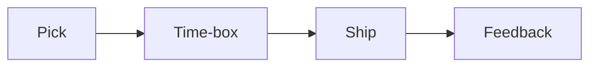

# 사이드 프로젝트와 학습

사이드 프로젝트를 시작할 때는 대개 아이디어가 너무 큽니다. 하지만 본업과 함께 가져가야 하는 프로젝트는 재미보다 지속 가능성이 더 중요하고, 멋진 비전보다 작게 끝내는 구조가 더 중요합니다.

이 글은 Developer Career 101 시리즈의 8번째 글입니다.

## 이 글에서 다룰 문제

- 본업과 충돌하지 않는 좋은 사이드 프로젝트는 어떤 조건을 가져야 할까요?
- 너무 큰 아이디어 대신 작은 MVP로 시작해야 하는 이유는 무엇일까요?
- 시간 박스, 공개, 피드백은 사이드 프로젝트를 어떻게 지속 가능하게 만들까요?
- 회사 자산, 지식재산권, 이해 충돌은 왜 초반부터 분리해서 생각해야 할까요?

## 이 글에서 배울 것

- 프로젝트를 고르는 기준
- 시간 박스 운영법
- 공개와 피드백 수집법
- 회사 업무와 분리하는 법
- 지속 가능성 전략

## 왜 중요한가

좋은 사이드 프로젝트는 학습과 증거를 동시에 남깁니다. 반대로 범위가 크고 경계가 모호하면 피로만 쌓이고 결과물이 남지 않기 쉽습니다.

> 사이드 프로젝트의 핵심은 대단한 아이디어가 아니라, 작게 끝내고 배움을 남기는 구조입니다.

## 핵심 개념 한눈에 보기



사이드 프로젝트는 길게 버티는 마라톤이 아닙니다. 아이디어를 고르고, 시간을 제한하고, 작게 내보내고, 피드백을 받아 다음 사이클로 넘어가는 구조가 있어야 지치지 않습니다.

## 핵심 용어

- **사이드 프로젝트**: 취미 또는 보조 성격의 개인 프로젝트입니다.
- **시간 박스**: 경계를 둔 시간 슬롯입니다.
- **MVP**: 최소 기능 제품입니다.
- 문라이팅: 공개하지 않은 부업입니다.
- **이해 충돌**: 의무가 충돌하는 상태입니다.

## Before/After

**Before**: “아이디어는 많지만 끝낸 것이 없습니다.”

**After**: “분기마다 작은 MVP 하나를 실제로 배포합니다.”

## 직접 해보기: 사이드 프로젝트 운영하기

### 1단계 — Pick the Idea

```text
criteria:
- interest
- learning value
- no conflict with day job
```

좋은 아이디어는 화려한 아이디어가 아닙니다. 흥미가 있고, 배울 것이 분명하며, 본업과 충돌하지 않아야 오래 가져갈 수 있습니다.

### 2단계 — Time Box

```text
4 hours/week (Sat 09-13)
```

사이드 프로젝트는 남는 시간에 하는 일이 아니라 미리 예약된 시간에 하는 일이어야 합니다. 시간을 무한정 쓰기 시작하면 건강과 본업 둘 다 흔들리기 쉽습니다.

### 3단계 — Define MVP

```markdown
- 1 core feature
- 1 command
- 1 README
```

MVP는 끝선을 만드는 장치입니다. 핵심 기능 하나와 최소한의 문서만으로도 첫 공개는 충분히 가능합니다.

### 4단계 — Publish

```bash
gh repo create --public
# README + LICENSE + first release
```

공개하지 않으면 피드백도 늦고 동기부여도 약해집니다. 작은 저장소라도 README와 LICENSE, 첫 릴리스를 남기면 프로젝트가 실제 자산으로 바뀝니다.

### 5단계 — Separation Policy

```text
- no company assets
- IP review with employer
```

본업과의 분리는 안전장치입니다. 회사 자산을 섞지 말고, 지식재산권 규정을 확인해 두어야 나중에 불필요한 문제를 피할 수 있습니다.

## 이 예시에서 먼저 볼 점

- 시간 박스가 지속 가능성을 만듭니다.
- MVP가 끝선을 만듭니다.
- 분리가 안전입니다.

## 자주 하는 실수 5가지

1. **회사 코드를 섞는 일입니다.**
2. **시간을 무한정 쓰는 일입니다.**
3. **MVP를 너무 크게 잡는 일입니다.**
4. **라이선스를 빼먹는 일입니다.**
5. **끝내 배포하지 않는 일입니다.**

## 실무에서는 이렇게 드러납니다

많은 회사가 고용 계약서에 오픈소스 기여나 개인 프로젝트 관련 규정을 명시합니다. 사이드 프로젝트는 학습 도구이면서 동시에 직업적 경계 감각을 시험하는 활동이기도 합니다.

## 시니어 엔지니어는 이렇게 생각합니다

- 작게 시작합니다.
- 배포가 동기부여를 만듭니다.
- 시간 박스가 건강을 지킵니다.
- 분리는 직업 안전입니다.
- 지속성이 결국 차이를 만듭니다.

## 체크리스트

- [ ] 주 4시간 시간 박스를 잡았습니다.
- [ ] MVP를 정의했습니다.
- [ ] 릴리스 절차를 정했습니다.
- [ ] 지식재산권 검토 기준을 확인했습니다.

## 연습 문제

1. 문라이팅을 한 줄로 설명해 보세요.
2. 이해 충돌 예시를 한 줄로 적어 보세요.
3. MVP 기준을 한 줄로 적어 보세요.

## 정리

좋은 사이드 프로젝트는 큰 꿈을 오래 품는 프로젝트가 아니라, 본업과 충돌하지 않는 범위 안에서 작게 만들고 실제로 끝내는 프로젝트입니다. 아이디어, 시간, 공개, 경계가 정리되면 사이드 프로젝트는 학습과 포트폴리오를 동시에 남겨 줍니다. 다음 글에서는 혼자 공부하는 한계를 넘기 위해 멘토링과 네트워킹을 어떻게 운영할지 정리하겠습니다.

<!-- toc:begin -->
- [개발자 커리어란 무엇인가](./01-what-is-developer-career.md)
- [직무 이해하기](./02-understanding-roles.md)
- [학습 계획 세우기](./03-learning-plan.md)
- [이력서와 포트폴리오](./04-resume-and-portfolio.md)
- [코딩 인터뷰 준비](./05-coding-interview.md)
- [시스템 디자인 인터뷰](./06-system-design-interview.md)
- [첫 직장 적응](./07-first-job.md)
- **사이드 프로젝트와 학습 (현재 글)**
- 멘토링과 네트워킹 (예정)
- 시니어로 가는 길 (예정)
<!-- toc:end -->

## 참고 자료

- [Side Project Marketing](https://sideprojectmarketing.com/)
- [Indie Hackers](https://www.indiehackers.com/)
- [Open Source IP policy](https://opensource.guide/legal/)
- [Time blocking](https://todoist.com/productivity-methods/time-blocking)

Tags: Career, SideProject, Learning, Portfolio, Beginner
