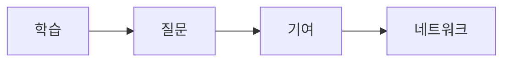

# 멘토링과 네트워킹

## 이 글에서 다룰 문제

- 좋은 멘토는 어떻게 찾고, 처음에는 어떤 방식으로 다가가야 할까요?
- 막연한 고민 대신 답을 얻기 쉬운 질문은 어떻게 준비해야 할까요?
- 커뮤니티, 컨퍼런스, 공개 글쓰기는 네트워크를 어떻게 넓혀 줄까요?
- 도움을 받는 사람에서 다시 도움을 주는 사람으로 넘어가는 과정은 왜 중요할까요?

> Developer Career 101 시리즈 (9/10)

혼자 공부하는 시간은 반드시 필요합니다. 다만 혼자만의 학습에는 분명한 한계가 있습니다. 내가 모르는 것을 내가 스스로 발견하기 어렵고, 비슷한 고민을 이미 겪은 사람의 조언이 있을 때 훨씬 빠르게 풀리는 문제가 많기 때문입니다.

멘토링과 네트워킹은 인맥 만들기 이벤트가 아닙니다. 질문을 더 잘하고, 기여를 통해 신뢰를 쌓고, 좋은 기회를 만날 확률을 높이는 장기적인 과정입니다. 이 글에서는 그 과정을 부담 없이 시작하는 방법을 정리하겠습니다.

## 왜 이 주제가 중요한가

연결은 학습의 지름길이 될 수 있습니다. 좋은 멘토 한 명, 꾸준히 참여하는 커뮤니티 하나, 공개적으로 남긴 글 몇 편이 예상보다 큰 기회를 가져다주기도 합니다. 반대로 아무 연결도 만들지 않으면, 같은 시행착오를 훨씬 오래 혼자 겪게 될 수 있습니다.

> 네트워크는 유명한 사람을 많이 아는 상태가 아니라, 서로 도움이 오갈 수 있는 신뢰의 연결망입니다.

## 핵심 개념 한눈에 보기



이 순서가 중요한 이유는 연결이 기여 없이 오래 가지 않기 때문입니다. 질문만 하는 관계보다, 작은 도움이라도 주고받는 관계가 훨씬 건강하고 오래갑니다. 네트워크는 단번에 생기지 않고, 학습과 기여가 쌓이며 형성됩니다.

## 핵심 용어

- **멘토**: 자신의 경험을 바탕으로 방향과 관점을 나누어 주는 사람입니다.
- **멘티**: 조언과 피드백을 받는 사람입니다.
- **오피스 아워**: 질문과 상담을 위해 정해 둔 시간입니다.
- **커뮤니티**: 공통 관심사로 모인 사람들의 집단입니다.
- **Paying it forward**: 받은 도움을 다른 사람에게 다시 돌려주는 태도입니다.

## Before / After

**Before**: 문서와 강의만 혼자 보며 막히는 문제를 오래 끌고 갑니다.

**After**: 멘토와 월 1회 대화하고, 커뮤니티에서 꾸준히 질문하고 답하며 연결을 넓힙니다.

## 직접 해보기: 네트워크 만들기

### 1단계 — 멘토 후보 적기

```text
- senior at work
- open source maintainer
- author of a blog you read
```

멘토는 거창한 사람이 아니어도 됩니다. 지금보다 몇 걸음 앞서 있는 사람, 내가 자주 참고하는 글을 쓰는 사람, 회사 안에서 좋은 협업 습관을 가진 선배도 충분히 좋은 후보입니다.

### 2단계 — 첫 메시지 준비하기

```text
Hi, I am interested in X and trying Y.
Could you spare 30 minutes to discuss Z?
```

좋은 첫 메시지는 짧고 구체적입니다. 무엇에 관심이 있고, 지금 무엇을 시도하고 있으며, 정확히 무엇을 묻고 싶은지 적으면 답을 받을 가능성이 훨씬 높아집니다.

### 3단계 — 커뮤니티 하나 고르기

```text
- pick one Discord/Slack
- post one helpful reply, twice a week
```

커뮤니티는 여러 곳을 얕게 도는 것보다 한 곳을 꾸준히 보는 편이 낫습니다. 질문만 하기보다 다른 사람 질문에 짧게라도 답해 보면 이름이 훨씬 빨리 기억됩니다.

### 4단계 — 컨퍼런스 후 기록 남기기

```bash
# write one recap within 24 hours of the conference
```

컨퍼런스는 듣는 자리에서 끝내지 않는 편이 좋습니다. 하루 안에 느낀 점과 배운 내용을 정리하면 기억이 남고, 온라인 연결고리도 자연스럽게 생깁니다.

### 5단계 — 온라인 존재감 만들기

```text
- GitHub README
- one blog post per month
- LinkedIn updates
```

온라인 존재감은 과장된 브랜딩이 아니라, 내가 무엇에 관심 있고 무엇을 배우는지 꾸준히 남기는 일에 가깝습니다. 작은 글과 업데이트가 기회를 연결하는 경우가 생각보다 많습니다.

## 이 예시에서 읽어야 할 포인트

- 준비된 질문은 답을 얻을 확률을 높입니다.
- 기여가 먼저 있을 때 연결은 더 건강해집니다.
- 꾸준함이 쌓여야 신뢰가 만들어집니다.

## 자주 하는 실수 5가지

1. **처음부터 멘토가 되어 달라고만 묻는 실수**: 관계가 형성되기 전에 요구부터 커집니다.
2. **질문이 너무 모호한 실수**: 상대가 어디서부터 답해야 할지 알기 어렵습니다.
3. **답례와 후속 공유가 없는 실수**: 관계가 일회성으로 끝납니다.
4. **하소연만 하는 실수**: 문제 정의 없이 감정만 쏟으면 도움을 주기 어렵습니다.
5. **공개 기록이 없는 실수**: 내가 무엇에 관심 있는지 외부에서 알기 어렵습니다.

## 실무에서는 이렇게 이어집니다

많은 회사가 멘토링 프로그램, 기술 길드, 사내 커뮤니티를 운영합니다. 개인이 바깥에서 네트워크를 만드는 방식과 크게 다르지 않습니다. 좋은 질문, 꾸준한 참여, 작은 기여가 결국 연결을 만듭니다.

## 시니어는 이렇게 생각합니다

- 연결은 시간이 갈수록 복리로 쌓입니다.
- 먼저 주는 태도가 중요합니다.
- 질문은 구체적일수록 좋습니다.
- 받은 도움은 다시 돌려주는 편이 좋습니다.
- 공개된 작업은 예상치 못한 기회를 엽니다.

## 체크리스트

- [ ] 멘토 후보 세 명을 적었다.
- [ ] 꾸준히 볼 커뮤니티 한 곳을 정했다.
- [ ] 월 1회 이상 공개 글이나 기록을 남기기로 했다.
- [ ] 도움을 받으면 감사와 후속 공유를 남기는 습관을 만들었다.

## 연습 문제

1. 멘토를 한 줄로 정의해 보세요.
2. paying it forward의 예시를 한 가지 적어 보세요.
3. 좋은 질문의 기준을 한 줄로 정리해 보세요.

## 정리 및 다음 글

멘토링과 네트워킹은 특별한 사람만 하는 활동이 아닙니다. 질문을 정리하고, 작은 기여를 남기고, 공개적으로 배움을 기록하는 사람이면 누구나 시작할 수 있습니다. 커리어가 길어질수록 이런 연결은 점점 더 큰 힘을 발휘합니다.

다음 글에서는 시리즈 마지막 주제로, 시니어 엔지니어로 성장할 때 실제로 어떤 행동이 달라져야 하는지 정리하겠습니다.

<!-- toc:begin -->
- [개발자 커리어란 무엇인가](./01-what-is-developer-career.md)
- [직무 이해하기](./02-understanding-roles.md)
- [학습 계획 세우기](./03-learning-plan.md)
- [이력서와 포트폴리오](./04-resume-and-portfolio.md)
- [코딩 인터뷰 준비](./05-coding-interview.md)
- [시스템 디자인 인터뷰](./06-system-design-interview.md)
- [첫 직장 적응](./07-first-job.md)
- [사이드 프로젝트와 학습](./08-side-projects.md)
- **멘토링과 네트워킹 (현재 글)**
- 시니어로 가는 길 (예정)
<!-- toc:end -->

## 참고 자료

- [The Mentor's Guide](https://www.lindajzachary.com/)
- [How to ask good questions](https://jvns.ca/blog/good-questions/)
- [CNCF Mentoring](https://github.com/cncf/mentoring)
- [Pay it Forward](https://en.wikipedia.org/wiki/Pay_it_forward)

Tags: Career, Mentoring, Networking, Community, Beginner
