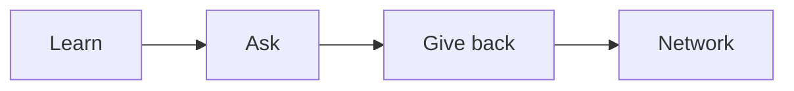

# 멘토링과 네트워킹

혼자 공부하는 기간이 길어지면 어느 순간 성장 속도가 둔해집니다. 문서를 읽고 강의를 듣는 일만으로는 실무 감각과 판단 기준을 빠르게 얻기 어렵기 때문입니다.

이 글은 Developer Career 101 시리즈의 9번째 글입니다.

## 이 글에서 다룰 문제

- 좋은 멘토는 어떻게 찾고, 처음에는 어떤 방식으로 다가가야 할까요?
- 막연한 고민 대신 답을 얻기 쉬운 질문은 어떻게 준비해야 할까요?
- 커뮤니티, 컨퍼런스, 공개 글쓰기는 네트워크를 어떻게 넓혀 줄까요?
- 도움을 받는 사람에서 다시 도움을 주는 사람으로 넘어가는 과정은 왜 중요할까요?

## 이 글에서 배울 것

- 멘토를 찾는 법
- 좋은 질문을 만드는 법
- 커뮤니티에 들어가는 법
- 컨퍼런스를 활용하는 법
- 온라인 존재감을 만드는 법

## 왜 중요한가

혼자 하는 학습에는 분명한 천장이 있습니다. 연결은 지름길이 될 수 있고, 때로는 문서 한 권보다 더 빠르게 실무 감각을 열어 줍니다.

> 네트워크는 유명한 사람을 많이 아는 상태가 아니라, 작은 기여와 꾸준한 접점 위에 쌓이는 신뢰의 연결망입니다.

## 핵심 개념 한눈에 보기



좋은 네트워크는 부탁만 하는 구조로 자라지 않습니다. 배우고, 구체적으로 묻고, 작은 도움을 되돌려 주는 흐름이 있어야 연결이 오래 갑니다.

## 핵심 용어

- 멘토: 경험을 나눠 주는 안내자입니다.
- 멘티: 조언을 받는 사람입니다.
- **오피스 아워**: 정해진 상담 시간입니다.
- 커뮤니티: 공통 관심사를 가진 집단입니다.
- **Paying it forward**: 다음 사람을 돕는 태도입니다.

## Before/After

**Before**: “문서를 혼자 읽는 데서 끝납니다.”

**After**: “월간 멘토 세션과 주간 커뮤니티 활동을 운영합니다.”

## 직접 해보기: 네트워크 만들기

### 1단계 — List Mentor Candidates

```text
- senior at work
- open source maintainer
- author of a blog you read
```

멘토는 거창한 사람이 아니어도 됩니다. 가까운 선배, 자주 읽는 글의 작성자, 오픈소스 메인테이너처럼 내가 배우고 싶은 기준을 가진 사람이면 충분합니다.

### 2단계 — Polite First Message

```text
Hi, I am interested in X and trying Y.
Could you spare 30 minutes to discuss Z?
```

첫 메시지는 짧고 구체적일수록 좋습니다. 무엇에 관심이 있고, 어떤 시도를 하고 있으며, 무엇을 묻고 싶은지 선명해야 답하기도 쉽습니다.

### 3단계 — Join a Community

```text
- pick one Discord/Slack
- post one helpful reply, twice a week
```

커뮤니티는 많이 가입하는 것보다 하나를 꾸준히 쓰는 편이 낫습니다. 질문만 하기보다 도움 되는 답변을 남기면 훨씬 빨리 신뢰가 쌓입니다.

### 4단계 — Conference Recap

```bash
# write one recap within 24 hours of the conference
```

컨퍼런스는 듣고 끝내면 효과가 빨리 사라집니다. 하루 안에 기록을 남기면 배운 내용이 정리되고, 나중에 다시 연결할 명분도 생깁니다.

### 5단계 — Online Presence

```text
- GitHub README
- one blog post per month
- LinkedIn updates
```

온라인 존재감은 거창한 브랜딩이 아닙니다. 내가 무엇을 배우고 만들고 있는지 꾸준히 보이는 정도만 되어도 기회가 생깁니다.

## 이 예시에서 먼저 볼 점

- 준비된 질문이 답을 끌어냅니다.
- 기여가 연결보다 먼저입니다.
- 꾸준함이 신뢰를 만듭니다.

## 자주 하는 실수 5가지

1. **처음부터 “멘토가 되어 주세요”라고 묻는 일입니다.**
2. **질문을 모호하게 던지는 일입니다.**
3. **후속 감사 인사를 하지 않는 일입니다.**
4. **불만만 쏟아내는 일입니다.**
5. **공개 기록을 전혀 남기지 않는 일입니다.**

## 실무에서는 이렇게 드러납니다

많은 회사가 멘토링 프로그램과 내부 길드, 커뮤니티를 운영합니다. 좋은 연결은 우연보다 구조에서 더 자주 만들어집니다.

## 시니어 엔지니어는 이렇게 생각합니다

- 연결은 복리로 쌓입니다.
- 먼저 주는 태도가 중요합니다.
- 질문은 구체적이어야 합니다.
- 받은 도움은 다음 사람에게 이어집니다.
- 공개 작업이 기회를 만듭니다.

## 체크리스트

- [ ] 멘토 후보 세 명을 적었습니다.
- [ ] 참여할 커뮤니티 하나를 골랐습니다.
- [ ] 월 1회 글쓰기 기준을 세웠습니다.
- [ ] 감사 인사 습관을 만들었습니다.

## 연습 문제

1. 멘토를 한 줄로 설명해 보세요.
2. Paying it forward의 예시를 한 줄로 적어 보세요.
3. 좋은 질문의 기준을 한 줄로 적어 보세요.

## 정리

멘토링과 네트워킹은 인맥을 넓히는 기술이 아니라, 배우고 묻고 기여하는 루프를 바깥으로 확장하는 과정입니다. 작은 기여와 구체적인 질문, 꾸준한 기록이 쌓이면 연결은 자연스럽게 기회가 됩니다. 다음 글에서는 이 시리즈의 마지막으로 시니어 엔지니어로 성장하는 길을 정리하겠습니다.

<!-- toc:begin -->
- [개발자 커리어란 무엇인가](./01-what-is-developer-career.md)
- [직무 이해하기](./02-understanding-roles.md)
- [학습 계획 세우기](./03-learning-plan.md)
- [이력서와 포트폴리오](./04-resume-and-portfolio.md)
- [코딩 인터뷰 준비](./05-coding-interview.md)
- [시스템 디자인 인터뷰](./06-system-design-interview.md)
- [첫 직장 적응](./07-first-job.md)
- [사이드 프로젝트와 학습](./08-side-projects.md)
- **멘토링과 네트워킹 (현재 글)**
- 시니어로 가는 길 (예정)
<!-- toc:end -->

## 참고 자료

- [The Mentor's Guide](https://www.lindajzachary.com/)
- [How to ask good questions](https://jvns.ca/blog/good-questions/)
- [CNCF Mentoring](https://github.com/cncf/mentoring)
- [Pay it Forward](https://en.wikipedia.org/wiki/Pay_it_forward)

Tags: Career, Mentoring, Networking, Community, Beginner
