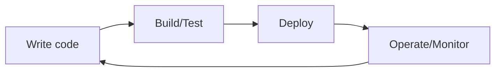

# What Is DevOps?

This is the first post in the DevOps 101 series.

> DevOps 101 series (1/10)

<!-- a-grade-intro:begin -->

**Core question**: Where does it start to go wrong when *the dev team* and *the ops team* keep *blaming each other*?

> DevOps is *not a tool* but *a culture* — a way of working where you *build together and own together*.

<!-- a-grade-intro:end -->

## What You Will Learn

- The definition of *DevOps* and the context that produced it
- The *pain* of the era when *Dev* and *Ops* were separated
- The *three principles* of DevOps
- The *minimum tools* to start with
- Five common pitfalls

## Why It Matters

Software produces no value when *only built*. It must be *deployed* and *operated* to reach users. *DevOps* is the practice of keeping that flow *unbroken*.

> *Fast deploys* and *stable operations* are *not in conflict*. They go together.

## Concept at a Glance



## Key Terms

- **Dev**: *Development*.
- **Ops**: *Operations*.
- **CI**: *Auto-integrate and validate* every commit.
- **CD**: *Auto-deploy* validated code.
- **SRE**: *Site Reliability Engineering*. The role that treats operations *as code*.

## Before/After

**Before (separated organizations)**

```text
- Dev team: "It works on my laptop"
- Ops team: "You broke it again"
- Deploys *once a quarter*, every time a *weekend overtime*
```

**After (DevOps)**

```text
- Every PR is merged after *passing CI*
- Capable of *dozens of deploys per day*
- Incidents are handled *together*; postmortems are run *together*
```

## Hands-on: Five Steps to Start with DevOps

### Step 1 - Git-based collaboration

```bash
git checkout -b feat/login
# after changes
git commit -m "feat(auth): add login form"
git push origin feat/login
# open a PR
```

### Step 2 - Automate CI

```yaml
# .github/workflows/ci.yml
on: [pull_request]
jobs:
  test:
    runs-on: ubuntu-latest
    steps:
      - uses: actions/checkout@v4
      - run: pytest
```

### Step 3 - Add one auto-deploy line

```yaml
deploy:
  needs: test
  if: github.ref == 'refs/heads/main'
  runs-on: ubuntu-latest
  steps:
    - run: ./deploy.sh
```

### Step 4 - Attach monitoring

```python
# a one-line health check
@app.get("/health")
def health(): return {"status": "ok"}
```

### Step 5 - Start incident postmortems

```text
- What happened
- Why was the discovery late
- How will we know faster next time
```

## What to Notice in This Code

- Start from *small automation*. It is not a grand transformation.
- *Dev and Ops* look at *the same repository*.
- Everything is expressed *as code*.

## Five Common Mistakes

1. **Making DevOps a *department name*.** It is *culture*, not an *org chart*.
2. **Adopting tools while *keeping the same process*.** Installing Jenkins is meaningless if you still ship quarterly.
3. **Pushing *all responsibility* onto ops.** *Own it together*.
4. **Over-investing in automation.** Do not build a *3-day automation* for a *one-shot task*.
5. **Blaming people after incidents.** Blame the *system*.

## How This Shows Up in Production

Successful teams start *small*. Auto tests on PRs -> auto deploy -> monitoring -> postmortem culture, settling in over *six months*.

## How a Senior Engineer Thinks

- *Every manual step* is an automation candidate.
- *Deploy frequency* is a *health indicator* of the organization.
- *Incidents are learning opportunities* for the system.
- *Dev and Ops* are *one team*.
- The *length of the feedback loop* decides everything.

## Checklist

- [ ] *Every PR* runs automated tests.
- [ ] A *main merge* triggers *automatic deployment*.
- [ ] Basic *monitoring* exists.
- [ ] *Postmortems* are held regularly.

## Practice Problems

1. List every *manual deploy step* in your project.
2. Mark *three of them* as automation candidates.
3. Summarize your *most recent incident* postmortem in *three sentences*.

## Wrap-up and Next Steps

DevOps is a *cultural shift*. In the next post we go deep on its first lever — the *CI pipeline*.

<!-- toc:begin -->
- **What Is DevOps? (current)**
- CI Pipeline (upcoming)
- CD and Deployment Strategies (upcoming)
- Environments and Configuration (upcoming)
- Infrastructure as Code (upcoming)
- Containers and Build (upcoming)
- Monitoring and Alerting (upcoming)
- Logging and Analysis (upcoming)
- Incident Response and On-Call (upcoming)
- An Operable DevOps Flow (upcoming)
<!-- toc:end -->

## References

- [The Phoenix Project (Gene Kim)](https://itrevolution.com/product/the-phoenix-project/)
- [Google SRE Book](https://sre.google/books/)
- [Atlassian DevOps Guide](https://www.atlassian.com/devops)
- [DORA State of DevOps](https://dora.dev/)

Tags: DevOps, Culture, CI, CD, Engineering
