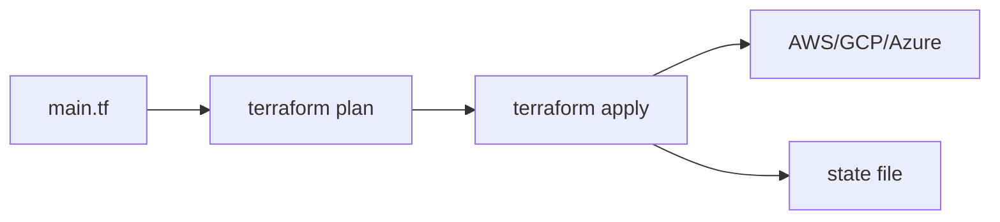

# Infrastructure as Code

This is post 5 in the DevOps 101 series.

> DevOps 101 series (5/10)

<!-- a-grade-intro:begin -->

**Core question**: Can you explain why a *server clicked together in the AWS console* *does not exist in another environment*?

> IaC turns *infrastructure into code* so it becomes *reproducible*.

<!-- a-grade-intro:end -->

## What You Will Learn

- The definition and benefits of *IaC*
- The basic *Terraform* workflow
- The meaning and management of the *state* file
- *Reuse* with *modules*
- Five common pitfalls

## Why It Matters

Console-built infrastructure exists *only in memory*. Replicating it elsewhere requires *clicking again*, and *drift* appears in between.

> *Code is the single source of truth (SSOT)*.

## Concept at a Glance



## Key Terms

- **IaC**: *Infrastructure as Code*. Define infrastructure *as code*.
- **Provider**: a cloud *adapter* like AWS or GCP.
- **Resource**: a *unit of creation* like an instance or bucket.
- **State**: a *record* of the current *real infrastructure*.
- **Module**: a *reusable bundle of infrastructure*.

## Before/After

**Before (console clicks)**

```text
- No record of *who* created what *when*
- Replicating to another region means *starting over*
- No change history
```

**After (Terraform)**

```hcl
# main.tf
resource "aws_s3_bucket" "logs" {
  bucket = "my-app-logs"
  tags   = { Env = "prod" }
}
```

## Hands-on: Five Steps with Terraform

### Step 1 - Define the provider

```hcl
terraform {
  required_providers {
    aws = { source = "hashicorp/aws", version = "~> 5.0" }
  }
}
provider "aws" { region = "us-east-1" }
```

### Step 2 - Write a resource

```hcl
resource "aws_s3_bucket" "logs" {
  bucket = "my-app-logs-${var.env}"
}
```

### Step 3 - Inspect the change with plan

```bash
terraform init
terraform plan
# Plan: 1 to add, 0 to change, 0 to destroy.
```

### Step 4 - Apply

```bash
terraform apply
# enters yes to actually create
```

### Step 5 - Reuse with modules

```hcl
module "vpc" {
  source = "terraform-aws-modules/vpc/aws"
  version = "5.0.0"
  cidr    = "10.0.0.0/16"
}
```

## What to Notice in This Code

- *Plan* before *apply* — execute only after the change is *visually confirmed*.
- *State* lives in a *remote backend* (S3, GCS).
- *Modules* keep *per-environment differences* in *variables only*.

## Five Common Mistakes

1. **Keeping state *locally*.** It conflicts with teammates and risks *loss*.
2. **Storing *secrets* in plain text in state.** Use S3 backend with KMS encryption.
3. **Manual changes in the console.** *Drift* appears.
4. **No automation for `apply`.** Manual runs invite *typos and accidents*.
5. **Running `destroy` *directly against production*.** Environment separation plus an approval gate is mandatory.

## How This Shows Up in Production

Mature teams automate *PR-based plan/apply* with *Terraform Cloud* or *Atlantis*. *Infrastructure review* becomes equivalent to *code review*.

## How a Senior Engineer Thinks

- *The console is read-only*. Changes go through *code only*.
- *State* requires *backups and locking*.
- *Modules* enforce *team standards*.
- *Plan diffs* are core information for *PR review*.
- *Tag policies* track *cost and ownership*.

## Checklist

- [ ] *All infrastructure* is defined in code.
- [ ] *State* lives in a *remote backend*.
- [ ] *Plan* is auto-rendered on *PRs*.
- [ ] *Tag policies* are enforced.

## Practice Problems

1. Create a single *S3 bucket* with *Terraform*.
2. Parameterize the same code with *variables* and apply it to *dev/prod*.
3. Configure *remote state* on S3 + DynamoDB.

## Wrap-up and Next Steps

IaC is *reproducible infrastructure*. In the next post we cover *containers*, which deliver reproducibility for the *application*.

<!-- toc:begin -->
- [What Is DevOps?](./01-what-is-devops.md)
- [CI Pipeline](./02-ci-pipeline.md)
- [CD and Deployment Strategies](./03-cd-and-deployment.md)
- [Environments and Configuration](./04-environments-and-config.md)
- **Infrastructure as Code (current)**
- Containers and Build (upcoming)
- Monitoring and Alerting (upcoming)
- Logging and Analysis (upcoming)
- Incident Response and On-Call (upcoming)
- An Operable DevOps Flow (upcoming)
<!-- toc:end -->

## References

- [Terraform docs](https://developer.hashicorp.com/terraform)
- [Terraform AWS Modules](https://registry.terraform.io/namespaces/terraform-aws-modules)
- [Atlantis](https://www.runatlantis.io/)
- [HashiCorp — IaC](https://www.hashicorp.com/resources/what-is-infrastructure-as-code)

Tags: DevOps, IaC, Terraform, Cloud, Automation
