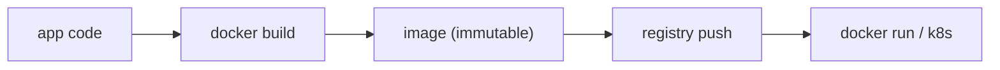

# Containers and Build

> DevOps 101 series (6/10)

<!-- a-grade-intro:begin -->

**Core question**: What is the *only way* to make *your laptop* and *the server* produce *the same result*?

> Containers freeze *the environment itself* into an *image*.

<!-- a-grade-intro:end -->

## What You Will Learn

- The difference between *containers* and *VMs*
- The core *Dockerfile* commands
- Shrinking images with *multi-stage builds*
- Leveraging *layer caching*
- Five common pitfalls

## Why It Matters

The same build artifact must *behave the same* in *every environment*. Containers bundle *OS libraries, dependencies, and code* into *a single unit*.

> Containers realize *Build once, run anywhere*.

## Concept at a Glance



## Key Terms

- **Image**: an *immutable executable package*.
- **Container**: a running *instance of an image*.
- **Dockerfile**: an image *build recipe*.
- **Layer**: a *read-only stratum* per command.
- **Registry**: an image store (Docker Hub, ECR, etc.).

## Before/After

**Before (host-dependent)**

```bash
# Install directly on the server
apt install python3.12 postgresql-client
pip install -r requirements.txt
# On another server, *versions differ*
```

**After (Dockerfile)**

```dockerfile
FROM python:3.12-slim
WORKDIR /app
COPY requirements.txt .
RUN pip install --no-cache-dir -r requirements.txt
COPY . .
CMD ["uvicorn", "main:app", "--host", "0.0.0.0"]
```

## Hands-on: Five Dockerfile Steps

### Step 1 - Basic build

```bash
docker build -t myapp:1.0 .
docker run -p 8000:8000 myapp:1.0
```

### Step 2 - Optimize the layer cache

```dockerfile
COPY requirements.txt .          # rare changes -> cache reuse
RUN pip install -r requirements.txt
COPY . .                          # only the code changes often
```

### Step 3 - Shrink with multi-stage

```dockerfile
FROM python:3.12 AS builder
COPY requirements.txt .
RUN pip install --user -r requirements.txt

FROM python:3.12-slim
COPY --from=builder /root/.local /root/.local
COPY . /app
WORKDIR /app
CMD ["python", "main.py"]
```

### Step 4 - Non-root user

```dockerfile
RUN useradd --create-home appuser
USER appuser
```

### Step 5 - Healthcheck

```dockerfile
HEALTHCHECK CMD curl -f http://localhost:8000/health || exit 1
```

## What to Notice in This Code

- Put commands with *low change frequency* *higher up*.
- Reduce the *attack surface* with *slim/distroless* images.
- *Non-root* is the *default*.

## Five Common Mistakes

1. **Using the `latest` tag.** *Not reproducible*. Always *pin a version*.
2. **`COPY . .` *at the start*.** Cache invalidation means *every build starts over*.
3. **Baking secrets *into the image*.** `docker history` *extracts* them.
4. **Running as root.** Container escape *risks the host*.
5. **Images over *1GB*.** *push/pull* gets slow and *cold starts* lengthen.

## How This Shows Up in Production

Mature teams wire *distroless* + *SBOM generation* + *image signing (cosign)* + *vulnerability scans (Trivy)* into the *CI pipeline*.

## How a Senior Engineer Thinks

- *Images are immutable*. Change = *new image*.
- *Smaller is safer*. Prefer distroless.
- *.dockerignore* matters as much as *.gitignore*.
- *Build speed* is *development speed*. Defend the cache.
- *Image signing* protects the *supply chain*.

## Checklist

- [ ] The *Dockerfile* ends as *non-root*.
- [ ] *Multi-stage* keeps the *final image* small.
- [ ] *.dockerignore* excludes *.git, tests, docs*.
- [ ] *Vulnerability scanning* is in CI.

## Practice Problems

1. Reduce your app's *final image size* to *under 200MB*.
2. Compare *build times* before and after applying *multi-stage*.
3. Audit *HIGH/CRITICAL* vulnerabilities with *Trivy*.

## Wrap-up and Next Steps

A container is *a frozen environment*. In the next post we cover how to *monitor* containers in production.

<!-- toc:begin -->
- [What Is DevOps?](./01-what-is-devops.md)
- [CI Pipeline](./02-ci-pipeline.md)
- [CD and Deployment Strategies](./03-cd-and-deployment.md)
- [Environments and Configuration](./04-environments-and-config.md)
- [Infrastructure as Code](./05-infrastructure-as-code.md)
- **Containers and Build (current)**
- Monitoring and Alerting (upcoming)
- Logging and Analysis (upcoming)
- Incident Response and On-Call (upcoming)
- An Operable DevOps Flow (upcoming)
<!-- toc:end -->

## References

- [Docker docs](https://docs.docker.com/)
- [Distroless images](https://github.com/GoogleContainerTools/distroless)
- [Trivy](https://trivy.dev/)
- [Sigstore Cosign](https://docs.sigstore.dev/cosign/overview/)

Tags: DevOps, Docker, Container, Build, Image
