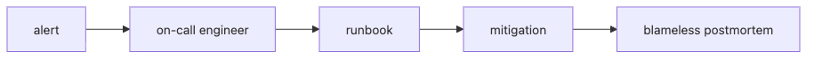

# Incident Response and On-Call

Incidents rarely become chaotic because the engineers are weak. They become chaotic because roles are unclear, runbooks are missing, and the same person tries to diagnose, mitigate, communicate, and document at the same time.

A good incident process reduces cognitive load before the alert even fires. Severity levels, on-call rotations, incident commanders, and postmortems give the team a repeatable way to recover under pressure.

This is post 9 in the DevOps 101 series. In this chapter, we turn incident response into an operational system with severity definitions, runbooks, escalation rules, and blameless follow-up.

## Questions this article answers

- When an *alert* fires at *3 AM*, who should do what first?
- How should teams define incident *severity (SEV)* levels so everyone responds with the same language?
- Why is an *on-call rotation* an operating design decision rather than just a schedule?
- How do *runbooks* and the *incident commander* role change real recovery speed?
- How does a *blameless postmortem* actually connect to preventing recurrence?

## Why It Matters

Incidents are an *organizational* problem more than a *technical* one. Without *roles* and *procedures*, people *panic* and *repeat* the same mistakes.

> *Process* is a substitute for *memory*.

## Concept at a Glance



*Concept at a Glance*

## Key Terms

- **SEV1 to SEV4**: severity from *1 (company-wide outage)* to *4 (minor)*.
- **On-call**: the engineer who *receives alerts* during a shift.
- **Runbook**: a *symptom -> diagnosis -> action* document.
- **Incident commander (IC)**: the person who *coordinates* during an incident.
- **Postmortem**: the *after-action* document.
- **MTTD/MTTR**: mean time to *detect/recover*.

## Before/After

**Before**: an alert fires, somebody yells *"who is on this?"* in Slack, and *everyone fixes things at once* and breaks more.

**After**: *one on-call* applies a *runbook* to *mitigate*, then an *IC* coordinates and the team holds a *postmortem*.

## Hands-on: Five Incident Steps

### Step 1 — Define severity (SEV)

```text
SEV1: company-wide outage     | respond immediately
SEV2: core feature degraded   | within 30 min
SEV3: partial degradation     | within business day
SEV4: low-impact bug          | backlog
```

### Step 2 — On-call rotation

```yaml
rotation:
  schedule: weekly
  primary: [alice, bob, carol]
  secondary: [dave, erin]
  handoff: "Mondays 10:00, hand off open incidents"
```

### Step 3 — Runbook template

```markdown
# Runbook: API 500 spike

## Symptoms
- /api/* 5xx ratio above 5%

## Diagnosis
1. Open the Grafana "API Errors" dashboard
2. Check recent logs: {service="api", level="error"}

## Mitigation
- If a recent deploy is suspect: `kubectl rollout undo deploy/api`

## Escalation
- If unresolved in 30 min, page IC in #incident channel
```

### Step 4 — Incident commander role

```text
IC = decision maker. Does NOT fix things directly.
- Single source of communication
- Assigns roles (investigator/comms/scribe)
- Decides on external announcements
```

### Step 5 — Blameless postmortem

```markdown
# Postmortem: 2026-05-04 API outage

- Impact: 12 minutes at 30% 5xx
- Timeline: 03:11 alert -> 03:18 rollback -> 03:23 recovery
- Root cause: typo in feature flag default
- Prevention: add flag-validation checklist to PR template
```

## The First 15 Minutes Set the Direction

Incident response is often decided less by deep expertise than by the order of actions in the first few minutes. Without a shared sequence, teams may perform technically correct work while still stretching recovery time through confusion.

```text
0-3m   Acknowledge the page, assign SEV, open the incident channel
3-5m   Start the runbook, check recent deploys and config changes
5-8m   Estimate customer impact and possible mitigations
8-12m  Assign an IC, split roles, decide on external communication
12-15m Execute mitigation or escalate further
```

This order helps because it separates technical recovery from coordination. The engineer debugging the system should not also be the only person maintaining shared situational awareness.

## What Good Postmortems Produce

The quality of a postmortem is visible in its outputs, not just its tone. A strong postmortem leaves at least three things behind: a reproducible timeline, a prevention or detection improvement, and action items with owners and deadlines.

If the root cause was a bad feature-flag default, for example, the system should change in concrete ways:

- add a flag-validation checkbox to the PR template
- include default-flag validation in smoke tests
- review existing flag defaults within a fixed time window

That is how incidents become system improvement instead of archived storytelling.

## What to Notice in This Code

- We *fix the system and the process*, not the person.
- *Runbooks live next to the code*, where they stay current.
- *Action items* must have an *owner* and a *deadline*.

## Five Common Mistakes

1. **Naming *people* in postmortems.** Trust collapses.
2. **Runbooks buried *deep in a wiki*.** No one finds them at 3 AM.
3. **Too many alerts.** Alert fatigue makes you *miss the real ones*.
4. **A *junior alone* on-call.** Always pair them.
5. **No action items after an incident.** The same incident *repeats*.

## How This Shows Up in Production

Mature teams attach a *runbook URL* to every alert so on-call engineers start the procedure with *one click*. PagerDuty/Opsgenie expose a *runbook URL* field for exactly this.

## How a Senior Engineer Thinks

- *Alert quality* determines *team sleep*.
- *Every SEV1* gets *a postmortem*.
- *Blameless* is non-negotiable.
- *Action items* are tracked as *tickets*.
- *MTTR* shrinks only when you *measure it*.

## Checklist

- [ ] *SEV definitions* are documented.
- [ ] *On-call rotation* is automated.
- [ ] *Runbooks* are linked from alerts.
- [ ] A *postmortem template* exists.

## Practice Problems

1. Write a *runbook* for your most common incident.
2. Agree *SEV definitions* with your team and document them.
3. Write a *blameless postmortem* for one recent incident.

## Wrap-up and Next Steps

Incident response is a combined *technical and organizational* skill. The final post wraps the whole DevOps flow into a single picture.

<!-- toc:begin -->
- [What is DevOps?](./01-what-is-devops.md)
- [The CI Pipeline](./02-ci-pipeline.md)
- [CD and Deployment Strategies](./03-cd-and-deployment.md)
- [Environments and Configuration](./04-environments-and-config.md)
- [Infrastructure as Code](./05-infrastructure-as-code.md)
- [Containers and Builds](./06-containers-and-build.md)
- [Monitoring and Alerting](./07-monitoring-and-alerting.md)
- [Logging and Analysis](./08-logging-and-analysis.md)
- **Incident Response and On-Call (current)**
- An Operable DevOps Flow (upcoming)
<!-- toc:end -->

## References

- [Google SRE Book — Managing Incidents](https://sre.google/sre-book/managing-incidents/)
- [PagerDuty Incident Response](https://response.pagerduty.com/)
- [Atlassian Postmortem Template](https://www.atlassian.com/incident-management/postmortem/templates)
- [Blameless Postmortems (Etsy)](https://www.etsy.com/codeascraft/blameless-postmortems/)

Tags: DevOps, Incident, OnCall, SRE, Postmortem
