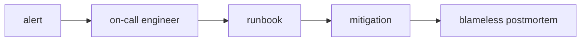

# Incident Response and On-Call

This is post 9 in the DevOps 101 series.

> DevOps 101 series (9/10)

<!-- a-grade-intro:begin -->

**Core question**: When a page fires at 3 AM, *who does what, and how*?

> *Incidents will happen.* The difference is *how fast and how calmly* you recover.

<!-- a-grade-intro:end -->

## What You Will Learn

- How to classify *severity (SEV)*
- How to design an *on-call rotation*
- How to write a *runbook*
- How to run a *blameless postmortem*
- The meaning of *MTTR/MTTD*

## Why It Matters

Incidents are an *organizational* problem more than a *technical* one. Without *roles* and *procedures*, people *panic* and *repeat* the same mistakes.

> *Process* is a substitute for *memory*.

## Concept at a Glance



## Key Terms

- **SEV1 to SEV4**: severity from *1 (company-wide outage)* to *4 (minor)*.
- **On-call**: the engineer who *receives alerts* during a shift.
- **Runbook**: a *symptom -> diagnosis -> action* document.
- **Incident commander (IC)**: the person who *coordinates* during an incident.
- **Postmortem**: the *after-action* document.
- **MTTD/MTTR**: mean time to *detect/recover*.

## Before/After

**Before**: an alert fires, somebody yells *"who is on this?"* in Slack, and *everyone fixes things at once* and breaks more.

**After**: *one on-call* applies a *runbook* to *mitigate*, then an *IC* coordinates and the team holds a *postmortem*.

## Hands-on: Five Incident Steps

### Step 1 — Define severity (SEV)

```text
SEV1: company-wide outage     | respond immediately
SEV2: core feature degraded   | within 30 min
SEV3: partial degradation     | within business day
SEV4: low-impact bug          | backlog
```

### Step 2 — On-call rotation

```yaml
rotation:
  schedule: weekly
  primary: [alice, bob, carol]
  secondary: [dave, erin]
  handoff: "Mondays 10:00, hand off open incidents"
```

### Step 3 — Runbook template

```markdown
# Runbook: API 500 spike

## Symptoms
- /api/* 5xx ratio above 5%

## Diagnosis
1. Open the Grafana "API Errors" dashboard
2. Check recent logs: {service="api", level="error"}

## Mitigation
- If a recent deploy is suspect: `kubectl rollout undo deploy/api`

## Escalation
- If unresolved in 30 min, page IC in #incident channel
```

### Step 4 — Incident commander role

```text
IC = decision maker. Does NOT fix things directly.
- Single source of communication
- Assigns roles (investigator/comms/scribe)
- Decides on external announcements
```

### Step 5 — Blameless postmortem

```markdown
# Postmortem: 2026-05-04 API outage

- Impact: 12 minutes at 30% 5xx
- Timeline: 03:11 alert -> 03:18 rollback -> 03:23 recovery
- Root cause: typo in feature flag default
- Prevention: add flag-validation checklist to PR template
```

## What to Notice in This Code

- We *fix the system and the process*, not the person.
- *Runbooks live next to the code*, where they stay current.
- *Action items* must have an *owner* and a *deadline*.

## Five Common Mistakes

1. **Naming *people* in postmortems.** Trust collapses.
2. **Runbooks buried *deep in a wiki*.** No one finds them at 3 AM.
3. **Too many alerts.** Alert fatigue makes you *miss the real ones*.
4. **A *junior alone* on-call.** Always pair them.
5. **No action items after an incident.** The same incident *repeats*.

## How This Shows Up in Production

Mature teams attach a *runbook URL* to every alert so on-call engineers start the procedure with *one click*. PagerDuty/Opsgenie expose a *runbook URL* field for exactly this.

## How a Senior Engineer Thinks

- *Alert quality* determines *team sleep*.
- *Every SEV1* gets *a postmortem*.
- *Blameless* is non-negotiable.
- *Action items* are tracked as *tickets*.
- *MTTR* shrinks only when you *measure it*.

## Checklist

- [ ] *SEV definitions* are documented.
- [ ] *On-call rotation* is automated.
- [ ] *Runbooks* are linked from alerts.
- [ ] A *postmortem template* exists.

## Practice Problems

1. Write a *runbook* for your most common incident.
2. Agree *SEV definitions* with your team and document them.
3. Write a *blameless postmortem* for one recent incident.

## Wrap-up and Next Steps

Incident response is a combined *technical and organizational* skill. The final post wraps the whole DevOps flow into a single picture.

<!-- toc:begin -->
- [What is DevOps?](./01-what-is-devops.md)
- [The CI Pipeline](./02-ci-pipeline.md)
- [CD and Deployment Strategies](./03-cd-and-deployment.md)
- [Environments and Configuration](./04-environments-and-config.md)
- [Infrastructure as Code](./05-infrastructure-as-code.md)
- [Containers and Builds](./06-containers-and-build.md)
- [Monitoring and Alerting](./07-monitoring-and-alerting.md)
- [Logging and Analysis](./08-logging-and-analysis.md)
- **Incident Response and On-Call (current)**
- An Operable DevOps Flow (upcoming)
<!-- toc:end -->

## References

- [Google SRE Book — Managing Incidents](https://sre.google/sre-book/managing-incidents/)
- [PagerDuty Incident Response](https://response.pagerduty.com/)
- [Atlassian Postmortem Template](https://www.atlassian.com/incident-management/postmortem/templates)
- [Blameless Postmortems (Etsy)](https://www.etsy.com/codeascraft/blameless-postmortems/)

Tags: DevOps, Incident, OnCall, SRE, Postmortem
