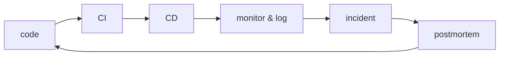

# An Operable DevOps Flow

> DevOps 101 series (10/10)

<!-- a-grade-intro:begin -->

**Core question**: Does *Code -> CI -> CD -> Monitor -> Incident -> Postmortem* close as a *feedback loop*?

> *DevOps* is *a flow*, not *a toolbox*.

<!-- a-grade-intro:end -->

## What You Will Learn

- The *whole flow* that ties this series together
- The *four DORA metrics* and how to measure them
- *Team rituals* that keep the flow alive
- A *next-step learning path* (Observability / SRE / Kubernetes)

## Why It Matters

Adopting tools *one by one* creates *islands*. Only when they connect as a *flow* do you get *speed and stability* together.

> What is *not measured* is *not improved*.

## Concept at a Glance



## Key Terms

- **DORA metrics**: the *four metrics* from Google's research.
- **Deploy frequency**: *how often* you deploy.
- **Lead time for changes**: time from merge to production.
- **Change failure rate**: percentage of deploys that *cause incidents*.
- **MTTR**: mean time to *recover*.
- **Ritual**: a recurring *team meeting* with a clear purpose.

## Before/After

**Before**: build, deploy, and monitoring run *separately* and no one looks at the *whole picture*.

**After**: a *single dashboard* shows the *four DORA metrics* and the team reviews it weekly.

## Hands-on: Build the Flow in 5 Steps

### Step 1 — Draw the flow on one page

```text
On a single sheet of paper:
PR -> CI -> staging -> prod -> alert -> on-call -> postmortem
For each step, write the *owner* and the *tool*.
```

### Step 2 — Start measuring DORA

```python
# Simplest start: create a GitHub Release on every deploy.
# Even hand-tracking these four numbers weekly is enough.
metrics = {
    "deploy_frequency": "5 per week",
    "lead_time": "6 hours average",
    "change_failure_rate": "8%",
    "mttr": "22 minutes",
}
```

### Step 3 — Weekly ritual: deploy review (30 min)

```text
- Last week's deploy count
- One incident summary from last week
- This week's risky deploys
```

### Step 4 — Monthly ritual: postmortem reading (60 min)

```text
- Read the month's postmortems together
- Track the action-item completion rate
- When patterns appear, change the *system*
```

### Step 5 — Quarterly: choose the next step

```text
- Pick the next learning track
- Add or remove tools
- Propose org-structure changes
```

## What to Notice in This Code

- *Metrics can start by hand*. Automate them later.
- *Rituals* are *short and recurring*.
- The team *learns* the moment the *feedback loop closes*.

## Five Common Mistakes

1. **Adopting *tools first*.** Without a flow, tools become *islands*.
2. **Watching only *MTTR* of the four DORA metrics.** Watch all four for *balance*.
3. **Not *reading postmortems*.** The same incidents *repeat*.
4. **Long, ceremonial rituals.** Keep them *short and data-driven*.
5. **No owner for improvement.** Decide *who owns the flow*.

## How This Shows Up in Production

Mature organizations have a *platform team* that ships an *internal developer platform (IDP)* exposing the flow as *self-service*. Every new service inherits the *same flow* for free.

## How a Senior Engineer Thinks

- *The flow is the architecture*.
- Without metrics, debate is just *opinion*.
- *Small rituals* drive *large change*.
- *Platformization* is the next step.
- *Learning never stops* — pick the next series.

## Checklist

- [ ] The *whole flow* is on *one diagram*.
- [ ] The team reviews the *four DORA metrics* weekly.
- [ ] *Weekly and monthly rituals* are scheduled.
- [ ] The *flow has an owner*.

## Practice Problems

1. Draw your team's *Code -> Postmortem* flow.
2. Hand-measure the *four DORA metrics* for one week.
3. Run one 30-minute *weekly deploy review*.

## Wrap-up and Next Steps

This concludes DevOps 101. Suggested learning paths next:

- **Observability 101** — combining metrics, logs, and traces
- **SRE 101** — operating reliability with SLO/SLI and error budgets
- **Kubernetes 101** — a serious entry into container orchestration

> *DevOps* is not a *collection of tools* but *the way a team learns*.

<!-- toc:begin -->
- [What is DevOps?](./01-what-is-devops.md)
- [The CI Pipeline](./02-ci-pipeline.md)
- [CD and Deployment Strategies](./03-cd-and-deployment.md)
- [Environments and Configuration](./04-environments-and-config.md)
- [Infrastructure as Code](./05-infrastructure-as-code.md)
- [Containers and Builds](./06-containers-and-build.md)
- [Monitoring and Alerting](./07-monitoring-and-alerting.md)
- [Logging and Analysis](./08-logging-and-analysis.md)
- [Incident Response and On-Call](./09-incident-and-oncall.md)
- **An Operable DevOps Flow (current)**
<!-- toc:end -->

## References

- [DORA Research Program](https://dora.dev/)
- [Google SRE Workbook](https://sre.google/workbook/table-of-contents/)
- [Accelerate (book)](https://itrevolution.com/product/accelerate/)
- [Team Topologies](https://teamtopologies.com/)

Tags: DevOps, DORA, Strategy, Capstone, Engineering
