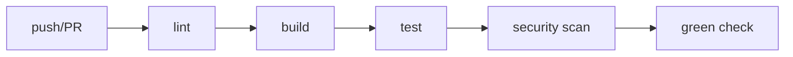

# CI 파이프라인

> DevOps 101 시리즈 (2/10)


## 이 글에서 다룰 문제

테스트만으로는 부족합니다. *린트, 타입, 보안 스캔*까지 *한 흐름*으로 묶어야 주관이 끼어들지 않습니다.

> CI 없는 PR은 희망회로입니다.

## 전체 흐름


## Before/After

**Before (수동 검증)**

```text
- 리뷰어가 *체크아웃 후 직접 빌드*
- 누가 빠뜨리면 *빨간 코드* 가 main에 진입
```

**After (CI 파이프라인)**

```yaml
on: [pull_request]
jobs:
  lint:
    runs-on: ubuntu-latest
    steps:
      - uses: actions/checkout@v4
      - run: ruff check .
  test:
    needs: lint
    runs-on: ubuntu-latest
    steps:
      - uses: actions/checkout@v4
      - run: pytest
```

## 파이프라인 5단계

### 1단계 — Lint (가장 빠름, 먼저)

```yaml
- run: ruff check .
- run: ruff format --check .
```

### 2단계 — Type check

```yaml
- run: mypy src/
```

### 3단계 — Build

```yaml
- run: python -m build
- uses: actions/upload-artifact@v4
  with: { name: dist, path: dist/ }
```

### 4단계 — Test (병렬)

```yaml
strategy:
  matrix:
    shard: [1, 2, 3, 4]
steps:
  - run: pytest --shard ${{ matrix.shard }}/4
```

### 5단계 — Security scan

```yaml
- uses: aquasecurity/trivy-action@master
  with: { scan-type: fs, severity: HIGH,CRITICAL }
```

## 이 코드에서 주목할 점

- *빠른 단계*가 먼저 와야 *빠른 실패*가 가능합니다.
- 단계 간 *artifact* 로 *재빌드 비용* 을 줄입니다.
- 보안 스캔은 *마지막 게이트* 로 둡니다.

## 자주 하는 실수 5가지

1. **모든 단계를 직렬로 처리하기.** 병렬화로 *50%*까지 단축 가능합니다.
2. **린트를 마지막에 두기.** 30분 빌드 후 *공백 1줄*로 빨간색이 뜹니다.
3. **CI에서만 *동작하는 환경*.** 로컬 재현이 어려워 *디버깅 지옥*.
4. **Required check 미설정.** 빨간 PR이 *그냥 머지* 됩니다.
5. **로그가 *너무 길어* 원인 못 찾음.** *요약 단계* 를 추가하세요.

## 실무에서는 이렇게 쓰입니다

큰 모노레포는 *변경된 패키지만* 빌드/테스트하는 *영향 분석* 을 적용합니다. Bazel, Nx, Turbo 등이 대표적입니다.

## 체크리스트

- [ ] *Lint, type, test, scan* 이 모두 있다.
- [ ] *Required check* 가 설정되어 있다.
- [ ] *피드백 5분* 이내.
- [ ] *artifact* 로 단계가 연결된다.

## 정리 및 다음 단계

CI 파이프라인은 *합격선의 코드화* 입니다. 다음 글에서는 *통과한 코드* 를 어떻게 *안전하게 배포* 할지 다룹니다.

<!-- toc:begin -->
- [DevOps란 무엇인가?](./01-what-is-devops.md)
- **CI 파이프라인 (현재 글)**
- CD와 배포 전략 (예정)
- 환경 분리와 설정 관리 (예정)
- Infrastructure as Code (예정)
- 컨테이너와 빌드 (예정)
- 모니터링과 알림 (예정)
- 로그 수집과 분석 (예정)
- 장애 대응과 on-call (예정)
- 운영 가능한 DevOps 흐름 (예정)
<!-- toc:end -->

## 참고 자료

- [GitHub Actions docs](https://docs.github.com/en/actions)
- [Martin Fowler — Continuous Integration](https://martinfowler.com/articles/continuousIntegration.html)
- [Trivy](https://trivy.dev/)
- [Bazel](https://bazel.build/)

Tags: DevOps, CI, GitHub Actions, Automation, Pipeline
