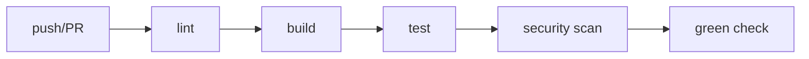

# CI 파이프라인

이 글은 DevOps 101 시리즈의 두 번째 글입니다.

## 이 글에서 다룰 문제

- CI 파이프라인은 단순한 테스트 자동화와 어떻게 다를까요?
- build, test, lint, scan 단계를 왜 한 흐름으로 묶어야 할까요?
- 빠른 피드백을 주는 파이프라인은 어떤 순서로 설계해야 할까요?
- 실패한 빌드가 팀에 분명한 신호가 되려면 무엇이 필요할까요?
- CI를 도입하고도 실무에서 자주 무너지는 패턴은 무엇일까요?

> **멘탈 모델**: CI 파이프라인은 팀의 합격선을 자동화한 장치입니다. PR마다 같은 기준을 같은 순서로 적용해서, 누가 리뷰하든 최소 품질선이 흔들리지 않게 만듭니다.

## 왜 중요한가

테스트만 자동화한다고 품질이 보장되지는 않습니다. 린트, 타입 검사, 보안 스캔까지 하나의 흐름으로 묶여 있어야 팀의 취향이 아니라 시스템 기준으로 코드를 통과시킬 수 있습니다.

운영 관점에서도 CI는 매우 중요합니다. 빌드가 깨진 상태의 코드를 main에 넣는 순간부터 배포와 장애 대응 비용이 급격히 커지기 때문입니다. CI는 뒤쪽 운영 비용을 앞단의 자동 검증으로 바꾸는 장치입니다.

> CI 없는 PR은 아직 검증되지 않은 가정에 가깝습니다.

## 한눈에 보는 개념



좋은 CI 파이프라인은 단순히 단계를 많이 붙이는 것이 아니라, 빠르게 실패시키고 명확하게 통과시키는 순서를 가집니다. 가장 싼 검사를 앞에 두고, 더 무거운 검사는 뒤로 보내는 이유가 여기에 있습니다.

## 핵심 용어

- **Pipeline**: 여러 검증 단계를 순서대로 묶은 자동화 흐름입니다.
- **Stage**: build, test, lint처럼 파이프라인 안의 논리적 단계입니다.
- **Job**: 실제로 실행되는 작업 단위입니다. 필요하면 병렬화할 수 있습니다.
- **Artifact**: 단계 사이에서 전달되는 파일 산출물입니다.
- **Status check**: PR 머지 가능 여부를 결정하는 최종 신호입니다.

실무에서 이 용어들이 중요한 이유는 역할을 분리하기 쉽기 때문입니다. 예를 들어 빌드 실패와 테스트 실패를 구분해 보여 주면 원인 파악 속도가 크게 빨라집니다.

## Before/After

**Before (수동 검증)**

```text
- Reviewers *check out and build manually*
- If anyone forgets, *red code* lands on main
```

이 구조에서는 리뷰어마다 기준이 달라지고, 누군가 놓친 검사가 그대로 main에 들어갑니다. 결국 문제는 나중 배포나 운영 단계에서 더 비싸게 드러납니다.

**After (CI pipeline)**

```yaml
on: [pull_request]
jobs:
  lint:
    runs-on: ubuntu-latest
    steps:
      - uses: actions/checkout@v4
      - run: ruff check .
  test:
    needs: lint
    runs-on: ubuntu-latest
    steps:
      - uses: actions/checkout@v4
      - run: pytest
```

PR가 열릴 때마다 같은 파이프라인이 자동으로 돌면, 코드 품질은 특정 리뷰어의 성실성보다 팀 시스템의 일관성에 더 의존하게 됩니다.

## 실전으로 보는 파이프라인 5단계

### 1단계 - Lint (가장 빠르고 가장 먼저)

가장 빨리 끝나는 검사를 먼저 둬야 불필요한 빌드 시간을 줄일 수 있습니다. 공백 하나 때문에 30분짜리 테스트를 돌리는 구조는 좋은 CI가 아닙니다.

```yaml
- run: ruff check .
- run: ruff format --check .
```

### 2단계 - 타입 검사

테스트는 통과해도 타입 수준의 결함은 숨어 있을 수 있습니다. 특히 Python처럼 런타임 오류가 늦게 드러나기 쉬운 언어에서는 타입 검사가 빠른 안전망 역할을 합니다.

```yaml
- run: mypy src/
```

### 3단계 - 빌드

실행 가능한 산출물을 실제로 만들어 보는 단계입니다. 코드가 컴파일되거나 패키징되는지 확인해야 이후 배포 단계에서 놀라지 않습니다.

```yaml
- run: python -m build
- uses: actions/upload-artifact@v4
  with: { name: dist, path: dist/ }
```

### 4단계 - 테스트 (병렬)

테스트는 보통 가장 오래 걸립니다. 그래서 shard를 나누거나 job을 병렬화해서 피드백 시간을 줄이는 설계가 중요합니다.

```yaml
strategy:
  matrix:
    shard: [1, 2, 3, 4]
steps:
  - run: pytest --shard ${{ matrix.shard }}/4
```

### 5단계 - 보안 스캔

빌드와 테스트만 통과했다고 끝이 아닙니다. 의존성 취약점이나 이미지 내부 위험 요소를 마지막 게이트로 점검해야 합니다.

```yaml
- uses: aquasecurity/trivy-action@master
  with: { scan-type: fs, severity: HIGH,CRITICAL }
```

## 이 코드에서 먼저 봐야 할 점

- 빠른 단계가 먼저 와야 빠른 실패가 가능합니다.
- 아티팩트를 단계 사이에 넘기면 재빌드 비용을 줄일 수 있습니다.
- 보안 스캔은 선택 사항이 아니라 마지막 품질 게이트입니다.

CI 파이프라인의 목적은 많은 검사를 보여 주는 것이 아니라, 문제를 가장 싼 순간에 드러내는 것입니다. 그래서 단계 순서와 병렬화 전략이 품질 못지않게 중요합니다.

## 자주 하는 실수 5가지

1. **모든 단계를 직렬로 실행하는 실수**입니다. 병렬화만으로도 전체 시간이 크게 줄어듭니다.
2. **린트를 마지막에 두는 실수**입니다. 사소한 형식 문제를 가장 비싼 시점에 발견하게 됩니다.
3. **CI에서만 동작하는 환경을 만드는 실수**입니다. 로컬 재현이 안 되면 실패 원인을 잡는 데 시간이 폭증합니다.
4. **Required check를 걸지 않는 실수**입니다. 빨간 PR이 그대로 머지되면 파이프라인의 권위가 무너집니다.
5. **로그를 과하게 장황하게 만드는 실수**입니다. 실패 원인을 한눈에 못 찾으면 팀은 CI를 신뢰하지 않게 됩니다.

## 실무에서는 이렇게 이어집니다

규모가 큰 모노레포는 변경된 패키지만 빌드하고 테스트하는 영향 분석을 붙입니다. Bazel, Nx, Turbo 같은 도구를 쓰는 이유도 모든 변경에 전체 검사를 매번 돌리는 비용을 줄이기 위해서입니다.

하지만 작은 팀이라면 먼저 5분 안에 피드백을 주는 파이프라인을 만드는 편이 더 중요합니다. 속도와 재현성, Required check 세 가지가 먼저 갖춰져야 합니다.

## 시니어 엔지니어는 이렇게 봅니다

- PR 피드백은 5분 안에 돌아와야 합니다.
- 앞 단계가 실패하면 다음 단계는 과감히 건너뛰어야 합니다.
- CI는 항상 재현 가능해야 합니다.
- 시크릿은 환경별로 분리되어야 합니다.
- 파이프라인 자체도 코드 리뷰 대상입니다.

## 체크리스트

- [ ] lint, type, test, scan 단계가 모두 있습니다.
- [ ] Required check가 설정되어 있습니다.
- [ ] 피드백 시간이 5분 이내로 관리됩니다.
- [ ] 단계 사이가 아티팩트로 연결됩니다.

## 연습 문제

1. 현재 프로젝트 CI를 네 단계 이상으로 나눠 보세요.
2. 병렬화 전후의 실행 시간을 측정하고 비교해 보세요.
3. PR 머지 조건에 Required check를 추가해 보세요.

## 정리 및 다음 단계

CI 파이프라인은 팀의 합격선을 코드로 고정하는 장치입니다. 다음 글에서는 통과한 코드를 어떻게 안전하게 배포할지 CD와 배포 전략을 다룹니다.

<!-- toc:begin -->
- [DevOps란 무엇인가?](./01-what-is-devops.md)
- **CI 파이프라인 (현재 글)**
- CD와 배포 전략 (예정)
- 환경 분리와 설정 관리 (예정)
- Infrastructure as Code (예정)
- 컨테이너와 빌드 (예정)
- 모니터링과 알림 (예정)
- 로그 수집과 분석 (예정)
- 장애 대응과 on-call (예정)
- 운영 가능한 DevOps 흐름 (예정)
<!-- toc:end -->

## 참고 자료

- [GitHub Actions docs](https://docs.github.com/en/actions)
- [Martin Fowler — Continuous Integration](https://martinfowler.com/articles/continuousIntegration.html)
- [Trivy](https://trivy.dev/)
- [Bazel](https://bazel.build/)

Tags: DevOps, CI, GitHub Actions, Automation, Pipeline
