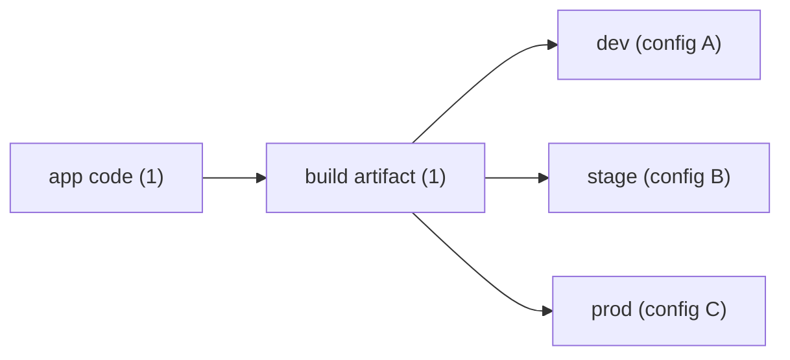

# 환경 분리와 설정 관리

> DevOps 101 시리즈 (4/10)


## 이 글에서 다룰 문제

환경별로 *DB 주소, 키, 도메인* 이 다릅니다. 이를 *코드와 분리* 해야 *같은 빌드물* 을 *모든 환경* 에 배포할 수 있습니다.

> *Build once, run anywhere*.

## 개념 한눈에 보기



## Before/After

**Before (코드에 박힌 설정)**

```python
DB_URL = "postgres://prod-db.example.com/app"   # 하드코딩
API_KEY = "sk-1234..."                           # 시크릿이 코드에
```

**After (환경에서 주입)**

```python
import os
DB_URL = os.environ["DB_URL"]
API_KEY = os.environ["API_KEY"]
```

## 실습: 설정 관리 5단계

### 1단계 — .env로 로컬 분리

```bash
# .env (gitignore)
DB_URL=postgres://localhost/app
API_KEY=test-key-1234
```

### 2단계 — pydantic-settings로 검증

```python
from pydantic_settings import BaseSettings

class Settings(BaseSettings):
    db_url: str
    api_key: str

settings = Settings()   # 자동으로 env 읽음
```

### 3단계 — 환경별 분리

```yaml
# k8s/values-prod.yaml
db_url: postgres://prod-db.example.com/app
api_key:
  valueFrom:
    secretKeyRef: { name: api-key, key: value }
```

### 4단계 — 시크릿은 별도 저장소

```bash
# AWS Secrets Manager
aws secretsmanager get-secret-value --secret-id prod/api-key
```

### 5단계 — 시크릿 자동 주입

```yaml
# Kubernetes External Secrets
apiVersion: external-secrets.io/v1
kind: ExternalSecret
spec:
  secretStoreRef: { name: aws-secrets, kind: ClusterSecretStore }
  data:
    - secretKey: api-key
      remoteRef: { key: prod/api-key }
```

## 이 코드에서 주목할 점

- *시크릿* 은 *코드 저장소* 에 절대 들어가지 않습니다.
- 설정 검증은 *시작 시* 합니다. 런타임 중 *모자란 값* 을 발견하면 늦습니다.
- 환경별 *YAML 분리* 로 가시성을 확보합니다.

## 자주 하는 실수 5가지

1. **시크릿을 *Git에 커밋*.** *영구 노출* 됩니다. *git filter-repo* 로도 100% 제거 어렵습니다.
2. ***.env* 를 *프로덕션* 에서 사용.** Secrets manager로 옮기세요.
3. **모든 환경에 *같은 시크릿*.** 유출 시 *전체 환경* 영향.
4. **설정을 *런타임에 변경* 후 재시작 안 함.** *불일치 상태* 가 발생.
5. **환경별 *코드 분기*.** *if env == "prod"* 는 안티패턴.

## 실무에서는 이렇게 쓰입니다

대규모 팀은 *Vault* 또는 *AWS Secrets Manager* 에 시크릿을 보관하고, *External Secrets Operator* 로 *Kubernetes* 에 자동 주입합니다.

## 체크리스트

- [ ] *.env* 가 *.gitignore* 에 있다.
- [ ] *시크릿* 이 *별도 저장소* 에 있다.
- [ ] *환경별 설정 파일* 이 분리되어 있다.
- [ ] 앱이 *시작 시 설정 검증* 을 한다.

## 정리 및 다음 단계

설정 관리는 *환경 독립성* 의 시작입니다. 다음 글에서는 *인프라 자체를 코드* 로 다루는 *IaC* 를 배웁니다.

<!-- toc:begin -->
- [DevOps란 무엇인가?](./01-what-is-devops.md)
- [CI 파이프라인](./02-ci-pipeline.md)
- [CD와 배포 전략](./03-cd-and-deployment.md)
- **환경 분리와 설정 관리 (현재 글)**
- Infrastructure as Code (예정)
- 컨테이너와 빌드 (예정)
- 모니터링과 알림 (예정)
- 로그 수집과 분석 (예정)
- 장애 대응과 on-call (예정)
- 운영 가능한 DevOps 흐름 (예정)
<!-- toc:end -->

## 참고 자료

- [The Twelve-Factor App — Config](https://12factor.net/config)
- [HashiCorp Vault](https://developer.hashicorp.com/vault)
- [AWS Secrets Manager](https://docs.aws.amazon.com/secretsmanager/)
- [External Secrets Operator](https://external-secrets.io/)

Tags: DevOps, Configuration, Secrets, Environment, TwelveFactor
