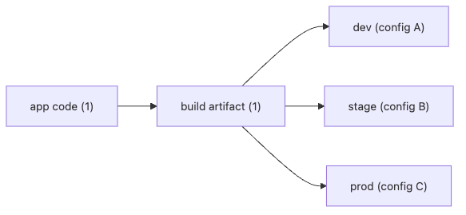

# 환경 분리와 설정 관리

이 글은 DevOps 101 시리즈의 네 번째 글입니다.

## 이 글에서 다룰 문제

- dev, stage, prod 환경을 분리하는 이유는 무엇일까요?
- 같은 코드베이스를 여러 환경에 배포하려면 무엇을 코드 밖으로 빼야 할까요?
- 환경변수와 시크릿은 어떻게 다르며 왜 따로 관리해야 할까요?
- .env, Vault, AWS Secrets Manager는 각각 어디에 적합할까요?
- 설정 관리에서 실무 팀이 가장 자주 저지르는 실수는 무엇일까요?

> **멘탈 모델**: 좋은 설정 관리는 코드를 환경별로 갈라놓지 않습니다. 하나의 코드베이스와 하나의 빌드 산출물을 유지한 채, 환경마다 달라지는 값만 안전하게 주입해서 "build once, run anywhere"를 가능하게 만듭니다.

## 왜 중요한가

데이터베이스 주소, 도메인, 외부 API 키는 환경마다 달라집니다. 이 값을 코드에 직접 박아 두면 dev에서는 되지만 stage에서 안 되고, prod에서는 다시 별도 빌드를 해야 하는 식으로 운영 복잡도가 빠르게 커집니다.

설정 관리는 단순히 값을 숨기는 문제가 아닙니다. 같은 산출물을 서로 다른 환경에 자신 있게 재사용할 수 있는가의 문제입니다. 이 원칙이 무너지면 배포 안정성과 재현성도 함께 무너집니다.

> Build once, run anywhere.

## 한눈에 보는 개념



*한눈에 보는 개념*

핵심은 간단합니다. 코드는 하나이고, 달라지는 것은 환경별 설정뿐입니다. 같은 빌드 산출물이 dev, stage, prod에 각각 다른 설정을 주입받아 실행돼야 합니다.

## 핵심 용어

- **Environment**: dev, stage, prod처럼 실행 문맥이 다른 환경입니다.
- **Config**: 데이터베이스 URL, 도메인처럼 환경마다 달라지는 값입니다.
- **Secret**: API 키, 비밀번호처럼 민감한 값입니다.
- **.env**: 주로 로컬 개발에 쓰는 간단한 환경 설정 파일입니다.
- **Secrets manager**: Vault, AWS Secrets Manager처럼 암호화된 시크릿 저장소입니다.

같은 설정이라도 민감도와 수명 주기가 다릅니다. 그래서 단순한 환경변수와 시크릿 저장소를 같은 것으로 취급하면 운영 사고로 이어지기 쉽습니다.

## Before/After

**Before (config baked into code)**

```python
DB_URL = "postgres://prod-db.example.com/app"   # hardcoded
API_KEY = "sk-1234..."                           # secret in code
```

이 구조는 처음에는 편해 보여도 금방 한계가 드러납니다. 코드 변경 없이 값을 바꿀 수 없고, 시크릿이 Git 히스토리에 영구적으로 남기 때문입니다.

**After (injected from the environment)**

```python
import os
DB_URL = os.environ["DB_URL"]
API_KEY = os.environ["API_KEY"]
```

코드가 값을 소유하지 않고 환경이 값을 주입하면, 같은 애플리케이션을 여러 환경에 일관되게 올릴 수 있습니다.

## 설정 관리를 위한 5단계

### 1단계 - 로컬은 .env로 분리

로컬 개발에서는 단순하고 빠른 방식이 필요합니다. 다만 .env는 어디까지나 로컬 편의 장치이지, 프로덕션 비밀 저장소가 아닙니다.

```bash
# .env (gitignored)
DB_URL=postgres://localhost/app
API_KEY=test-key-1234
```

### 2단계 - pydantic-settings로 검증

설정은 실행 도중 뒤늦게 실패하는 것보다 시작 시점에 즉시 검증되는 편이 훨씬 낫습니다. 빠르게 실패해야 배포도 빨리 고칠 수 있습니다.

```python
from pydantic_settings import BaseSettings

class Settings(BaseSettings):
    db_url: str
    api_key: str

settings = Settings()   # auto-loads from env
```

### 3단계 - 환경별 설정 분리

환경 차이는 코드 분기가 아니라 설정 파일에서 표현해야 합니다. 운영자는 값 차이를 볼 수 있어야 하고, 리뷰어는 변경 범위를 추적할 수 있어야 합니다.

```yaml
# k8s/values-prod.yaml
db_url: postgres://prod-db.example.com/app
api_key:
  valueFrom:
    secretKeyRef: { name: api-key, key: value }
```

### 4단계 - 시크릿은 전용 저장소에 보관

시크릿은 배포 파일이나 Git 저장소에 오래 남아 있으면 안 됩니다. 회전, 접근 통제, 감사 로그를 고려하면 전용 저장소가 사실상 필수입니다.

```bash
# AWS Secrets Manager
aws secretsmanager get-secret-value --secret-id prod/api-key
```

### 5단계 - 시크릿 자동 주입

사람이 직접 값을 복사해서 붙여 넣는 과정이 많을수록 누락과 노출이 함께 늘어납니다. 운영 환경에서는 주입까지 자동화되어야 합니다.

```yaml
# Kubernetes External Secrets
apiVersion: external-secrets.io/v1
kind: ExternalSecret
spec:
  secretStoreRef: { name: aws-secrets, kind: ClusterSecretStore }
  data:
    - secretKey: api-key
      remoteRef: { key: prod/api-key }
```

## 이 코드에서 먼저 봐야 할 점

- 시크릿은 코드 저장소에 들어가면 안 됩니다.
- 설정 검증은 애플리케이션 시작 시점에 끝내야 합니다.
- 환경별 YAML 분리는 가시성과 리뷰 품질을 함께 높여 줍니다.

좋은 설정 관리의 목적은 숨기는 것만이 아닙니다. 누가 어떤 값을 바꿨는지, 어떤 환경에 어떤 차이가 있는지, 누락 시 언제 실패하는지가 분명해야 합니다.

## 자주 하는 실수 5가지

1. **시크릿을 Git에 커밋하는 실수**입니다. 한 번 올라간 시크릿은 완전히 지우기 매우 어렵습니다.
2. **프로덕션에서도 .env에 기대는 실수**입니다. 로컬 편의 도구와 운영 비밀 관리를 구분해야 합니다.
3. **모든 환경에서 같은 시크릿을 쓰는 실수**입니다. 하나가 새면 전 환경이 함께 위험해집니다.
4. **설정을 런타임에 바꾸고 재시작하지 않는 실수**입니다. 인스턴스마다 다른 상태가 남을 수 있습니다.
5. **환경별 코드 분기를 만드는 실수**입니다. `if env == "prod"`는 설정 문제를 코드 문제로 바꿉니다.

## 실무에서는 이렇게 이어집니다

성숙한 팀은 Vault나 AWS Secrets Manager에 시크릿을 저장하고, External Secrets Operator 같은 구성 요소로 Kubernetes에 자동 주입합니다. 이렇게 해야 시크릿 회전과 접근 관리가 운영 절차 안으로 들어옵니다.

작은 팀도 원칙은 같습니다. 코드와 설정을 분리하고, 시크릿을 Git에서 빼고, 시작 시 검증하도록 바꾸는 세 가지만 해도 운영 리스크가 크게 줄어듭니다.

## 시니어 엔지니어는 이렇게 봅니다

- 하나의 코드베이스로 여러 환경을 운영해야 합니다.
- 시크릿 회전은 자동화 가능한 구조여야 합니다.
- 설정 변경도 PR과 리뷰를 거쳐야 합니다.
- 환경 차이는 코드가 아니라 설정으로 표현해야 합니다.
- 시크릿 유출은 가능성이 아니라 시간 문제라고 가정합니다.

## 체크리스트

- [ ] .env가 .gitignore에 포함되어 있습니다.
- [ ] 시크릿이 전용 저장소에 보관됩니다.
- [ ] 환경별 설정 파일이 분리되어 있습니다.
- [ ] 애플리케이션이 시작 시 설정을 검증합니다.

## 연습 문제

1. 현재 프로젝트 Git 히스토리에서 시크릿 흔적을 찾아보세요.
2. pydantic-settings로 설정 검증을 추가해 보세요.
3. 환경별 YAML 파일로 설정을 분리해 보세요.

## 정리 및 다음 단계

설정 관리는 환경 독립성의 출발점입니다. 다음 글에서는 같은 원리를 더 확장해, 인프라 자체를 코드로 다루는 IaC를 살펴봅니다.

<!-- toc:begin -->
- [DevOps란 무엇인가?](./01-what-is-devops.md)
- [CI 파이프라인](./02-ci-pipeline.md)
- [CD와 배포 전략](./03-cd-and-deployment.md)
- **환경 분리와 설정 관리 (현재 글)**
- Infrastructure as Code (예정)
- 컨테이너와 빌드 (예정)
- 모니터링과 알림 (예정)
- 로그 수집과 분석 (예정)
- 장애 대응과 on-call (예정)
- 운영 가능한 DevOps 흐름 (예정)
<!-- toc:end -->

## 참고 자료

- [The Twelve-Factor App — Config](https://12factor.net/config)
- [HashiCorp Vault](https://developer.hashicorp.com/vault)
- [AWS Secrets Manager](https://docs.aws.amazon.com/secretsmanager/)
- [External Secrets Operator](https://external-secrets.io/)

Tags: DevOps, Configuration, Secrets, Environment, TwelveFactor
