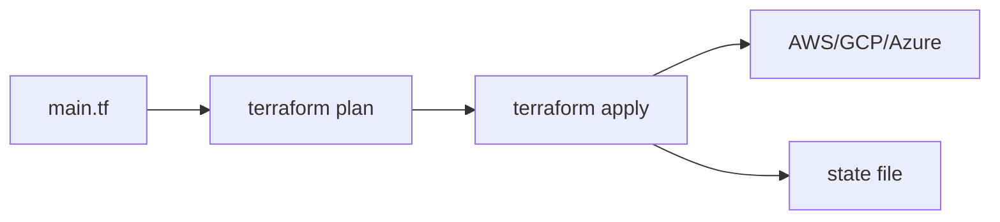

# Infrastructure as Code

> DevOps 101 시리즈 (5/10)

<!-- a-grade-intro:begin -->

**핵심 질문**: *AWS 콘솔* 에서 *클릭으로 만든 서버* 가 *왜 다른 환경에는 없는지* 설명할 수 있나요?

> IaC는 *인프라를 코드* 로 만들어 *재현 가능* 하게 합니다.

<!-- a-grade-intro:end -->

## 이 글에서 배울 것

- *IaC* 의 정의와 효용
- *Terraform* 의 기본 워크플로우
- *State* 파일의 의미와 관리
- *Module* 로 *재사용* 하기
- 흔한 함정 5가지

## 왜 중요한가

콘솔로 만든 인프라는 *기억에만* 존재합니다. 다른 환경에 *복제* 하려면 다시 *클릭* 해야 하고, 그 사이 *드리프트* 가 생깁니다.

> *코드만이 진실의 원천(SSOT)* 이다.

## 개념 한눈에 보기



## 핵심 용어 정리

- **IaC**: *Infrastructure as Code*. 인프라를 *코드로* 정의.
- **Provider**: AWS, GCP 등 *클라우드 어댑터*.
- **Resource**: 인스턴스, 버킷 등 *생성 단위*.
- **State**: 현재 *실제 인프라* 의 *기록*.
- **Module**: *재사용 가능한 인프라 묶음*.

## Before/After

**Before (콘솔 클릭)**

```text
- 누가 *언제* 만들었는지 모름
- 다른 region에 복제하려면 *처음부터*
- 변경 이력 없음
```

**After (Terraform)**

```hcl
# main.tf
resource "aws_s3_bucket" "logs" {
  bucket = "my-app-logs"
  tags   = { Env = "prod" }
}
```

## 실습: Terraform 5단계

### 1단계 — Provider 정의

```hcl
terraform {
  required_providers {
    aws = { source = "hashicorp/aws", version = "~> 5.0" }
  }
}
provider "aws" { region = "us-east-1" }
```

### 2단계 — Resource 작성

```hcl
resource "aws_s3_bucket" "logs" {
  bucket = "my-app-logs-${var.env}"
}
```

### 3단계 — Plan으로 변경 확인

```bash
terraform init
terraform plan
# Plan: 1 to add, 0 to change, 0 to destroy.
```

### 4단계 — Apply

```bash
terraform apply
# yes 입력 시 실제 생성
```

### 5단계 — Module로 재사용

```hcl
module "vpc" {
  source = "terraform-aws-modules/vpc/aws"
  version = "5.0.0"
  cidr    = "10.0.0.0/16"
}
```

## 이 코드에서 주목할 점

- *plan* 후 *apply* — 변경을 *눈으로 확인* 한 뒤에만 실행.
- *State* 는 *원격 백엔드* (S3, GCS)에 저장합니다.
- *Module* 로 *환경별 차이* 를 *변수* 로만 다룹니다.

## 자주 하는 실수 5가지

1. **State를 *로컬* 에 두기.** 팀원과 충돌하고 *유실 위험*.
2. **State에 *시크릿* 평문 저장.** S3 백엔드 + KMS 암호화 필수.
3. **콘솔에서 *수동 변경*.** *드리프트* 발생.
4. **`apply` 자동화 안 함.** 수동 실행은 *오타와 사고* 의 원인.
5. **`destroy` 명령을 *프로덕션에 직접*.** 환경 분리 + approval 게이트 필수.

## 실무에서는 이렇게 쓰입니다

성숙한 팀은 *Terraform Cloud* 또는 *Atlantis* 로 *PR 기반 plan/apply* 를 자동화합니다. *변경 리뷰* 가 *코드 리뷰* 와 동일하게 됩니다.

## 시니어 엔지니어는 이렇게 생각합니다

- *콘솔은 read-only*. 변경은 *코드로만*.
- *State* 는 *백업과 잠금* 이 필수.
- *Module* 로 *팀 표준* 을 강제한다.
- *plan diff* 는 *PR 리뷰* 의 핵심 정보.
- *Tag 정책* 으로 *비용/소유* 추적.

## 체크리스트

- [ ] *모든 인프라* 가 코드로 정의되어 있다.
- [ ] *State* 가 *원격 백엔드* 에 있다.
- [ ] *Plan* 이 *PR* 에 자동 표시된다.
- [ ] *Tag 정책* 이 강제된다.

## 연습 문제

1. *Terraform* 으로 *S3 버킷* 하나를 만들어보세요.
2. 같은 코드를 *변수* 로 분리해 *dev/prod* 에 적용해보세요.
3. *원격 state* 를 S3 + DynamoDB로 설정하세요.

## 정리 및 다음 단계

IaC는 *재현 가능한 인프라* 입니다. 다음 글에서는 *애플리케이션* 의 재현성을 책임지는 *컨테이너* 를 배웁니다.

<!-- toc:begin -->
- [DevOps란 무엇인가?](./01-what-is-devops.md)
- [CI 파이프라인](./02-ci-pipeline.md)
- [CD와 배포 전략](./03-cd-and-deployment.md)
- [환경 분리와 설정 관리](./04-environments-and-config.md)
- **Infrastructure as Code (현재 글)**
- 컨테이너와 빌드 (예정)
- 모니터링과 알림 (예정)
- 로그 수집과 분석 (예정)
- 장애 대응과 on-call (예정)
- 운영 가능한 DevOps 흐름 (예정)
<!-- toc:end -->

## 참고 자료

- [Terraform docs](https://developer.hashicorp.com/terraform)
- [Terraform AWS Modules](https://registry.terraform.io/namespaces/terraform-aws-modules)
- [Atlantis](https://www.runatlantis.io/)
- [HashiCorp — IaC](https://www.hashicorp.com/resources/what-is-infrastructure-as-code)

Tags: DevOps, IaC, Terraform, Cloud, Automation
