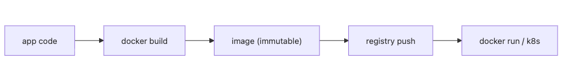

# 컨테이너와 빌드

이 글은 DevOps 101 시리즈의 여섯 번째 글입니다.

## 이 글에서 다룰 문제

- 컨테이너는 VM과 무엇이 다르고 왜 배포 재현성에 유리할까요?
- Dockerfile에서 꼭 이해해야 할 기본 명령은 무엇일까요?
- multi-stage build는 이미지 크기와 보안에 어떤 차이를 만들까요?
- layer cache를 잘 쓰는 Dockerfile은 왜 개발 속도까지 바꿀까요?
- 컨테이너 이미지를 운영에 올릴 때 자주 생기는 함정은 무엇일까요?

> **멘탈 모델**: 컨테이너는 코드를 감싸는 포장지가 아닙니다. 운영체제 라이브러리, 런타임, 의존성, 애플리케이션 코드를 하나의 변경 불가능한 실행 단위로 묶어서, 내 노트북과 서버가 같은 결과를 내도록 만드는 장치입니다.

## 왜 중요한가

같은 빌드 산출물이 모든 환경에서 같은 방식으로 동작해야 배포가 예측 가능해집니다. 컨테이너는 운영체제 라이브러리와 의존성, 애플리케이션 코드를 함께 묶어서 이 문제를 해결합니다.

실무에서 컨테이너의 가치는 단순히 배포가 편해진다는 데 있지 않습니다. 환경 차이 때문에 생기던 "내 로컬에서는 되는데 서버에서는 안 된다"라는 종류의 문제를 구조적으로 줄여 준다는 점이 더 중요합니다.

> 컨테이너는 Build once, run anywhere를 애플리케이션 레벨에서 실현합니다.

## 한눈에 보는 개념



*한눈에 보는 개념*

코드가 이미지가 되고, 이미지는 레지스트리에 올라가고, 운영 환경은 그 이미지를 가져다 실행합니다. 이 흐름이 명확할수록 배포는 더 단순해지고 롤백도 쉬워집니다.

## 핵심 용어

- **Image**: 변경 불가능한 실행 패키지입니다.
- **Container**: 이미지를 실제로 실행한 인스턴스입니다.
- **Dockerfile**: 이미지를 만들기 위한 선언형 빌드 레시피입니다.
- **Layer**: Dockerfile 명령마다 쌓이는 읽기 전용 계층입니다.
- **Registry**: 이미지를 저장하고 배포하는 저장소입니다.

이 용어를 구분하면 컨테이너 운영에서 자주 나오는 질문도 훨씬 쉽게 풀립니다. 예를 들어 문제를 고칠 때 컨테이너 안에서 직접 수정하는 것이 아니라 새 이미지를 다시 만드는 이유도 여기서 설명됩니다.

## Before/After

**Before (host-dependent)**

```bash
# Install directly on the server
apt install python3.12 postgresql-client
pip install -r requirements.txt
# On another server, *versions differ*
```

호스트에 직접 설치하는 방식은 서버마다 상태가 조금씩 달라지기 쉽습니다. 운영자는 버전을 맞추느라 고생하고, 장애가 나면 "어느 서버에 무엇이 설치됐는지"부터 다시 조사해야 합니다.

**After (Dockerfile)**

```dockerfile
FROM python:3.12-slim
WORKDIR /app
COPY requirements.txt .
RUN pip install --no-cache-dir -r requirements.txt
COPY . .
CMD ["uvicorn", "main:app", "--host", "0.0.0.0"]
```

Dockerfile이 있으면 실행 환경이 코드와 함께 버전 관리됩니다. 그 순간부터 환경 차이는 개인의 기억이 아니라 저장소 안의 변경 이력으로 다룰 수 있습니다.

## 실전으로 보는 Dockerfile 5단계

### 1단계 - 기본 빌드

먼저 이미지를 만들고 실제로 실행해 보아야 합니다. 컨테이너 학습의 출발점은 개념보다 빌드와 실행을 한 번 연결해 보는 경험입니다.

```bash
docker build -t myapp:1.0 .
docker run -p 8000:8000 myapp:1.0
```

### 2단계 - layer cache 최적화

의존성 파일은 자주 안 바뀌고 애플리케이션 코드는 자주 바뀝니다. 이 차이를 Dockerfile 순서에 반영해야 빌드 속도가 빨라집니다.

```dockerfile
COPY requirements.txt .          # rare changes -> cache reuse
RUN pip install -r requirements.txt
COPY . .                          # only the code changes often
```

### 3단계 - multi-stage로 이미지 줄이기

빌드에 필요한 도구와 실행에 필요한 도구는 다릅니다. 이 둘을 분리하면 최종 이미지를 훨씬 작고 안전하게 만들 수 있습니다.

```dockerfile
FROM python:3.12 AS builder
COPY requirements.txt .
RUN pip install --user -r requirements.txt

FROM python:3.12-slim
COPY --from=builder /root/.local /root/.local
COPY . /app
WORKDIR /app
CMD ["python", "main.py"]
```

### 4단계 - non-root user

운영 컨테이너는 기본적으로 루트가 아니어야 합니다. 보안은 별도 옵션이 아니라 기본 실행 계정에서부터 시작합니다.

```dockerfile
RUN useradd --create-home appuser
USER appuser
```

### 5단계 - healthcheck

실행만 된다고 끝이 아닙니다. 컨테이너가 실제로 정상 응답하는지 런타임이 알 수 있어야 운영 자동화가 가능합니다.

```dockerfile
HEALTHCHECK CMD curl -f http://localhost:8000/health || exit 1
```

## 이 코드에서 먼저 봐야 할 점

- 변경 빈도가 낮은 명령을 위에 두어야 캐시를 최대한 재사용할 수 있습니다.
- slim이나 distroless 이미지는 공격 표면을 줄여 줍니다.
- non-root는 권장사항이 아니라 기본값처럼 다뤄야 합니다.

Dockerfile 한 줄 순서가 빌드 시간과 보안 수준을 동시에 바꿀 수 있습니다. 그래서 컨테이너 빌드는 단순 포장 작업이 아니라 운영 품질을 결정하는 설계 작업에 가깝습니다.

## 자주 하는 실수 5가지

1. **`latest` 태그를 쓰는 실수**입니다. 재현성이 사라지므로 항상 버전을 고정해야 합니다.
2. **`COPY . .`를 처음에 두는 실수**입니다. 캐시가 쉽게 깨져 빌드 시간이 계속 길어집니다.
3. **시크릿을 이미지 안에 굽는 실수**입니다. `docker history`만으로도 흔적이 드러날 수 있습니다.
4. **루트 계정으로 실행하는 실수**입니다. 컨테이너 탈출 시 피해 범위가 커집니다.
5. **이미지를 과도하게 크게 만드는 실수**입니다. push, pull, 콜드 스타트 모두 느려집니다.

## 실무에서는 이렇게 이어집니다

성숙한 팀은 distroless, SBOM 생성, 이미지 서명, 취약점 스캔을 CI 파이프라인에 붙입니다. 이미지 빌드는 이제 단순 배포 준비가 아니라 소프트웨어 공급망 보안의 일부입니다.

작은 팀도 최소한 이미지 크기 관리, non-root 실행, 취약점 스캔 세 가지는 초기에 습관으로 들이는 편이 좋습니다.

## 시니어 엔지니어는 이렇게 봅니다

- 이미지는 변경 불가능해야 합니다. 수정이 필요하면 새 이미지를 만듭니다.
- 작은 이미지가 더 안전하고 운영 비용도 낮습니다.
- .dockerignore는 .gitignore만큼 중요합니다.
- 빌드 속도는 개발 속도와 직결됩니다.
- 이미지 서명은 공급망 보호의 핵심 장치입니다.

## 체크리스트

- [ ] Dockerfile이 non-root 계정으로 끝납니다.
- [ ] multi-stage로 최종 이미지 크기를 줄였습니다.
- [ ] .dockerignore가 .git, tests, docs를 제외합니다.
- [ ] CI에 취약점 스캔이 포함됩니다.

## 연습 문제

1. 현재 앱의 최종 이미지 크기를 200MB 이하로 줄여 보세요.
2. multi-stage 적용 전후의 빌드 시간을 비교해 보세요.
3. Trivy로 HIGH/CRITICAL 취약점을 점검해 보세요.

## 정리 및 다음 단계

컨테이너는 실행 환경을 얼려서 전달하는 방식입니다. 다음 글에서는 이렇게 배포된 서비스를 운영 중에 어떻게 관찰할지 모니터링과 알림을 다룹니다.

<!-- toc:begin -->
- [DevOps란 무엇인가?](./01-what-is-devops.md)
- [CI 파이프라인](./02-ci-pipeline.md)
- [CD와 배포 전략](./03-cd-and-deployment.md)
- [환경 분리와 설정 관리](./04-environments-and-config.md)
- [Infrastructure as Code](./05-infrastructure-as-code.md)
- **컨테이너와 빌드 (현재 글)**
- 모니터링과 알림 (예정)
- 로그 수집과 분석 (예정)
- 장애 대응과 on-call (예정)
- 운영 가능한 DevOps 흐름 (예정)
<!-- toc:end -->

## 참고 자료

- [Docker docs](https://docs.docker.com/)
- [Distroless images](https://github.com/GoogleContainerTools/distroless)
- [Trivy](https://trivy.dev/)
- [Sigstore Cosign](https://docs.sigstore.dev/cosign/overview/)

Tags: DevOps, Docker, Container, Build, Image
