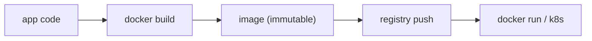

# 컨테이너와 빌드

> DevOps 101 시리즈 (6/10)


## 이 글에서 다룰 문제

같은 빌드 산출물이 *모든 환경* 에서 *같이 동작* 해야 합니다. 컨테이너는 *OS 라이브러리, 의존성, 코드* 를 *한 덩어리* 로 만듭니다.

> 컨테이너는 *Build once, run anywhere* 의 실현체입니다.

## 전체 흐름


## Before/After

**Before (호스트 의존)**

```bash
# 서버에 직접 설치
apt install python3.12 postgresql-client
pip install -r requirements.txt
# 다른 서버에서는 *버전 다름*
```

**After (Dockerfile)**

```dockerfile
FROM python:3.12-slim
WORKDIR /app
COPY requirements.txt .
RUN pip install --no-cache-dir -r requirements.txt
COPY . .
CMD ["uvicorn", "main:app", "--host", "0.0.0.0"]
```

## Dockerfile 5단계

### 1단계 — 기본 빌드

```bash
docker build -t myapp:1.0 .
docker run -p 8000:8000 myapp:1.0
```

### 2단계 — Layer 캐시 최적화

```dockerfile
COPY requirements.txt .          # 의존성 변경 적음 → 캐시 활용
RUN pip install -r requirements.txt
COPY . .                          # 코드만 자주 변경
```

### 3단계 — Multi-stage로 크기 줄이기

```dockerfile
FROM python:3.12 AS builder
COPY requirements.txt .
RUN pip install --user -r requirements.txt

FROM python:3.12-slim
COPY --from=builder /root/.local /root/.local
COPY . /app
WORKDIR /app
CMD ["python", "main.py"]
```

### 4단계 — Non-root user

```dockerfile
RUN useradd --create-home appuser
USER appuser
```

### 5단계 — Healthcheck

```dockerfile
HEALTHCHECK CMD curl -f http://localhost:8000/health || exit 1
```

## 이 코드에서 주목할 점

- *변경 빈도*가 낮은 명령을 위에 둡니다.
- *Slim/distroless* 이미지로 *공격 표면*을 줄입니다.
- *Non-root*는 기본값입니다.

## 자주 하는 실수 5가지

1. **`latest` 태그 사용.** *재현 불가능*. 항상 *버전 고정*.
2. **`COPY . .`를 처음에 두기.** 캐시 무효화로 *빌드 매번 처음부터* 시작합니다.
3. **시크릿을 *이미지에 빌드*.** `docker history`로 추출됩니다.
4. **루트로 실행.** 컨테이너 탈출 시 *호스트 위험*.
5. **이미지가 *1GB+*.** *push/pull* 이 느려지고 *콜드 스타트* 가 길어집니다.

## 실무에서는 이렇게 쓰입니다

성숙한 팀은 *distroless* + *SBOM 생성* + *이미지 서명(cosign)* + *취약점 스캔(Trivy)* 을 *CI 파이프라인* 에 연결합니다.

## 체크리스트

- [ ] *Dockerfile* 이 *non-root* 로 끝난다.
- [ ] *Multi-stage* 로 *최종 이미지* 가 작다.
- [ ] *.dockerignore* 가 *.git, tests, docs* 를 제외한다.
- [ ] *취약점 스캔* 이 CI에 있다.

## 정리 및 다음 단계

컨테이너는 *환경의 박제*입니다. 다음 글에서는 컨테이너를 모니터링하는 법을 배웁니다.

<!-- toc:begin -->
- [DevOps란 무엇인가?](./01-what-is-devops.md)
- [CI 파이프라인](./02-ci-pipeline.md)
- [CD와 배포 전략](./03-cd-and-deployment.md)
- [환경 분리와 설정 관리](./04-environments-and-config.md)
- [Infrastructure as Code](./05-infrastructure-as-code.md)
- **컨테이너와 빌드 (현재 글)**
- 모니터링과 알림 (예정)
- 로그 수집과 분석 (예정)
- 장애 대응과 on-call (예정)
- 운영 가능한 DevOps 흐름 (예정)
<!-- toc:end -->

## 참고 자료

- [Docker docs](https://docs.docker.com/)
- [Distroless images](https://github.com/GoogleContainerTools/distroless)
- [Trivy](https://trivy.dev/)
- [Sigstore Cosign](https://docs.sigstore.dev/cosign/overview/)

Tags: DevOps, Docker, Container, Build, Image
