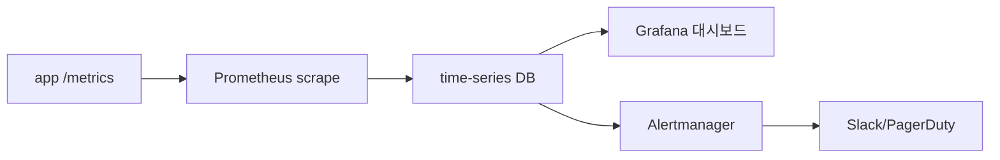

# 모니터링과 알림

> DevOps 101 시리즈 (7/10)


## 이 글에서 다룰 문제

장애는 *언제나 옵니다*. 차이는 *얼마나 빨리 아느냐* 와 *어디가 문제인지 얼마나 빨리 좁히느냐* 입니다.

> 모니터링 없는 운영은 *눈 감고 운전* 입니다.

## 전체 흐름


## Before/After

**Before (로그만)**

```text
- 장애 시 *grep -i error* 로 찾기
- 추세 모름, *왜 느려졌는지* 모름
- 알림은 *고객 이메일*
```

**After (메트릭 + 알림)**

```python
from prometheus_client import Counter, Histogram

requests = Counter("http_requests_total", "Total", ["path", "status"])
latency = Histogram("http_latency_seconds", "Latency", ["path"])
```

## 모니터링 5단계

### 1단계 — 앱에 /metrics 노출

```python
from prometheus_client import make_asgi_app
app.mount("/metrics", make_asgi_app())
```

### 2단계 — Prometheus 설정

```yaml
scrape_configs:
  - job_name: myapp
    static_configs:
      - targets: ['myapp:8000']
```

### 3단계 — RED 메트릭 추적

```text
- Rate (요청률)
- Errors (에러율)
- Duration (응답 시간 p95)
```

### 4단계 — Grafana 대시보드

```text
- 패널 1: 요청률 (rate(http_requests_total[5m]))
- 패널 2: 에러율 (rate(http_requests_total{status=~"5.."}[5m]))
- 패널 3: p95 latency
```

### 5단계 — 의미 있는 알림

```yaml
- alert: HighErrorRate
  expr: rate(http_requests_total{status=~"5.."}[5m]) > 0.01
  for: 5m
  annotations:
    summary: "5xx 에러율 1% 초과"
```

## 이 코드에서 주목할 점

- *5분 지속* 후 알림 — *순간 스파이크* 무시.
- 에러율은 비율로 봐야 합니다. 절대값은 트래픽에 따라 다릅니다.
- *p95*가 평균보다 의미 있습니다.

## 자주 하는 실수 5가지

1. **알림이 *너무 많다*.** *알림 피로* 로 *진짜 알림* 무시.
2. ***평균 latency* 만 본다.** *꼬리(p99)* 가 진짜 문제.
3. **메트릭 *카디널리티 폭발*.** user_id 같은 고유값을 라벨로 쓰면 안 됩니다.
4. **알림에 *대응 가이드 없음*.** 새벽 3시에 *어떻게 해야* 할까요?
5. **모니터링 자체가 *모니터링 안 됨*.** *Prometheus 다운* 을 외부에서 감시.

## 실무에서는 이렇게 쓰입니다

성숙한 팀은 *SLO 기반 알림* 을 씁니다. *에러 예산* 을 정의하고, *예산 소진 속도* 가 빠를 때만 알림이 울립니다.

## 체크리스트

- [ ] *RED 메트릭* 이 모든 서비스에 있다.
- [ ] *p95 latency* 가 대시보드에 있다.
- [ ] *알림에 runbook 링크* 가 있다.
- [ ] *알림 노이즈* 가 측정되고 있다.

## 정리 및 다음 단계

모니터링은 눈입니다. 다음 글에서는 귀에 해당하는 로그를 다룹니다.

<!-- toc:begin -->
- [DevOps란 무엇인가?](./01-what-is-devops.md)
- [CI 파이프라인](./02-ci-pipeline.md)
- [CD와 배포 전략](./03-cd-and-deployment.md)
- [환경 분리와 설정 관리](./04-environments-and-config.md)
- [Infrastructure as Code](./05-infrastructure-as-code.md)
- [컨테이너와 빌드](./06-containers-and-build.md)
- **모니터링과 알림 (현재 글)**
- 로그 수집과 분석 (예정)
- 장애 대응과 on-call (예정)
- 운영 가능한 DevOps 흐름 (예정)
<!-- toc:end -->

## 참고 자료

- [Prometheus docs](https://prometheus.io/docs/)
- [Grafana docs](https://grafana.com/docs/)
- [Google SRE — Monitoring](https://sre.google/sre-book/monitoring-distributed-systems/)
- [The RED Method (Tom Wilkie)](https://www.weave.works/blog/the-red-method-key-metrics-for-microservices-architecture/)

Tags: DevOps, Monitoring, Prometheus, Alerting, SRE
