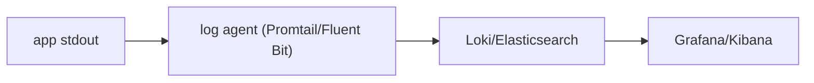

# 로그 수집과 분석

이 글은 DevOps 101 시리즈의 여덟 번째 글입니다.

## 이 글에서 다룰 문제

- 구조화 로그와 비구조화 로그는 실무에서 무엇이 다를까요?
- 여러 서버의 로그를 한곳에 모아야 하는 이유는 무엇일까요?
- Loki와 ELK는 어떤 관점에서 비교하면 좋을까요?
- correlation ID는 왜 분산 시스템 디버깅의 기본이라고 할까요?
- 로깅 전략을 세울 때 팀이 가장 자주 놓치는 실수는 무엇일까요?

> **멘탈 모델**: 로그는 남기는 것만으로 가치가 생기지 않습니다. 나중에 검색 가능하고, 여러 인스턴스에서 연결 가능하고, 요청 단위로 추적 가능해야 비로소 운영 신호가 됩니다.

## 왜 중요한가

서버 한 대에 SSH로 들어가 grep 하던 시대는 끝났습니다. 분산 시스템에서는 동시에 여러 인스턴스에서 같은 요청이 흐르고, 문제는 그 사이에서 발생합니다. 그래서 로그는 중앙에서 수집되고 검색 가능해야 합니다.

실제 운영에서는 로그를 지금 보는 시간보다 며칠 뒤, 혹은 몇 주 뒤에 다시 보는 시간이 더 많습니다. 검색성과 보존 정책이 중요한 이유도 여기에 있습니다.

> 로그는 지금보다 몇 주 뒤에 더 자주 읽히는 운영 기록입니다.

## 한눈에 보는 개념



애플리케이션은 stdout으로 로그를 내보내고, 수집 에이전트가 이를 중앙 저장소로 보내며, 운영자는 Grafana나 Kibana에서 검색합니다. 이 구조가 갖춰져야 "어디서 어떤 에러가 났는가"를 한 번에 찾을 수 있습니다.

## 핵심 용어

- **Structured log**: 보통 JSON 형태의 key-value 로그입니다.
- **Log level**: DEBUG, INFO, WARN, ERROR, CRITICAL 같은 심각도 구분입니다.
- **Correlation ID**: 하나의 요청을 끝까지 따라가기 위한 고유 ID입니다.
- **Log aggregator**: 여러 인스턴스 로그를 한곳에 모으는 시스템입니다.
- **Retention**: 로그를 얼마나 오래 보관할지 정한 정책입니다.

로깅은 저장보다 설계가 중요합니다. 어떤 필드를 남길지, 어떤 데이터는 마스킹할지, 몇 일 동안 보관할지가 모두 비용과 디버깅 품질을 함께 결정합니다.

## Before/After

**Before (print-style logs)**

```python
print("user logged in", user_id)
# ssh server-01 && grep "logged in" /var/log/app.log
```

이 방식은 서버가 하나일 때만 겨우 버팁니다. 서비스가 분산되면 어떤 요청이 어느 서버를 지났는지 금방 놓치게 됩니다.

**After (structured + central collection)**

```python
import structlog
log = structlog.get_logger()
log.info("user.login", user_id=user_id, request_id=req_id)
# In Grafana, search with {service="api"} |= "user.login"
```

구조화 로그와 중앙 수집을 붙이면, 특정 서비스와 특정 요청을 조건으로 빠르게 좁힐 수 있습니다. 이 차이가 곧 디버깅 속도 차이입니다.

## 로깅을 위한 5단계

### 1단계 — JSON 로그로 전환

로그가 기계가 읽기 좋은 구조를 가져야 쿼리와 집계가 쉬워집니다. 사람에게 보이기만 하는 문자열 로그는 운영 규모가 커질수록 금방 한계에 닿습니다.

```python
import structlog
structlog.configure(
    processors=[structlog.processors.JSONRenderer()],
)
log = structlog.get_logger()
```

### 2단계 — correlation ID 주입

요청이 프론트엔드, API, 데이터베이스를 거칠 때 같은 ID를 따라갈 수 있어야 원인을 좁히기 쉽습니다. correlation ID는 분산 시스템의 최소 추적 장치입니다.

```python
import uuid
@app.middleware("http")
async def add_request_id(request, call_next):
    rid = request.headers.get("X-Request-ID", str(uuid.uuid4()))
    structlog.contextvars.bind_contextvars(request_id=rid)
    return await call_next(request)
```

### 3단계 — stdout으로 출력

컨테이너 시대에는 애플리케이션이 파일을 직접 돌보기보다 stdout으로 내보내고, 수집은 런타임과 인프라에 맡기는 편이 훨씬 단순합니다.

```text
The container-era principle is *stdout, not files*.
The runtime collects them for you.
```

### 4단계 — Promtail로 Loki에 전송

로그를 중앙 저장소로 모으는 단계입니다. 수집 에이전트가 붙어야 여러 컨테이너와 여러 호스트의 로그를 하나의 인터페이스에서 볼 수 있습니다.

```yaml
scrape_configs:
  - job_name: containers
    docker_sd_configs:
      - host: unix:///var/run/docker.sock
```

### 5단계 — 의미 있는 쿼리 작성

좋은 로그 설계는 좋은 쿼리까지 포함합니다. 어떤 조건으로 원하는 사건을 좁혀 볼지 팀이 알고 있어야 실제 장애 순간에 바로 쓸 수 있습니다.

```text
{service="api", level="error"} | json | line_format "{{.user_id}} {{.msg}}"
```

## 이 코드에서 먼저 봐야 할 점

- request ID 하나만 있어도 프론트엔드부터 API, DB까지 요청 흐름을 한 줄로 좁힐 수 있습니다.
- 애플리케이션은 stdout에 집중하고 수집은 인프라가 맡는 편이 더 단순합니다.
- PII는 처음부터 코드 수준에서 마스킹해야 합니다.

로그는 많이 남기는 것보다 다시 읽을 수 있게 남기는 것이 중요합니다. 구조와 필드, 쿼리 가능성이 그 핵심입니다.

## 자주 하는 실수 5가지

1. **프로덕션에서 DEBUG 로그를 계속 켜 두는 실수**입니다. 비용과 노이즈가 함께 폭증합니다.
2. **PII를 그대로 남기는 실수**입니다. 이는 운영 편의 문제가 아니라 컴플라이언스 문제입니다.
3. **보존 정책 없이 계속 쌓는 실수**입니다. 로그 비용이 뒤늦게 크게 터집니다.
4. **correlation ID 없이 운영하는 실수**입니다. 요청 단위 추적이 거의 불가능해집니다.
5. **에러 로그에 스택트레이스를 남기지 않는 실수**입니다. 원인 분석이 반쯤 막힙니다.

## 실무에서는 이렇게 이어집니다

성숙한 팀은 `trace_id`를 로그, 메트릭, 트레이스의 공통 키로 사용합니다. 하나의 ID로 세 신호를 교차 분석할 수 있어야 장애 원인 파악 속도가 크게 빨라집니다.

작은 팀이라면 먼저 JSON 로그, Request ID, 중앙 수집 세 가지부터 갖추는 것이 좋습니다. 이 세 가지가 로깅 품질을 가장 크게 끌어올립니다.

## 시니어 엔지니어는 이렇게 봅니다

- 로그는 비용입니다. 레벨과 보존 기간을 의식해야 합니다.
- 구조화 로그는 검색의 전제 조건입니다.
- 민감 정보는 나중이 아니라 코드에서 바로 마스킹해야 합니다.
- trace_id가 세 관측 신호를 이어 줍니다.
- INFO 이하 로그는 샘플링도 적극적으로 고려합니다.

## 체크리스트

- [ ] 로그가 JSON 형태로 출력됩니다.
- [ ] 모든 로그에 Request ID가 포함됩니다.
- [ ] PII 마스킹이 적용됩니다.
- [ ] 보존 정책이 정해져 있습니다.

## 연습 문제

1. 현재 애플리케이션을 structlog 기반으로 바꿔 보세요.
2. Request ID 미들웨어를 추가해 보세요.
3. Loki 또는 Elasticsearch로 중앙 수집을 구성해 보세요.

## 정리 및 다음 단계

로그는 시스템을 시간을 거슬러 읽게 해 주는 기록입니다. 다음 글에서는 로그와 메트릭, 절차를 묶어 실제 장애에 대응하는 방법을 다룹니다.

<!-- toc:begin -->
- [DevOps란 무엇인가?](./01-what-is-devops.md)
- [CI 파이프라인](./02-ci-pipeline.md)
- [CD와 배포 전략](./03-cd-and-deployment.md)
- [환경 분리와 설정 관리](./04-environments-and-config.md)
- [Infrastructure as Code](./05-infrastructure-as-code.md)
- [컨테이너와 빌드](./06-containers-and-build.md)
- [모니터링과 알림](./07-monitoring-and-alerting.md)
- **로그 수집과 분석 (현재 글)**
- 장애 대응과 on-call (예정)
- 운영 가능한 DevOps 흐름 (예정)
<!-- toc:end -->

## 참고 자료

- [structlog](https://www.structlog.org/)
- [Grafana Loki](https://grafana.com/docs/loki/latest/)
- [Elastic Stack](https://www.elastic.co/elastic-stack)
- [OpenTelemetry Logs](https://opentelemetry.io/docs/specs/otel/logs/)

Tags: DevOps, Logging, Observability, ELK, Loki
