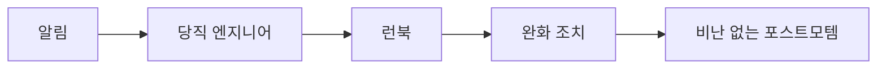

# 장애 대응과 on-call

## 이 글에서 다룰 문제

- 새벽 3시에 장애 알림이 울렸을 때, 누가 먼저 판단하고 누가 커뮤니케이션을 맡아야 할까요?
- 장애 심각도(SEV)는 어떤 기준으로 나누어야 팀 전체가 같은 언어로 움직일 수 있을까요?
- on-call 로테이션과 런북(runbook)은 왜 함께 설계해야 할까요?
- incident commander는 직접 복구 작업을 하지 않는데도 왜 중요한 역할일까요?
- blameless postmortem이 재발 방지에 실제로 어떻게 연결될까요?

> DevOps 101 시리즈 (9/10)

장애는 언제든 발생합니다. 중요한 차이는 장애를 막을 수 있느냐가 아니라, 얼마나 빠르고 침착하게 복구하느냐입니다. 비슷한 기술 스택을 쓰는 팀이라도 장애 대응 품질은 크게 갈립니다. 이유는 대개 코드보다 체계에 있습니다. 역할이 정리되어 있고, 심각도 기준이 문서화되어 있고, 런북이 손에 잡히는 곳에 있으면 같은 장애라도 대응 속도와 후속 학습 수준이 완전히 달라집니다.

작은 팀일수록 이 주제가 더 중요합니다. 사람이 적으면 장애를 겪는 순간 한 사람이 여러 역할을 동시에 떠안기 쉽고, 그러면 판단과 커뮤니케이션, 실제 복구가 한꺼번에 꼬입니다. 반대로 최소한의 절차만 잡아 두어도 팀은 훨씬 차분하게 움직입니다. 이 글에서는 장애 대응을 기술 조각이 아니라 운영 체계로 보는 관점을 설명하겠습니다.

---

## 왜 장애 대응은 기술보다 체계가 먼저일까요?

프로덕션 장애가 터졌을 때 팀이 가장 먼저 잃기 쉬운 것은 CPU나 메모리가 아니라 공통 상황 인식입니다. 누가 확인 중인지, 어느 정도 영향인지, 롤백이 가능한지, 외부 공지가 필요한지 같은 질문이 동시에 쏟아집니다. 이때 정해진 절차가 없으면 사람들은 선의로 움직이지만 결과는 혼선이 됩니다. 누군가는 로그를 보고, 누군가는 임시 패치를 넣고, 누군가는 고객 문의에 답하면서 정작 전체 방향을 잡는 사람이 사라집니다.

> 프로세스는 기억력을 대신합니다.

이 문장이 중요한 이유가 여기에 있습니다. 장애 대응은 평소에 자주 연습하지 않는 작업입니다. 그래서 머리로 알고 있는 것만 믿으면 실전에서 빠뜨리기 쉽습니다. 반면 SEV 정의, 연락 체계, 런북, 포스트모템 템플릿이 준비되어 있으면 사람은 그 틀을 따라 움직이면 됩니다. 좋은 장애 대응 체계는 뛰어난 개인을 전제로 하지 않고, 보통의 팀이 일관되게 대응할 수 있게 만드는 장치입니다.

---

## 한눈에 보는 장애 대응 흐름



장애 대응은 보통 이 순서로 흘러갑니다. 알림이 발생하면 on-call 엔지니어가 먼저 확인하고, 준비된 런북을 따라 초기 진단과 완화 조치를 진행합니다. 영향이 크거나 대응이 길어지면 incident commander가 들어와 역할을 분리하고, 복구가 끝난 뒤에는 blameless postmortem으로 원인과 개선 항목을 정리합니다.

여기서 핵심은 모든 단계를 완벽하게 하자는 뜻이 아닙니다. 다음 단계가 무엇인지 모두가 알고 있는 상태를 만드는 것이 더 중요합니다. 첫 대응자는 런북을 펼치면 되고, IC는 누가 어떤 역할인지 정리하면 되고, 팀은 나중에 포스트모템에서 시스템과 절차를 고치면 됩니다. 순서가 보이면 공포가 줄고, 공포가 줄면 실수도 줄어듭니다.

## Before/After

체계가 없는 팀에서는 알림이 울리는 순간부터 혼선이 시작됩니다. Slack에 "누가 이거 보고 있나요?"라는 말이 올라오고, 여러 사람이 동시에 서버에 들어가 서로 다른 가설을 검증합니다. 누군가는 임시로 값을 바꾸고, 누군가는 새 배포를 멈추고, 누군가는 고객에게 답하면서 기록은 남지 않습니다. 이런 상황에서는 원래 장애보다 대응 과정에서 만든 2차 문제가 더 커지기도 합니다.

반대로 체계가 있는 팀은 첫 10분이 다릅니다. on-call 한 명이 먼저 대응을 시작하고, 런북을 기준으로 증상과 완화 조치를 확인합니다. 필요하면 IC가 들어와 조사 담당, 커뮤니케이션 담당, 기록 담당을 나눕니다. 서비스가 안정된 뒤에는 포스트모템으로 원인과 재발 방지 항목을 남깁니다. 같은 장애라도 대응 과정이 훨씬 조용하고, 다음 장애에서 더 강해집니다.

---

## 장애 대응 5단계

이제 실제 운영 체계를 구성하는 다섯 요소를 순서대로 보겠습니다. 여기 나오는 예시는 형식을 보여 주기 위한 최소 예시입니다. 중요한 것은 문서 양이 아니라, 팀이 실제로 따라 할 수 있을 만큼 짧고 분명해야 한다는 점입니다.

### 1단계 — 심각도(SEV) 정의

장애 대응에서 가장 먼저 필요한 것은 기술 지식보다 같은 기준으로 상황을 분류하는 언어입니다. SEV 정의가 없으면 어떤 사람은 "큰일 났다"고 하고, 다른 사람은 "조금 느린 정도"라고 말합니다. 이 차이는 대응 우선순위와 호출 대상, 공지 수준을 모두 흔듭니다.

SEV는 절대적인 표준이 있는 것이 아니라 팀이 합의한 운영 기준입니다. 다만 기준은 분명해야 합니다. 전사 장애인지, 핵심 기능 저하인지, 일부 고객만 영향을 받는지, 백로그로 보내도 되는 수준인지가 빠르게 결정되어야 합니다.

```text
SEV1: company-wide outage     | respond immediately
SEV2: core feature degraded   | within 30 min
SEV3: partial degradation     | within business day
SEV4: low-impact bug          | backlog
```

이 표를 문서에 넣어 두는 것만으로도 효과가 큽니다. 특히 알림 정책과 연결하면 더 좋습니다. SEV1은 즉시 호출, SEV2는 30분 내 확인, SEV3는 영업시간 내 처리처럼 규칙이 연결되어야 실제 행동으로 이어집니다.

### 2단계 — On-call 로테이션

SEV 기준이 정해졌다면, 다음 질문은 자연스럽습니다. 그래서 누가 받습니까? on-call 로테이션은 단순한 일정표가 아니라 책임의 분산 장치입니다. 모두가 항상 책임지는 구조는 실제로는 아무도 책임지지 않는 구조가 되기 쉽습니다. 특정 시간대에 1차 대응자와 2차 대응자를 명확히 정해 두어야 알림이 사람에게 도달합니다.

좋은 로테이션은 세 가지를 담습니다. 첫째, 주기입니다. 매주인지 격주인지가 분명해야 합니다. 둘째, primary와 secondary입니다. 혼자 고립되지 않게 백업 경로를 둬야 합니다. 셋째, handoff입니다. 미해결 장애와 주의할 배포를 다음 담당자에게 넘기는 인수인계가 빠지면 같은 팀 안에서도 맥락이 끊깁니다.

```yaml
rotation:
  schedule: weekly
  primary: [alice, bob, carol]
  secondary: [dave, erin]
  handoff: "Mondays 10:00, hand off open incidents"
```

실무에서는 junior 엔지니어를 혼자 세우지 않는 원칙도 중요합니다. on-call은 기술 숙련도만의 문제가 아니라 심리적 부담의 문제이기도 합니다. 경험이 적은 엔지니어에게는 항상 escalation 경로와 함께 움직일 수 있는 사람을 붙이는 편이 안전합니다.

### 3단계 — 런북 템플릿

런북은 "문제가 생기면 이것부터 보세요"를 문서로 만든 것입니다. 증상, 진단, 완화, 에스컬레이션 순서가 들어가면 새벽에도 따라가기 쉬워집니다. 길고 완벽한 문서보다 짧고 자주 열리는 문서가 훨씬 낫습니다. 실제로 좋은 런북은 위키 깊숙한 곳보다 코드 저장소나 알림 시스템 링크 옆에 붙어 있는 경우가 많습니다.

```markdown
# 런북: API 500 급증

## 증상
- /api/* 5xx 비율 5% 초과

## 진단
1. Grafana의 "API Errors" 대시보드를 엽니다.
2. 최근 로그 `{service="api", level="error"}`를 확인합니다.

## 완화 조치
- 최근 배포가 의심되면 `kubectl rollout undo deploy/api`를 실행합니다.

## 에스컬레이션
- 30분 안에 해결되지 않으면 #incident 채널에서 IC를 호출합니다.
```

런북이 잘 쓰였는지 판단하는 가장 좋은 기준은 간단합니다. 처음 보는 사람이 그 문서를 읽고 5분 안에 첫 조치를 할 수 있는가입니다. 복잡한 배경 설명보다 바로 열어 볼 대시보드, 확인할 로그 쿼리, 의심 배포가 있을 때의 롤백 명령이 중요합니다.

### 4단계 — Incident commander 역할

많은 팀이 여기서 실수합니다. 장애를 가장 잘 아는 사람이 모든 것을 직접 하게 두는 방식입니다. 그러면 그 사람은 로그를 보다가 동시에 Slack에 상황을 알리고, 고객 대응 문구를 검토하고, 우선순위 결정까지 해야 합니다. 판단 품질이 떨어질 수밖에 없습니다.

incident commander는 직접 고치는 사람보다 흐름을 정리하는 사람에 가깝습니다. 누가 조사하는지, 누가 소통하는지, 어떤 가설을 먼저 검증할지, 외부 공지가 필요한지 결정합니다. 이 역할이 있으면 손이 빠른 사람은 복구에 집중하고, 전체 팀은 같은 정보를 공유할 수 있습니다.

```text
IC = 의사결정 담당자입니다. 직접 복구 작업을 하지는 않습니다.
- 커뮤니케이션 창구를 하나로 유지합니다.
- 조사 담당, 커뮤니케이션 담당, 기록 담당을 지정합니다.
- 외부 공지 여부를 결정합니다.
```

작은 팀이라면 formal한 IC 체계까지는 부담스러울 수 있습니다. 그래도 "이번 장애에서는 누가 최종 조율을 맡는가"는 정해 두는 편이 좋습니다. 이름만 붙어도 혼선이 크게 줄어듭니다.

### 5단계 — Blameless 포스트모템

복구가 끝났다고 장애 대응이 끝난 것은 아닙니다. 포스트모템이 빠지면 팀은 같은 실패를 다시 만납니다. blameless라는 표현이 중요한 이유는 사람을 보호하기 위해서만이 아닙니다. 사람이 아니라 시스템과 절차를 보아야 실제 재발 방지책이 나오기 때문입니다.

좋은 포스트모템은 사건 기록, 영향 범위, 원인, 예방 항목이 짧고 명확하게 정리되어 있습니다. 그리고 반드시 담당자와 기한이 붙습니다. 문서만 쓰고 끝나면 학습이 아니라 기록으로 끝납니다.

```markdown
# 포스트모템: 2026-05-04 API 장애

- 영향: 12분 동안 5xx 비율 30%
- 타임라인: 03:11 알림 -> 03:18 롤백 -> 03:23 복구
- 근본 원인: 기능 플래그 기본값 오타
- 예방 조치: PR 템플릿에 플래그 검증 체크리스트 추가
```

## 이 코드에서 주목할 점

- 사람보다 시스템과 절차를 고친다는 관점이 일관되게 들어 있습니다.
- 런북은 코드와 가까운 곳에 두어야 실제 장애 때 바로 열립니다.
- 후속 조치는 담당자와 기한이 붙어야 다음 장애 이전에 반영됩니다.

## 자주 하는 실수 5가지

1. 포스트모템에 사람 이름과 잘못을 중심으로 적는 경우입니다. 이 방식은 신뢰를 무너뜨리고 중요한 기술적 맥락을 가립니다.
2. 런북이 위키 깊숙한 곳에 묻혀 있는 경우입니다. 문서가 있어도 장애 순간에 못 찾으면 없는 것과 비슷합니다.
3. 알림이 지나치게 많은 경우입니다. alert fatigue가 생기면 정말 중요한 알림도 무시됩니다.
4. junior 엔지니어를 혼자 on-call에 세우는 경우입니다. 기술보다 심리적 압박이 먼저 무너질 수 있습니다.
5. 장애 뒤에 action item이 남지 않는 경우입니다. 그러면 같은 사건이 이름만 바꿔 다시 돌아옵니다.

## 실무에서는 이렇게 쓰입니다

성숙한 팀은 알림 자체에 런북 URL을 붙여 둡니다. on-call 엔지니어가 알림을 받은 뒤 검색부터 시작하지 않도록 하려는 설계입니다. PagerDuty나 Opsgenie 같은 도구가 runbook URL 필드를 따로 제공하는 이유도 같습니다. 알림 품질이 좋을수록 팀의 수면 품질도 좋아집니다.

또 한 가지 중요한 습관은 숫자를 남기는 것입니다. MTTD와 MTTR이 대표적입니다. 탐지에 얼마나 걸렸는지, 복구까지 얼마나 걸렸는지를 기록해야 개선이 가능합니다. 장애 대응은 감정이 강하게 남는 영역이라 기억만 믿기 쉽지만, 실제 개선은 측정에서 시작합니다.

## 장애 당일에는 무엇이 갈릴까요?

장애 대응 수준은 장애가 없는 날에는 잘 드러나지 않습니다. 모두가 바쁜 평일 오후보다, 사람이 적고 피로가 쌓인 새벽 시간대에 더 분명하게 드러납니다. 문서가 없는 팀은 사람의 기억과 경험에 의존합니다. 누가 무슨 시스템을 잘 아는지, 지난번에는 어떤 방식으로 복구했는지, 지금 이 알림이 정말 중요한지 같은 판단이 모두 개인 머릿속에 들어 있습니다. 이런 구조에서는 한 사람이 휴가를 가거나 잠깐 자리를 비우기만 해도 대응 품질이 크게 흔들립니다.

반대로 체계가 있는 팀은 사람이 아니라 절차가 먼저 움직입니다. 알림을 받은 사람은 정해진 경로로 상황을 열고, 심각도를 분류하고, 런북의 첫 단계부터 실행합니다. 필요한 시점에 조율 담당을 세우고, 영향 범위를 기록하고, 외부 공지 여부를 판단합니다. 이 과정이 차분해 보이는 이유는 모두가 천재여서가 아니라, **이미 결정해 둔 질문**을 다시 실시간으로 만들지 않기 때문입니다.

운영 현장에서는 이 차이가 아주 현실적인 비용으로 이어집니다. 대응 시간이 길어지면 고객 불편만 커지는 것이 아니라, 담당자의 피로와 다음 날 개발 생산성까지 함께 떨어집니다. 따라서 장애 대응 체계는 단순한 안전장치가 아니라 팀의 지속 가능성을 지키는 장치이기도 합니다.

## 런북과 포스트모템은 왜 저장소 가까이에 있어야 할까요?

장애 문서를 위키에만 두면 보통 두 가지 문제가 생깁니다. 첫째, 배포와 코드 변경 속도를 문서가 따라가지 못합니다. 둘째, 장애 순간에 검색 경로가 길어집니다. 반면 저장소 가까이에 문서를 두면 코드 변경과 함께 검토하기 쉬워집니다. 배포 절차가 바뀌었는데 런북은 예전 롤백 명령을 가리키는 상황을 줄일 수 있고, 포스트모템에서 나온 개선 항목도 바로 같은 작업 흐름으로 티켓화하기 좋습니다.

포스트모템도 마찬가지입니다. 문서가 많이 쌓이는 것보다 중요한 것은, 다음 변경에 영향을 주는가입니다. 캐시 무효화 절차가 빠져서 장애가 났다면 배포 체크리스트가 바뀌어야 하고, 기능 플래그 기본값 실수였다면 검증 절차가 추가되어야 합니다. 좋은 포스트모템은 회고 문서로 끝나지 않고 다음 배포의 입력으로 돌아갑니다.

이 연결이 만들어지면 장애 대응은 사건 처리에서 학습 체계로 바뀝니다. 팀은 장애를 겪을 때마다 소모되기만 하는 것이 아니라, 조금씩 더 나은 운영 방식을 축적합니다.

---

## 시니어 엔지니어는 이렇게 봅니다

- 알림 품질이 팀의 피로도를 결정합니다.
- 모든 SEV1은 포스트모템까지 이어져야 학습이 닫힙니다.
- blameless 원칙은 선택이 아니라 신뢰 기반입니다.
- action item은 티켓으로 추적해야 문서가 실행으로 바뀝니다.
- MTTR은 측정하기 전에는 줄어들지 않습니다.

## 체크리스트

- [ ] SEV 정의가 문서화되어 있다.
- [ ] on-call 로테이션과 백업 체계가 자동화되어 있다.
- [ ] 주요 알림에서 바로 열 수 있는 런북 링크가 있다.
- [ ] 포스트모템 템플릿과 후속 조치 추적 방식이 있다.

## 연습 문제

1. 팀에서 가장 자주 겪는 장애 하나를 골라 런북 초안을 작성해 보세요.
2. 팀원들과 SEV1~SEV4 기준을 합의하고 실제 예시를 붙여 문서화해 보세요.
3. 최근 장애 하나를 골라 사람 이름 없이 blameless postmortem 형식으로 다시 써 보세요.

## 정리 및 다음 단계

장애 대응은 기술과 조직이 만나는 지점입니다. 로그를 잘 읽는 능력만으로는 충분하지 않고, 역할과 절차, 문서와 측정이 함께 있어야 안정적으로 복구할 수 있습니다. 이 글에서 본 SEV 정의, on-call 로테이션, 런북, IC, blameless postmortem은 각각 따로 놀면 효과가 약하지만, 하나의 흐름으로 연결되면 팀의 운영 역량을 크게 끌어올립니다.

다음 글에서는 지금까지 배운 내용을 하나의 DevOps 흐름으로 묶어 봅니다. 코드 작성부터 배포, 모니터링, 장애 대응, 포스트모템까지가 어떻게 하나의 피드백 루프를 이루는지 정리하겠습니다.

<!-- toc:begin -->
- [DevOps란 무엇인가?](./01-what-is-devops.md)
- [CI 파이프라인](./02-ci-pipeline.md)
- [CD와 배포 전략](./03-cd-and-deployment.md)
- [환경 분리와 설정 관리](./04-environments-and-config.md)
- [Infrastructure as Code](./05-infrastructure-as-code.md)
- [컨테이너와 빌드](./06-containers-and-build.md)
- [모니터링과 알림](./07-monitoring-and-alerting.md)
- [로그 수집과 분석](./08-logging-and-analysis.md)
- **장애 대응과 on-call (현재 글)**
- 운영 가능한 DevOps 흐름 (예정)
<!-- toc:end -->

## 참고 자료

- [Google SRE Book — Managing Incidents](https://sre.google/sre-book/managing-incidents/)
- [PagerDuty Incident Response](https://response.pagerduty.com/)
- [Atlassian Postmortem Template](https://www.atlassian.com/incident-management/postmortem/templates)
- [Blameless Postmortems (Etsy)](https://www.etsy.com/codeascraft/blameless-postmortems/)

Tags: DevOps, Incident, OnCall, SRE, Postmortem
