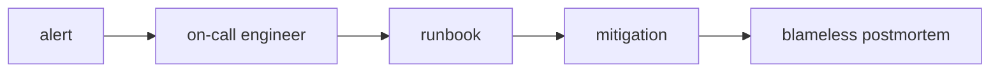

# 장애 대응과 on-call

이 글은 DevOps 101 시리즈의 아홉 번째 글입니다.

## 이 글에서 다룰 문제

- 새벽 3시에 알림이 울리면 누가 무엇을 해야 할까요?
- 장애 심각도(SEV)는 어떤 기준으로 나눠야 팀이 같은 언어로 움직일까요?
- on-call 로테이션은 왜 일정표가 아니라 운영 설계일까요?
- runbook과 incident commander 역할은 실제 복구 속도에 어떤 차이를 만들까요?
- blameless postmortem은 어떻게 재발 방지까지 연결될까요?

> **멘탈 모델**: 장애는 기술 문제이기 전에 조직 문제입니다. 역할, 절차, 문서가 준비돼 있지 않으면 좋은 엔지니어가 많아도 장애 순간에는 쉽게 혼선이 생깁니다.

## 왜 중요한가

장애는 항상 발생할 수 있습니다. 중요한 차이는 장애가 오느냐가 아니라, 팀이 얼마나 빠르고 침착하게 복구하느냐입니다. 역할과 절차가 없는 팀은 같은 기술력을 갖고 있어도 장애 순간에 훨씬 더 큰 혼선을 겪습니다.

특히 작은 팀일수록 이 주제가 중요합니다. 사람이 적을수록 한 사람이 진단, 복구, 커뮤니케이션을 동시에 떠안기 쉬워지고, 그럴수록 판단 품질이 급격히 떨어집니다.

> 프로세스는 기억력을 대신합니다.

## 한눈에 보는 개념



좋은 장애 대응은 영웅적인 개인에게 기대지 않습니다. 알림을 받은 사람이 런북을 열고, 완화 조치를 하고, 필요하면 조율 역할이 붙고, 마지막에 포스트모템으로 학습이 남는 흐름이 있어야 합니다.

## 핵심 용어

- **SEV1~SEV4**: 회사 전체 장애부터 경미한 버그까지 나누는 심각도 체계입니다.
- **On-call**: 특정 시간대에 알림을 직접 받는 담당자입니다.
- **Runbook**: 증상, 진단, 조치 순서를 적은 대응 문서입니다.
- **Incident commander (IC)**: 장애 중 역할과 의사결정을 조율하는 사람입니다.
- **Postmortem**: 장애 이후 원인과 재발 방지책을 정리하는 문서입니다.
- **MTTD/MTTR**: 탐지와 복구까지 걸린 평균 시간입니다.

이 용어를 미리 정리해 두면 장애 순간의 대화가 훨씬 짧아집니다. 무엇을 보고, 누가 받고, 누가 결정하는지 언어가 합의되어 있기 때문입니다.

## Before/After

**Before**: 알림이 울리면 Slack에서 "이거 누가 보고 있나요?"가 먼저 나오고, 여러 사람이 동시에 손을 대다가 오히려 문제를 더 키우기 쉽습니다.

이 상태에서는 기술적으로 정답을 알고 있는 사람도 팀 전체를 안정시키기 어렵습니다. 기록과 커뮤니케이션, 복구가 뒤섞여 버리기 때문입니다.

**After**: *one on-call* applies a *runbook* to *mitigate*, then an *IC* coordinates and the team holds a *postmortem*.

역할이 분리된 팀은 첫 대응부터 다릅니다. on-call이 초기 조치를 하고, 필요하면 IC가 의사결정과 커뮤니케이션을 정리하며, 복구 후에는 학습까지 남깁니다.

## 장애 대응을 구성하는 5단계

### 1단계 — 심각도(SEV) 정의

장애 대응의 첫 번째 준비물은 기술 지식이 아니라 같은 상황을 같은 기준으로 부를 수 있는 언어입니다. 심각도 정의가 없으면 누구는 큰일이라고 하고 누구는 경미하다고 판단해 대응이 흔들립니다.

```text
SEV1: company-wide outage     | respond immediately
SEV2: core feature degraded   | within 30 min
SEV3: partial degradation     | within business day
SEV4: low-impact bug          | backlog
```

### 2단계 — on-call 로테이션

누가 언제 알림을 받을지 명확하지 않으면 결국 모두가 책임지는 척하지만 실제로는 아무도 선명하게 책임지지 않게 됩니다. primary와 secondary, handoff를 포함한 로테이션이 필요합니다.

```yaml
rotation:
  schedule: weekly
  primary: [alice, bob, carol]
  secondary: [dave, erin]
  handoff: "Mondays 10:00, hand off open incidents"
```

### 3단계 — runbook 템플릿

런북은 기억 의존을 줄이는 핵심 문서입니다. 좋은 런북은 배경 설명보다, 지금 무엇을 열고 어떤 명령을 실행해야 하는지가 먼저 보입니다.

```markdown
# Runbook: API 500 spike

## Symptoms
- /api/* 5xx ratio above 5%

## Diagnosis
1. Open the Grafana "API Errors" dashboard
2. Check recent logs: {service="api", level="error"}

## Mitigation
- If a recent deploy is suspect: `kubectl rollout undo deploy/api`

## Escalation
- If unresolved in 30 min, page IC in #incident channel
```

### 4단계 — incident commander 역할

장애 때 가장 흔한 실수는 가장 잘 아는 사람이 모든 일을 동시에 하게 두는 것입니다. IC는 직접 복구하기보다, 역할을 나누고 판단과 소통을 정리하는 역할이어야 합니다.

```text
IC = decision maker. Does NOT fix things directly.
- Single source of communication
- Assigns roles (investigator/comms/scribe)
- Decides on external announcements
```

### 5단계 — blameless postmortem

복구가 끝났다고 장애 대응이 끝난 것은 아닙니다. 시스템과 절차를 고쳐야 같은 종류의 장애를 반복하지 않습니다.

```markdown
# Postmortem: 2026-05-04 API outage

- Impact: 12 minutes at 30% 5xx
- Timeline: 03:11 alert -> 03:18 rollback -> 03:23 recovery
- Root cause: typo in feature flag default
- Prevention: add flag-validation checklist to PR template
```

## 이 코드에서 먼저 봐야 할 점

- 사람이 아니라 시스템과 절차를 고치는 관점이 일관되게 들어 있습니다.
- 런북은 코드 가까이에 있어야 실제 장애 때 찾을 수 있습니다.
- 후속 조치는 반드시 담당자와 기한이 있어야 합니다.

장애 대응 체계의 품질은 문서 양이 아니라, 알림이 울렸을 때 팀이 실제로 따라갈 수 있는가로 판단해야 합니다.

## 자주 하는 실수 5가지

1. **포스트모템에 사람 이름과 잘못을 적는 실수**입니다. 신뢰가 무너지면 학습도 멈춥니다.
2. **런북을 깊은 위키에 묻어 두는 실수**입니다. 새벽 3시에 못 찾으면 없는 문서와 다르지 않습니다.
3. **알림을 너무 많이 두는 실수**입니다. 결국 진짜 중요한 알림을 놓치게 됩니다.
4. **주니어를 혼자 on-call에 세우는 실수**입니다. 항상 백업 경로가 있어야 합니다.
5. **장애 뒤에 액션 아이템을 남기지 않는 실수**입니다. 같은 사고가 다른 이름으로 반복됩니다.

## 실무에서는 이렇게 이어집니다

성숙한 팀은 모든 알림에 runbook URL을 붙입니다. on-call 엔지니어가 검색부터 시작하지 않도록 하기 위해서입니다. PagerDuty나 Opsgenie가 runbook URL 필드를 제공하는 이유도 여기에 있습니다.

또한 MTTD와 MTTR을 숫자로 남깁니다. 장애 대응은 감정이 강하게 남는 영역이라 체감으로 판단하기 쉬운데, 실제 개선은 측정에서 시작합니다.

## 시니어 엔지니어는 이렇게 봅니다

- 알림 품질이 팀의 수면 품질을 결정합니다.
- 모든 SEV1은 포스트모템까지 이어져야 합니다.
- blameless 원칙은 선택 사항이 아닙니다.
- 액션 아이템은 티켓으로 추적해야 합니다.
- MTTR은 측정하기 전에는 줄어들지 않습니다.

## 체크리스트

- [ ] SEV 정의가 문서화되어 있습니다.
- [ ] on-call 로테이션이 자동화되어 있습니다.
- [ ] 알림에서 런북으로 바로 이동할 수 있습니다.
- [ ] 포스트모템 템플릿이 존재합니다.

## 연습 문제

1. 팀에서 가장 자주 겪는 장애에 대한 런북을 작성해 보세요.
2. SEV 정의를 팀과 합의하고 문서화해 보세요.
3. 최근 장애 하나를 blameless postmortem 형식으로 다시 정리해 보세요.

## 정리 및 다음 단계

장애 대응은 기술과 조직이 만나는 운영 역량입니다. 다음 글에서는 지금까지 살펴본 모든 요소를 하나의 DevOps 흐름으로 연결해 정리합니다.

<!-- toc:begin -->
- [DevOps란 무엇인가?](./01-what-is-devops.md)
- [CI 파이프라인](./02-ci-pipeline.md)
- [CD와 배포 전략](./03-cd-and-deployment.md)
- [환경 분리와 설정 관리](./04-environments-and-config.md)
- [Infrastructure as Code](./05-infrastructure-as-code.md)
- [컨테이너와 빌드](./06-containers-and-build.md)
- [모니터링과 알림](./07-monitoring-and-alerting.md)
- [로그 수집과 분석](./08-logging-and-analysis.md)
- **장애 대응과 on-call (현재 글)**
- 운영 가능한 DevOps 흐름 (예정)
<!-- toc:end -->

## 참고 자료

- [Google SRE Book — Managing Incidents](https://sre.google/sre-book/managing-incidents/)
- [PagerDuty Incident Response](https://response.pagerduty.com/)
- [Atlassian Postmortem Template](https://www.atlassian.com/incident-management/postmortem/templates)
- [Blameless Postmortems (Etsy)](https://www.etsy.com/codeascraft/blameless-postmortems/)

Tags: DevOps, Incident, OnCall, SRE, Postmortem
