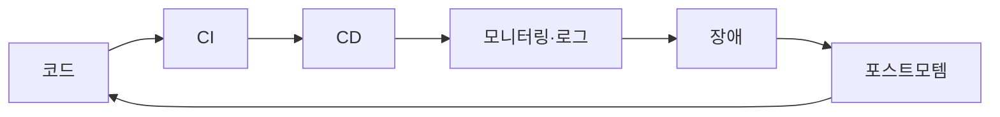

# 운영 가능한 DevOps 흐름

## 이 글에서 다룰 문제

- CI, CD, 모니터링, 장애 대응이 각각 돌아가는데도 팀 전체 속도가 느린 이유는 무엇일까요?
- DevOps를 도구 목록이 아니라 하나의 운영 흐름으로 보려면 어떤 그림이 필요할까요?
- DORA 4지표는 무엇을 재고, 왜 네 개를 함께 봐야 할까요?
- 주간·월간·분기별 팀 리듬은 DevOps를 실제 습관으로 만드는 데 어떤 역할을 할까요?
- 이 시리즈를 마친 뒤 Observability, SRE, Kubernetes 중 무엇을 다음 단계로 보면 좋을까요?

> DevOps 101 시리즈 (10/10)

DevOps를 공부할 때 가장 흔한 오해는 도구를 많이 붙이면 곧 DevOps가 된다고 생각하는 것입니다. CI를 붙이고, 배포 자동화를 만들고, 대시보드를 열어 두면 뭔가 갖춰진 것처럼 보입니다. 그런데 막상 운영을 해 보면 빌드는 빌드대로, 배포는 배포대로, 모니터링은 모니터링대로 따로 움직이고 있다는 사실을 자주 마주칩니다. 도구는 있는데 흐름이 없는 상태입니다.

이 글은 DevOps 101 시리즈의 마지막 글입니다. 앞선 글에서 다룬 CI, CD, 환경 분리, IaC, 컨테이너, 모니터링, 로깅, 장애 대응을 하나의 그림으로 묶겠습니다. 핵심은 간단합니다. DevOps는 툴박스가 아니라 피드백 루프를 가진 운영 흐름이라는 점입니다. 흐름이 닫혀야 팀이 배웁니다.

---

## 왜 도구만 늘리면 오히려 복잡해질까요?

툴은 문제를 해결해 주지만, 툴 사이의 연결까지 대신 설계해 주지는 않습니다. 예를 들어 CI는 성공하는데 배포 후 장애가 잦고, 모니터링은 있는데 포스트모템이 쌓이지 않는 팀을 떠올려 보겠습니다. 각각의 도구는 작동하지만, 결과가 다음 단계의 입력으로 이어지지 않습니다. 그래서 팀은 매번 같은 문제를 다른 이름으로 다시 겪습니다.

> 측정되지 않는 것은 개선되지 않습니다.

이 문장이 마지막 글에서 중요한 이유는, 흐름을 연결하는 가장 강한 접착제가 측정이기 때문입니다. 배포가 얼마나 자주 일어나는지, 변경이 프로덕션에 닿기까지 얼마나 걸리는지, 배포가 얼마나 자주 장애를 만드는지, 장애에서 복구하기까지 얼마나 걸리는지 보지 않으면 팀의 대화는 쉽게 감상이나 인상으로 흘러갑니다. DevOps는 속도와 안정성을 함께 다루는 일이라서 더더욱 숫자가 필요합니다.

---

## 한눈에 보는 DevOps 피드백 루프



이 그림은 시리즈 전체를 한 장으로 압축한 것입니다. 코드를 작성하고, CI로 검증하고, CD로 배포하고, 모니터링과 로그로 상태를 읽고, 장애가 나면 대응하고, 포스트모템으로 배운 뒤 다시 코드와 프로세스를 고칩니다. 중요한 점은 마지막 화살표입니다. postmortem이 code로 돌아오지 않으면 이 흐름은 선형 파이프라인일 뿐이고, DevOps가 말하는 학습 루프가 되지 않습니다.

운영이 안정적인 팀은 이 그림을 머릿속으로만 갖고 있지 않습니다. 각 단계의 책임자, 도구, 시작 지점이 분명합니다. PR은 어디서 열고, CI 실패는 누가 보고, staging과 prod 배포 기준은 무엇이고, 알림은 누가 받고, 포스트모템 후속 조치는 어디서 추적하는지가 연결되어 있습니다. DevOps는 결국 이런 연결의 품질입니다.

## Before/After

흐름이 없는 조직에서는 빌드와 배포, 모니터링이 각각 성공해도 팀 전체는 느립니다. 배포는 자주 하는데 실패율을 모른 채 진행하고, 장애가 나도 다음 PR 템플릿이나 테스트 전략이 바뀌지 않습니다. 운영 개선이 개인의 의지에 기대기 때문에 사람에 따라 편차도 큽니다.

흐름이 있는 팀은 전체 그림을 한 번에 볼 수 있습니다. 한 대시보드에서 DORA 4지표를 확인하고, 주간 리뷰에서 위험 배포와 최근 장애를 함께 읽고, 월간 포스트모템 회고에서 반복 패턴을 발견하면 시스템을 바꿉니다. 속도와 안정성을 따로 이야기하지 않고 같은 화면에서 다룹니다.

---

## 5단계로 흐름 만들기

처음부터 거대한 플랫폼을 만들 필요는 없습니다. 오히려 작은 팀일수록 손으로 측정하고 짧은 회의를 반복하는 쪽이 현실적입니다. 아래 다섯 단계는 영어 원문의 예시를 그대로 가져오되, 실제 팀에 맞게 가장 작게 시작하는 방법으로 이해하면 좋습니다. 중요한 것은 완벽한 도입이 아니라, 다음 주에도 계속할 수 있는 리듬을 만드는 일입니다.

### 1단계 — 흐름을 그림으로 그린다

대부분의 팀은 각자 자기 단계만 잘 알고 있습니다. 개발자는 PR과 CI를, 운영 담당은 배포와 알림을, 리더는 지표를 따로 봅니다. 그래서 먼저 해야 할 일은 복잡한 자동화보다 전체 흐름을 같은 종이에 올리는 것입니다. 누가 어떤 단계를 소유하고 어떤 도구를 쓰는지 한 장에 보이면, 병목과 공백이 곧바로 드러납니다.

```text
한 장의 종이에 다음 흐름을 적습니다.
PR -> CI -> staging -> prod -> alert -> on-call -> postmortem
각 단계마다 *owner*와 *tool*을 함께 적습니다.
```

이 작업은 단순해 보이지만 효과가 큽니다. staging 승인 기준이 없는지, prod 배포 뒤 어떤 알림을 보는지, postmortem 후속 조치를 누가 소유하는지처럼 팀이 암묵적으로 넘겨 왔던 문제를 눈에 띄게 만듭니다.

### 2단계 — DORA 4지표 측정 시작

DORA 지표는 DevOps 흐름을 숫자로 읽는 가장 좋은 출발점입니다. deploy frequency는 배포 빈도, lead time for changes는 merge에서 production까지 걸리는 시간, change failure rate는 장애를 만든 배포 비율, MTTR은 복구 시간입니다. 이 네 개를 함께 봐야 속도만 빠르거나 안정성만 높은 왜곡을 피할 수 있습니다.

중요한 점은 자동 수집이 준비될 때까지 기다릴 필요가 없다는 사실입니다. 처음 몇 주는 손으로 적어도 충분합니다. 측정 습관이 생긴 뒤에 자동화해도 늦지 않습니다.

```python
# 가장 단순한 시작은 배포마다 GitHub Release를 하나 만드는 것입니다.
# 이 네 숫자만 매주 손으로 적어도 충분히 시작할 수 있습니다.
metrics = {
    "deploy_frequency": "5 per week",
    "lead_time": "6 hours average",
    "change_failure_rate": "8%",
    "mttr": "22 minutes",
}
```

지표를 손으로 적는 행위 자체가 팀에 메시지를 줍니다. 우리는 감으로만 운영하지 않고, 변화를 숫자로 읽겠다는 약속입니다. 작은 팀일수록 이 약속이 중요합니다.

### 3단계 — 주간 의식: 배포 리뷰 (30분)

흐름은 문서로만 유지되지 않습니다. 팀이 정기적으로 같은 데이터를 함께 읽는 시간이 있어야 살아남습니다. 주간 deploy review는 길 필요가 없습니다. 지난주 배포 횟수, 최근 장애 한 건, 이번 주 위험 배포 후보만 봐도 충분합니다. 핵심은 짧고 반복적이어야 한다는 점입니다.

```text
- 지난주 배포 횟수
- 지난주 장애 요약 1건
- 이번 주 위험 배포 후보
```

이 회의는 보고용 행사가 아니라 리듬을 맞추는 장치입니다. 모두가 같은 지표와 같은 사건을 보고 있으면, 다음 배포에서 어떤 위험을 조심해야 하는지 자연스럽게 공유됩니다.

### 4단계 — 월간 의식: 포스트모템 읽기 (60분)

주간 리뷰가 현재를 보는 자리라면, 월간 포스트모템 읽기는 패턴을 보는 자리입니다. 개별 장애는 지나가지만, 비슷한 유형이 반복되면 시스템 설계나 팀 절차 쪽에 구조적 문제가 있다는 신호일 가능성이 큽니다. 포스트모템을 문서함에 쌓아 두지 말고 함께 읽어야 하는 이유가 여기에 있습니다.

```text
- 이번 달 포스트모템을 함께 읽습니다.
- action item 완료율을 추적합니다.
- 반복 패턴이 보이면 *system*을 바꿉니다.
```

이 단계에서 중요한 것은 비난보다 변화입니다. 같은 종류의 장애가 두 번, 세 번 반복된다면 개인 실수가 아니라 시스템 설계가 학습을 흡수하지 못하고 있다는 뜻입니다.

### 5단계 — 분기별: 다음 단계 결정

DevOps 흐름은 한 번 설계하고 끝나는 체계가 아닙니다. 팀 규모, 서비스 수, 장애 양상이 바뀌면 다음 학습 주제와 도구 구성도 달라집니다. 그래서 분기별로는 한 걸음 물러서서 이 흐름 자체를 점검해야 합니다.

```text
- 다음 학습 트랙을 고릅니다.
- 도구를 추가하거나 제거합니다.
- 조직 구조 변경이 필요하면 제안합니다.
```

어떤 팀은 Observability 강화가 먼저일 수 있고, 어떤 팀은 SLO와 error budget이 필요한 시점일 수 있습니다. 서비스 수가 늘었다면 platform team이나 internal developer platform 같은 구조적 해법을 검토할 수도 있습니다.

## 이 코드에서 주목할 점

- 지표는 처음부터 자동 수집하지 않아도 됩니다. 중요한 것은 측정을 시작하는 일입니다.
- 팀 리듬은 길고 무거운 회의보다 짧고 반복적인 의식이 더 잘 유지됩니다.
- postmortem이 code와 process 변경으로 돌아올 때 비로소 피드백 루프가 닫힙니다.

## 자주 하는 실수 5가지

1. 도구부터 도입하고 흐름은 나중에 생각하는 경우입니다. 그러면 각 도구가 연결되지 않은 섬으로 남습니다.
2. DORA 4지표 중 MTTR만 보는 경우입니다. 속도와 안정성의 균형을 보려면 네 개를 함께 봐야 합니다.
3. 포스트모템을 읽지 않는 경우입니다. 문서는 남아도 학습은 남지 않아 같은 장애가 반복됩니다.
4. 팀 의식이 길고 형식적인 경우입니다. 짧고 데이터 중심이어야 지속됩니다.
5. 개선 책임이 없는 경우입니다. 누가 이 흐름의 owner인지 분명해야 개선이 계속됩니다.

## 실무에서는 이렇게 쓰입니다

성숙한 조직은 이 흐름을 개인 경험에 맡기지 않고 플랫폼화합니다. 플랫폼 팀이 내부 개발자 플랫폼(IDP)을 통해 새 서비스가 기본 CI, 배포, 관측성, 알림, 문서 템플릿을 자동으로 상속받게 만듭니다. 팀이 늘어날수록 이런 공통 흐름의 가치가 커집니다.

다만 작은 팀은 거기까지 갈 필요가 없습니다. 먼저 한 장짜리 흐름, 손으로 적는 DORA 4지표, 짧은 주간·월간 리뷰만으로도 충분히 큰 변화를 만들 수 있습니다. DevOps의 핵심은 거대한 시스템이 아니라 지속적으로 배우는 팀 습관입니다. 같은 질문을 같은 주기로 다시 보는 문화가 생기면, 도구는 그다음에 자연스럽게 따라옵니다.

## DORA 4지표는 함께 읽어야 합니다

네 가지 지표를 따로따로 보면 오해하기 쉽습니다. 배포 빈도만 높으면 빨라 보이지만, 변경 실패율이 함께 올라가면 팀은 빠르게 문제를 배포하는 셈이 됩니다. 반대로 변경 실패율만 낮추겠다고 배포를 지나치게 줄이면 안정성은 높아 보여도 학습 속도가 크게 떨어질 수 있습니다. 그래서 DORA 지표는 어느 하나의 점수를 자랑하는 도구가 아니라, 속도와 안정성의 균형을 읽는 렌즈로 써야 합니다.

리드 타임도 마찬가지입니다. PR이 오래 머무는지, staging 승인에 시간이 걸리는지, 운영 배포 창이 너무 제한적인지에 따라 같은 숫자라도 의미가 달라집니다. 숫자를 본 뒤에는 언제나 질문이 따라와야 합니다. 병목은 어디서 생겼는가, 이 수치가 이번 주의 어떤 사건과 연결되는가, 다음 실험은 무엇인가를 함께 물어야 지표가 살아납니다.

작은 팀에게 특히 유용한 방법은, 매주 수치를 읽고 그 옆에 이유를 한 줄씩 적는 것입니다. "배포 빈도 하락 — 휴일 주간", "리드 타임 증가 — 승인 대기", "변경 실패율 상승 — 기능 플래그 실수"처럼 맥락을 붙이면 숫자가 비난이 아니라 학습 재료가 됩니다.

## 작은 팀은 어떤 리듬부터 만들면 좋을까요?

실무에서 가장 많이 실패하는 시도는 처음부터 큰 체계를 설계하는 것입니다. 회의는 많아지고 문서는 늘어나지만, 몇 주 지나면 아무도 보지 않는 제도만 남습니다. 작은 팀이라면 오히려 반대로 가는 편이 좋습니다. 매주 30분, 매달 60분처럼 작고 분명한 리듬을 먼저 만들고, 그 안에서 꼭 필요한 숫자와 사건만 읽는 방식이 훨씬 오래 갑니다.

예를 들어 주간 리뷰에서는 지난주 배포 수, 가장 큰 장애 한 건, 이번 주 위험 변경 두세 개만 보아도 충분합니다. 월간 리뷰에서는 포스트모템 몇 건을 함께 읽고, 재발 방지 항목이 실제로 닫혔는지 확인하면 됩니다. 이 정도만 꾸준히 해도 팀은 점점 같은 언어를 갖게 됩니다. 무엇이 위험한 배포인지, 어떤 장애는 시스템을 바꿔야 하는 신호인지, 어떤 지표 움직임이 경고인지가 자연스럽게 공유됩니다.

중요한 것은 화려한 프레임워크가 아니라 반복입니다. 같은 질문을 같은 주기로 던지면 팀은 데이터를 쌓고, 데이터가 쌓이면 판단이 정교해지고, 판단이 정교해지면 개선 속도가 붙습니다. DevOps 흐름은 한 번의 혁신으로 완성되지 않고, 이런 작은 반복 속에서 점점 운영 가능한 형태로 굳어집니다.

이 관점은 팀 분위기에도 영향을 줍니다. 문제가 생겼을 때 누군가를 탓하기보다, 이번 루프에서 무엇을 배웠고 다음 루프에서 무엇을 바꿀지를 묻기 시작하기 때문입니다. 결국 운영 가능한 DevOps 흐름은 자동화만 많은 조직이 아니라, 배포와 장애와 회고를 연결해 꾸준히 학습하는 조직에서 만들어집니다.

---

## 시니어 엔지니어는 이렇게 봅니다

- 흐름 자체가 아키텍처입니다.
- 지표가 없으면 토론은 쉽게 의견 싸움이 됩니다.
- 작은 의식이 큰 변화보다 오래 갑니다.
- platformization은 규모가 커질수록 자연스럽게 따라옵니다.
- 학습은 끝나지 않으므로 다음 시리즈를 의도적으로 고르는 것이 중요합니다.

## 체크리스트

- [ ] 코드에서 포스트모템까지의 전체 흐름이 한 그림으로 정리되어 있다.
- [ ] 팀이 DORA 4지표를 주간 단위로 확인하고 있다.
- [ ] 주간 deploy review와 월간 postmortem review가 일정에 잡혀 있다.
- [ ] 흐름의 개선을 소유하는 owner가 분명하다.

## 연습 문제

1. 팀의 Code -> Postmortem 흐름을 한 장으로 그려 보세요.
2. 한 주 동안 DORA 4지표를 손으로 측정해 보세요.
3. 30분짜리 주간 deploy review를 한 번 직접 운영해 보세요.

## 정리 및 다음 단계

DevOps 101은 여기서 마무리입니다. 이 시리즈 전체를 한 문장으로 줄이면, DevOps는 도구의 집합이 아니라 팀이 빠르게 배포하고, 장애를 배우고, 다시 시스템을 고치는 학습 루프입니다. 앞선 글에서 다룬 주제들이 각각 중요한 이유도 결국 이 루프 안에서 자기 자리를 가지기 때문입니다.

다음 학습 경로는 팀의 현재 병목에 따라 고르면 됩니다.

- **Observability 101** — 메트릭, 로그, trace 의 통합
- **SRE 101** — SLO/SLI/Error budget 으로 안정성 운영
- **Kubernetes 101** — 컨테이너 오케스트레이션 본격 입문

DevOps는 결국 팀이 배우는 방식입니다. 이 관점을 잡았다면, 이제는 다음 단계의 도구보다 다음 단계의 학습 루프를 설계할 차례입니다.

<!-- toc:begin -->
- [DevOps란 무엇인가?](./01-what-is-devops.md)
- [CI 파이프라인](./02-ci-pipeline.md)
- [CD와 배포 전략](./03-cd-and-deployment.md)
- [환경 분리와 설정 관리](./04-environments-and-config.md)
- [Infrastructure as Code](./05-infrastructure-as-code.md)
- [컨테이너와 빌드](./06-containers-and-build.md)
- [모니터링과 알림](./07-monitoring-and-alerting.md)
- [로그 수집과 분석](./08-logging-and-analysis.md)
- [장애 대응과 on-call](./09-incident-and-oncall.md)
- **운영 가능한 DevOps 흐름 (현재 글)**
<!-- toc:end -->

## 참고 자료

- [DORA Research Program](https://dora.dev/)
- [Google SRE Workbook](https://sre.google/workbook/table-of-contents/)
- [Accelerate (book)](https://itrevolution.com/product/accelerate/)
- [Team Topologies](https://teamtopologies.com/)

Tags: DevOps, DORA, Strategy, Capstone, Engineering
