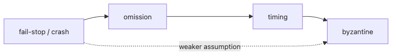

# Failure Models

When an incident channel says "the service is down," that sentence hides several very different realities. A node may be dead, the network may be dropping packets, or the node may simply be so slow that every peer mistakes it for dead.

This is post 2 in the Distributed Systems 101 series.

Here we name those realities precisely so later topics such as consensus, leases, and CAP stop sounding like abstract theory and start reading like concrete design choices.

## Questions this chapter answers

- What a failure model is and why we model failure
- The differences between crash, omission, timing, and Byzantine
- Why network partition deserves its own category
- Why timeouts are only an approximation of failure detection
- Which models real systems pick

## Why It Matters

If your algorithm does not state how nodes break, you cannot reason about its correctness or its cost. Raft, Paxos, and BFT algorithms differ because they assume different failure models. Without this vocabulary you cannot read papers or docs.

> A failure model is the price tag of an algorithm.

## Concept at a Glance



*Failure-model spectrum from crash to Byzantine*

The further right you go, the harsher the world you assume. Harsher worlds force more expensive algorithms and more nodes.

## Key Terms

- **Crash (fail-stop)**: A node, once stopped, stays stopped.
- **Omission**: A node may occasionally drop a message.
- **Timing**: A node's response may be arbitrarily slow.
- **Byzantine**: A node may lie or behave arbitrarily.
- **Network partition**: Only the links between nodes break, not the nodes themselves.

## Before/After

**Before — "just assume it died"**

```text
treating every failure the same forces algorithms to over-pay
```

**After — explicit failure model**

```text
crash only -> Raft / Paxos
byzantine  -> BFT (an order of magnitude more expensive)
```

Different assumptions, different costs.

## Hands-on: Simulate Each Failure

### Step 1 — Simulate a crash

```python
# 1_crash.py
import os, sys
def handler():
    print("doing work")
    os._exit(1)  # cleanly dies
handler()
```

Under this model, other nodes assume "once dead, dead forever." The failure detector is simple.

### Step 2 — Simulate omission

```python
# 2_omission.py
import random
def send(msg):
    if random.random() < 0.1:
        return  # drop with 10% probability
    transport.send(msg)
```

From here on you need retries, sequence numbers, and acknowledgements.

### Step 3 — Simulate timing (slow)

```python
# 3_slow.py
import time, random
def handle(req):
    if random.random() < 0.05:
        time.sleep(10)  # 5% chance of being very slow
    return process(req)
```

A "slow node" and a "dead node" look identical from the outside. That is the limit of timeout-based failure detectors.

### Step 4 — Simulate Byzantine behavior

```python
# 4_byzantine.py
def vote(question):
    real_answer = compute(question)
    return not real_answer if is_malicious() else real_answer
```

Under this model majority voting is not enough; you need signed messages or 3f+1 nodes.

### Step 5 — Simulate a network partition

```bash
# 5_partition.sh (linux)
sudo iptables -A INPUT -s 10.0.0.5 -j DROP
sudo iptables -A OUTPUT -d 10.0.0.5 -j DROP
# restore
sudo iptables -F
```

A partition is the special state where "nodes are alive but cannot see each other." Episode 4 (CAP) lives right here.

## What to Notice in This Code

- The same "error" comes in different flavors with different responses.
- Omission and timing can only be distinguished by timeout (and not exactly).
- Byzantine costs an order of magnitude more.
- Partition is a link-level event, not a node-level one.

## Five Common Mistakes

1. **Assuming every failure is a crash.** Algorithms converge incorrectly when the network breaks partially.
2. **Setting timeouts too short.** You will mark live nodes dead (false suspicion).
3. **Reaching for Byzantine everywhere.** Costs explode.
4. **Ignoring partition.** It is a daily event in cloud environments.
5. **Assuming the failure detector is perfect.** A perfect detector is impossible in an asynchronous model.

## How This Shows Up in Production

Most internet services assume crash + partition (CFT). Finance and blockchain assume Byzantine (BFT, PBFT, Tendermint). The algorithm choices in Kubernetes, Spanner, and Cassandra all explicitly state which failure model they target.

## How a Senior Engineer Thinks

- They pick the algorithm that needs the weakest assumption that suffices (no needless BFT).
- They are aware that failure detectors are always approximate.
- They treat partition as a daily occurrence.
- They derive timeout values from network measurements.
- They trust only docs and RFCs that name the failure model explicitly.

## Checklist

- [ ] Can you state the difference between crash and omission in one line?
- [ ] Can you explain why Byzantine is more expensive?
- [ ] Can you say how partition differs from node failure?
- [ ] Do you know why timeout-based detectors are imperfect?
- [ ] Can you say which model your system assumes?

## Practice Problems

1. Write down which model your service assumes: crash, omission, or Byzantine.
2. List two metrics you must measure to choose a timeout (e.g., p99 latency).
3. Research one mechanism that prevents split-brain when a partition occurs.

## Wrap-up and Next Steps

The failure model is the first design decision; it sets the algorithm and the operational cost. Next we look at how nodes exchange messages on top of these models — RPC and message passing.

<!-- toc:begin -->
- [What Is a Distributed System?](./01-what-is-a-distributed-system.md)
- **Failure Models (current)**
- RPC and message passing (upcoming)
- consistency and CAP (upcoming)
- replication (upcoming)
- consensus and Raft (upcoming)
- leader election (upcoming)
- message queues and event sourcing (upcoming)
- distributed transactions (upcoming)
- patterns for operable distributed systems (upcoming)
<!-- toc:end -->

## References

- [Failure semantics (Wikipedia)](https://en.wikipedia.org/wiki/Failure_semantics)
- [Byzantine fault (Wikipedia)](https://en.wikipedia.org/wiki/Byzantine_fault)
- [Network partition (Wikipedia)](https://en.wikipedia.org/wiki/Network_partition)
- [Designing Data-Intensive Applications — chapter 8](https://dataintensive.net/)

Tags: Computer Science, Distributed Systems, Failure Models, Crash, Byzantine, Reliability
