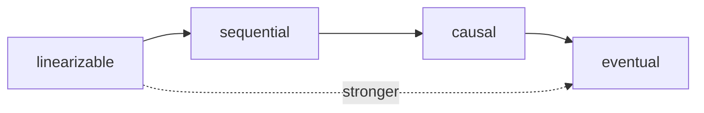

# Consistency and CAP

This is post 4 in the Distributed Systems 101 series.

> Distributed Systems 101 series (4/10)

<!-- a-grade-intro:begin -->

**Core question**: The moment data lives in more than one place, why does "what is the latest value?" suddenly become hard?

> CAP says that during a partition you must give up either consistency or availability. The shape of that compromise is the consistency model you choose.

<!-- a-grade-intro:end -->

## What You Will Learn

- The many meanings of consistency (different from the C in transactions)
- The spectrum from linearizable to sequential to causal to eventual
- The CAP theorem and the misunderstandings around it
- What PACELC adds to CAP
- Where real databases sit on the spectrum

## Why It Matters

A one-line difference like "this DB is strongly consistent" or "eventual" reshapes the whole design. The screens you can build, your retry policy, and the failure behavior all flow from this. Without CAP vocabulary you cannot read database docs.

> A consistency model is data's social contract.

## Concept at a Glance



Toward the left is intuitive but expensive. Toward the right is cheap and available but further from intuition.

## Key Terms

- **Linearizability**: Every node behaves as if there were a single timeline.
- **Sequential consistency**: All nodes see the same order, but real-time order is not guaranteed.
- **Causal consistency**: Only the ordering of causally related operations is preserved.
- **Eventual consistency**: All replicas converge given enough time.
- **CAP**: During a partition you must choose between C and A.

## Before/After

**Before — "let the DB decide"**

```text
defaults silently chosen -> races and stale reads in production
```

**After — explicit model selection**

```text
orders/payments -> linearizable, feeds/recommendations -> eventual
```

You distribute cost by screen.

## Hands-on: See the Models in Code

### Step 1 — single node (the linearizable baseline)

```python
# 1_single.py
log = []
def write(x): log.append(x)
def read(): return log[-1] if log else None
```

On a single node every read sees the latest write. That intuition is the baseline.

### Step 2 — async replica (eventual)

```python
# 2_eventual.py
import threading, time
primary = []
replica = []
def write(x):
    primary.append(x)
    threading.Thread(target=lambda: (time.sleep(0.5), replica.append(x))).start()
def read_primary(): return primary[-1] if primary else None
def read_replica(): return replica[-1] if replica else None
```

A value just written is invisible on the replica for half a second. That is eventual in one snippet.

### Step 3 — fake read-your-writes

```python
# 3_ryw.py
session_writes = {}
def write(uid, x):
    primary.append(x); session_writes[uid] = x
def read(uid):
    if uid in session_writes:
        return session_writes[uid]   # users see their own writes immediately
    return read_replica()
```

This is the common pattern of layering a stronger guarantee on top of a weaker model.

### Step 4 — partition simulation (CAP choice)

```python
# 4_partition.py (pseudocode)
def write(x):
    if not majority_alive():
        # CP: refuse
        raise Exception("no majority")
        # AP: accept locally and merge later
```

Two lines of difference separate CP from AP.

### Step 5 — fake causal (one-line vector clock)

```python
# 5_vector.py
clock = {"A":0, "B":0}
def tick(node): clock[node] += 1
def happens_before(a, b):
    return all(a[k] <= b[k] for k in a) and any(a[k] < b[k] for k in a)
```

Causal models only need to preserve happens-before. Concurrent events are free to be in any order.

## What to Notice in This Code

- Consistency is a spectrum, not a binary.
- A single system can choose different models per screen.
- Read-your-writes is the trick that saves UX on weaker models.
- CP vs AP under partition is a policy decision, not automatic.

## Five Common Mistakes

1. **Confusing CAP's C with the C of ACID transactions.** Two different concepts.
2. **Calling a system "CP" globally.** Different calls in the same system can choose different models.
3. **Reading "eventual" as "soon."** There is no time bound in the guarantee.
4. **Assuming read-your-writes is automatic.** You must implement it.
5. **Promising strong consistency while ignoring partitions.** You will not deliver.

## How This Shows Up in Production

Spanner, etcd, and ZooKeeper aim near linearizability (CP). DynamoDB, Cassandra, and Redis Cluster default close to eventual (AP). Even within one company, payment DBs go CP and recommendation caches go AP. PACELC adds the latency vs consistency view for the partition-free common case.

## How a Senior Engineer Thinks

- They map models to screens, not to the whole system.
- They implement read-your-writes explicitly (sticky sessions and so on).
- They treat partition policy as an operational responsibility.
- They measure "strong consistency is expensive" via SLOs.
- They distrust docs that do not name the model.

## Checklist

- [ ] Can you state the difference between linearizable and eventual in one line?
- [ ] Can you say what CAP means when there is no partition?
- [ ] Can you map your system's screens to consistency models?
- [ ] Can you describe how to implement read-your-writes?
- [ ] Do you know what the ELC in PACELC means?

## Practice Problems

1. Map three of your service's main data sets to a model (linearizable / causal / eventual).
2. Design how to guarantee read-your-writes in an eventual system.
3. Write down whether you would pick CP or AP under partition and why.

## Wrap-up and Next Steps

The consistency model is the most important tradeoff axis once data is distributed. Next we look at the direct cause behind that choice — the kinds of replication and the sync vs async tradeoff.

<!-- toc:begin -->
- [What Is a Distributed System?](./01-what-is-a-distributed-system.md)
- [Failure Models](./02-failure-model.md)
- [RPC and Message Passing](./03-rpc-and-message-passing.md)
- **Consistency and CAP (current)**
- replication (upcoming)
- consensus and Raft (upcoming)
- leader election (upcoming)
- message queues and event sourcing (upcoming)
- distributed transactions (upcoming)
- patterns for operable distributed systems (upcoming)
<!-- toc:end -->

## References

- [CAP theorem (Wikipedia)](https://en.wikipedia.org/wiki/CAP_theorem)
- [Consistency model (Wikipedia)](https://en.wikipedia.org/wiki/Consistency_model)
- [PACELC theorem (Wikipedia)](https://en.wikipedia.org/wiki/PACELC_theorem)
- [Designing Data-Intensive Applications — chapter 9](https://dataintensive.net/)

Tags: Computer Science, Distributed Systems, Consistency, CAP, Linearizability, Eventual Consistency
