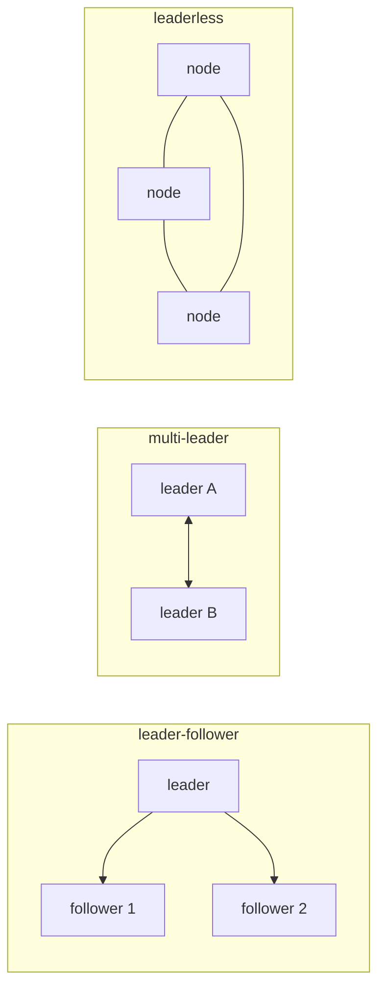

# Replication

> Distributed Systems 101 series (5/10)

<!-- a-grade-intro:begin -->

**Core question**: Putting the same data on more than one node sounds simple — why does it produce so many modes and knobs?

> Replication is the basic tool for durability and availability. But sync vs async, leader count, and quorum settings change visible behavior dramatically.

<!-- a-grade-intro:end -->

## What You Will Learn

- Why we replicate, what kinds exist, and the tradeoffs
- The leader-follower, multi-leader, and leaderless models
- Sync vs async replication and the risk of data loss
- Quorum reads and writes and the meaning of R+W>N
- How to measure and handle replication lag

## Why It Matters

Replication is the lowest layer in any distributed data system. The choices here shape what you saw in episode 4 (consistency) and what you will see in episode 6 (consensus). The answer to "why does my DB behave this way?" is usually in the replication settings.

> Replication settings are the exchange rate between safety and speed.

## Concept at a Glance



These three topologies cover more than ninety percent of real systems.

## Key Terms

- **Leader/follower**: Writes go to one leader, reads can fan out to followers.
- **Multi-leader**: Multiple leaders accept writes and synchronize with each other.
- **Leaderless**: All nodes are equal; quorums decide.
- **Sync replication**: The leader waits for follower acknowledgments.
- **Quorum (R, W, N)**: With R+W>N you guarantee reading the latest value among N replicas.

## Before/After

**Before — single primary, async replica**

```text
fast write but possible data loss on crash
```

**After — sync to majority + read from leader**

```text
slower write, near-zero loss, linearizable reads possible
```

The same system, with one option flipped, makes a different promise.

## Hands-on: Models in Code

### Step 1 — async leader-follower

```python
# 1_async.py
import threading, time
leader = []
follower = []
def write(x):
    leader.append(x)
    threading.Thread(target=lambda: (time.sleep(0.5), follower.append(x))).start()
```

Writes are fast, but if the leader crashes you may lose half a second of data.

### Step 2 — sync leader-follower

```python
# 2_sync.py
def write(x):
    leader.append(x)
    follower.append(x)   # write both before returning
```

A write must touch both nodes. Latency rises; loss approaches zero.

### Step 3 — quorum write

```python
# 3_quorum.py
nodes = [[], [], []]   # N=3
def write(x, w=2):
    acks = 0
    for n in nodes:
        n.append(x); acks += 1
        if acks >= w: return "ok"
def read(x_id, r=2):
    seen = []
    for n in nodes:
        if any(item["id"] == x_id for item in n):
            seen.append(n)
            if len(seen) >= r: return "found"
```

R+W>N guarantees at least one node has both. This is the heart of Dynamo-style systems.

### Step 4 — multi-leader (simple last-write-wins)

```python
# 4_mlw.py
A, B = {}, {}
def write_a(k, v): A[k] = (time.time(), v)
def write_b(k, v): B[k] = (time.time(), v)
def merge():
    for k in set(A) | set(B):
        ta, va = A.get(k, (0, None))
        tb, vb = B.get(k, (0, None))
        winner = (va if ta >= tb else vb)
        A[k] = B[k] = (max(ta, tb), winner)
```

LWW is simple but loses user input when clocks drift.

### Step 5 — measuring replication lag

```python
# 5_lag.py
def lag(): return leader_lsn - follower_lsn
print("replication lag rows:", lag())
```

Most DBs expose LSN/GTID/offset. Tracking lag as an SLO catches stale reads early.

## What to Notice in This Code

- Async is fast but can lose data.
- Sync is safe but slow — neither is correct in isolation; pick by workload.
- Quorums turn the tradeoff into a dial via R and W.
- Multi-leader requires you to define conflict resolution by hand.

## Five Common Mistakes

1. **Assuming reads from replicas are always fast.** Lag produces stale reads.
2. **Placing the only sync replica in one place.** That one slow follower blocks the leader.
3. **Using only LWW in multi-leader systems.** Clock drift loses data.
4. **Breaking the R+W>N rule of quorums.** Latest-value guarantee disappears.
5. **Not monitoring lag.** You discover stale reads only when users complain.

## How This Shows Up in Production

PostgreSQL and MySQL use leader-follower by default. Cassandra and DynamoDB are leaderless quorum systems. CRDT-based systems are multi-leader. Cloud multi-AZ DBs typically blend sync to one AZ with async to another.

## How a Senior Engineer Thinks

- They write replication settings down explicitly in docs.
- They expose read-from-replica as a separate endpoint with a documented staleness limit.
- They keep at least two sync replicas to avoid a single slow point.
- They design application-level merge instead of relying on LWW.
- They track lag with an SLO and alert on it.

## Checklist

- [ ] Can you state the difference between sync and async replication in one line?
- [ ] Can you say what R+W>N means?
- [ ] Can you name two ways to resolve conflicts in multi-leader systems?
- [ ] Can you sketch your DB's replication topology?
- [ ] Do you know how to measure replication lag?

## Practice Problems

1. Pick two screens in your service where stale reads are safe.
2. Evaluate the availability and consistency of a quorum config (N=5, W=3, R=3).
3. Design an application-level resolution for two concurrent writes to the same key in a multi-leader system.

## Wrap-up and Next Steps

Replication is the foundation of distributed data. Next we look at the algorithm by which nodes agree on what the next value is — consensus and Raft.

<!-- toc:begin -->
- [What Is a Distributed System?](./01-what-is-a-distributed-system.md)
- [Failure Models](./02-failure-model.md)
- [RPC and Message Passing](./03-rpc-and-message-passing.md)
- [Consistency and CAP](./04-consistency-and-cap.md)
- **Replication (current)**
- consensus and Raft (upcoming)
- leader election (upcoming)
- message queues and event sourcing (upcoming)
- distributed transactions (upcoming)
- patterns for operable distributed systems (upcoming)
<!-- toc:end -->

## References

- [Replication (computing) — Wikipedia](https://en.wikipedia.org/wiki/Replication_(computing))
- [Quorum (distributed computing) — Wikipedia](https://en.wikipedia.org/wiki/Quorum_(distributed_computing))
- [Amazon Dynamo paper](https://www.allthingsdistributed.com/files/amazon-dynamo-sosp2007.pdf)
- [Designing Data-Intensive Applications — chapter 5](https://dataintensive.net/)

Tags: Computer Science, Distributed Systems, Replication, LeaderFollower, QuorumWrites, Durability
