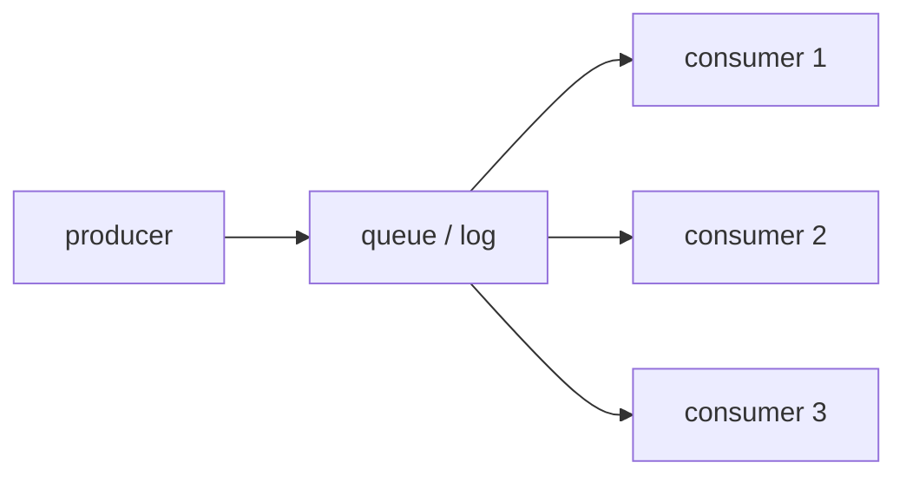

# Message Queues and Event Sourcing

> Distributed Systems 101 series (8/10)

<!-- a-grade-intro:begin -->

**Core question**: When two services depend on the same data, how do they exchange work without calling each other directly?

> Message queues and event sourcing promote time and history into first-class tools of distributed systems.

<!-- a-grade-intro:end -->

## What You Will Learn

- The decoupling and guarantees that a message queue provides
- The meaning of at-most-once, at-least-once, and exactly-once
- The definition of event sourcing and its relationship to CQRS
- Why Kafka is a log, not a broker
- The core ideas of consumer groups, partitions, and offsets

## Why It Matters

Direct service-to-service calls strongly couple availability and latency. Put a queue in between and one side staying up does not depend on the other. Event sourcing goes one step further by defining state as the sum of events, making history and replay possible.

> Queues separate time. Events separate truth.

## Concept at a Glance



Producers write to the queue and consumers read at their own pace. A single message can be processed by several consumers.

## Key Terms

- **Message queue**: A middleman that stores and dispatches messages.
- **Event sourcing**: A pattern that represents state as the accumulation of events.
- **Offset**: A position pointing at how far a consumer has read.
- **Consumer group**: A unit that shares messages among its members.
- **Idempotency**: The property that processing the same message many times yields the same result.

## Before/After

**Before — direct calls**

```text
order -> payment -> inventory -> notify   (one death stops everything)
```

**After — separated by a queue**

```text
order -> queue
         -> payment consumer
         -> inventory consumer
         -> notify consumer
```

Each consumer works at its own pace; if it dies the queue holds the messages.

## Hands-on: Queues and Event Sourcing

### Step 1 — start with an in-memory queue

```python
# 1_queue.py
from collections import deque
q = deque()
def produce(msg): q.append(msg)
def consume():
    if q: return q.popleft()
```

The simplest in-memory queue. Later steps extend this idea to a distributed setting.

### Step 2 — durable queue (append-only log)

```python
# 2_log.py
import json
def produce(path, msg):
    with open(path, "a") as f: f.write(json.dumps(msg) + "\n")
def consume(path, offset):
    with open(path) as f:
        lines = f.readlines()
    return lines[offset], offset + 1
```

Once the queue becomes a file, messages survive a crash. This is the essence of Kafka.

### Step 3 — at-least-once + idempotent consumer

```python
# 3_idem.py
processed = set()
def consume_once(msg):
    if msg["id"] in processed: return "skip"
    processed.add(msg["id"])
    return "process"
```

Even if the queue delivers the same message twice it is safe — duplicates are filtered by ID.

### Step 4 — event sourcing reconstructs state

```python
# 4_event.py
events = [
    {"type": "deposit", "amount": 100},
    {"type": "withdraw", "amount": 30},
]
def balance(events):
    b = 0
    for e in events:
        if e["type"] == "deposit": b += e["amount"]
        elif e["type"] == "withdraw": b -= e["amount"]
    return b
print(balance(events))  # 70
```

Instead of storing state, compute it from the sum of events. Any past point can be reproduced.

### Step 5 — CQRS read model

```python
# 5_cqrs.py
read_model = {"balance": 0}
def project(event):
    if event["type"] == "deposit": read_model["balance"] += event["amount"]
    elif event["type"] == "withdraw": read_model["balance"] -= event["amount"]
```

Writes go through events; reads use a precomputed model. Splitting the two paths makes each easier to optimize.

## What to Notice in This Code

- The moment the queue becomes a file, the fate of messages changes — durability and replay.
- Exactly-once is not a property of the queue alone; it is "queue + idempotent consumer."
- In event sourcing the history is essence, snapshots are optimization.
- The read model is throwaway — it can be rebuilt from events anytime.

## Five Common Mistakes

1. **Believing exactly-once is guaranteed by the broker alone.** Consumer idempotency is required too.
2. **Using too many partitions.** Rebalance cost and metadata explosion.
3. **Treating events as mutable.** A written event is never edited.
4. **Replaying a million events every time without snapshots.** Periodic snapshots are necessary.
5. **Treating the read model as the source of truth.** Truth lives in the event log.

## How This Shows Up in Production

Kafka is the most widely used streaming backbone, a distributed append-only log. RabbitMQ and AWS SQS are traditional message queues. Event sourcing is often adopted in finance, order systems, and any domain with audit needs. CQRS suits systems where read and write workloads diverge significantly.

## How a Senior Engineer Thinks

- Before introducing a queue they confirm the flow can really be asynchronous.
- They design consumer idempotency before choosing the queue technology.
- They write down who commits the offset.
- They decide event-schema versioning from day one.
- They measure read-model rebuild time and put it in an SLO.

## Checklist

- [ ] Can you explain at-most-once / at-least-once / exactly-once in one line each?
- [ ] Can you say why event sourcing is strong for audit?
- [ ] Can you describe the relationship between consumer group and partition?
- [ ] Can you say why CQRS separates the read and write paths?
- [ ] Do you have one pattern in mind for guaranteeing idempotency?

## Practice Problems

1. Design an order system with event sourcing. Write the schema for five events.
2. Explain in a paragraph how at-least-once plus an idempotent consumer approximates exactly-once.
3. List two criteria you would use to decide the partition count in Kafka.

## Wrap-up and Next Steps

Queues and event sourcing are tools that handle time in distributed systems. Next we look at the difficulty of transactions across multiple nodes — distributed transactions — and the practical solutions that exist.

<!-- toc:begin -->
- [What Is a Distributed System?](./01-what-is-a-distributed-system.md)
- [Failure Models](./02-failure-model.md)
- [RPC and Message Passing](./03-rpc-and-message-passing.md)
- [Consistency and CAP](./04-consistency-and-cap.md)
- [Replication](./05-replication.md)
- [Consensus and Raft](./06-consensus-and-raft.md)
- [Leader Election](./07-leader-election.md)
- **Message Queues and Event Sourcing (current)**
- distributed transactions (upcoming)
- patterns for operable distributed systems (upcoming)
<!-- toc:end -->

## References

- [Apache Kafka documentation](https://kafka.apache.org/documentation/)
- [Event Sourcing — Martin Fowler](https://martinfowler.com/eaaDev/EventSourcing.html)
- [CQRS — Martin Fowler](https://martinfowler.com/bliki/CQRS.html)
- [Designing Data-Intensive Applications — chapter 11](https://dataintensive.net/)

Tags: Computer Science, Distributed Systems, MessageQueue, EventSourcing, Kafka, CQRS
