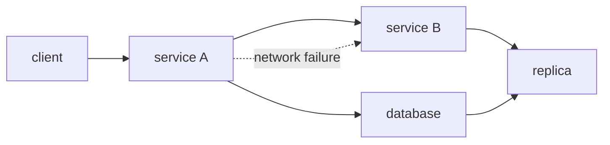

# 분산 시스템이란 무엇인가?

> Distributed Systems 101 시리즈 (1/10)


## 이 글에서 다룰 문제

요즘은 거의 모든 서비스가 사실상 분산 시스템입니다. 데이터베이스 한 대도 replica를 두면 분산 시스템이고, 마이크로서비스 두 개만 있어도 분산 시스템입니다. 단일 머신의 직관(즉시 응답, 항상 성공, 같은 시계)으로 짜면 production에서 반드시 깨집니다.

> 단일 머신 프로그램의 가정이 깨지는 지점이 곧 분산 시스템의 본질입니다.

## 개념 한눈에 보기



화살표 하나하나가 latency, failure, partial 응답의 가능성을 가집니다. 단일 함수 호출과 본질적으로 다릅니다.

## Before/After

**Before — 단일 머신 직관**

```text
함수 호출은 즉시 끝난다 / 항상 성공한다 / 시계는 하나다
```

**After — 분산 환경**

```text
호출은 ms~s 걸릴 수 있다 / 일부만 실패할 수 있다 / 노드마다 시계가 다르다
```

이 단순한 차이가 retry, timeout, consensus 같은 이 시리즈의 모든 주제를 만들어 냅니다.

## 실습: 단일 vs 분산의 체감 차이

### 1단계 — 단일 프로세스 함수 호출

```python
# 1_local.py
def add(a, b):
    return a + b

print(add(1, 2))  # 3, 즉시
```

호출은 마이크로초 단위입니다. 실패할 일도 없습니다.

### 2단계 — 같은 머신, 다른 프로세스 (HTTP)

```python
# 2_local_http.py
# pip install fastapi uvicorn requests
# 서버
from fastapi import FastAPI
app = FastAPI()
@app.get("/add")
def add(a: int, b: int): return {"r": a + b}
# 실행: uvicorn 2_local_http:app --port 8001
```

```python
# 2_client.py
import requests
print(requests.get("http://127.0.0.1:8001/add", params={"a":1,"b":2}, timeout=1).json())
```

같은 머신인데도 latency가 ms 단위로 늘어납니다. 첫 분산화 비용입니다.

### 3단계 — 서버를 죽여 보기

```bash
# 서버를 ctrl+c로 죽인 뒤
python3 2_client.py
# requests.exceptions.ConnectionError
```

호출자 코드는 서버 상태를 모릅니다. 단일 머신에서 본 적 없는 종류의 에러입니다.

### 4단계 — 응답이 늦으면?

```python
# 4_slow.py
@app.get("/slow")
def slow():
    import time; time.sleep(5)
    return {"ok": True}
```

```python
requests.get("http://127.0.0.1:8001/slow", timeout=1)
# requests.exceptions.ReadTimeout
```

timeout 없이 호출하면 5초간 막힙니다. 분산에서는 timeout이 선택이 아니라 의무입니다.

### 5단계 — 두 노드 사이 시계 차이

```python
# 5_clock.py
import time
print("server time:", time.time())
# 다른 머신에서도 같은 코드를 실행하면
# 두 값이 정확히 같지는 않다 (NTP가 있어도 ms 단위 차이)
```

"누가 먼저였는가"를 wall clock으로 결정하면 안 됩니다. 6편의 consensus, 8편의 message ordering이 이 문제를 다룹니다.

## 이 코드에서 주목할 점

- 같은 함수 호출도 네트워크를 끼면 종류가 다른 에러가 생깁니다.
- timeout, retry, idempotency는 단일 머신에는 없던 개념입니다.
- 시계는 절대로 정확히 일치하지 않습니다.
- "성공/실패" 외에 "모름"이 새 상태로 등장합니다.

## 자주 하는 실수 5가지

1. **timeout 없이 호출한다.** 응답이 영원히 안 올 수 있습니다.
2. **retry만으로 멱등성을 가정한다.** 두 번 처리되면 중복 결제가 됩니다.
3. **wall clock으로 순서를 정한다.** 노드마다 시계가 다릅니다.
4. **partial failure를 무시한다.** 일부 노드만 죽은 상태가 흔합니다.
5. **단일 머신 latency로 capacity 계산을 한다.** 네트워크 latency가 뼈대를 결정합니다.

## 실무에서는 이렇게 쓰입니다

웹 서비스의 backend는 사실상 모두 분산 시스템입니다. RDBMS도 replica + failover가 있으면 분산이고, Redis cluster, Kafka, Cassandra는 명백히 분산입니다. Cloud의 AZ 단위 redundancy, multi-region 구성, CDN 모두 분산 시스템 설계입니다.

## 체크리스트

- [ ] 분산 시스템의 정의를 한 줄로 말할 수 있는가?
- [ ] latency, failure, coordination 세 축을 설명할 수 있는가?
- [ ] partial failure가 단일 머신과 어떻게 다른지 답할 수 있는가?
- [ ] timeout이 왜 의무인지 설명할 수 있는가?
- [ ] wall clock과 monotonic clock의 차이를 아는가?

## 정리 및 다음 단계

분산 시스템은 latency, failure, coordination 세 축에서 단일 머신과 본질적으로 다릅니다. 다음 글에서는 그 중 failure를 모델링하는 법(crash, omission, byzantine)을 다룹니다.

<!-- toc:begin -->
- **분산 시스템이란 무엇인가? (현재 글)**
- failure model (예정)
- RPC와 message passing (예정)
- consistency와 CAP (예정)
- replication (예정)
- consensus와 Raft (예정)
- leader election (예정)
- message queue와 event sourcing (예정)
- distributed transaction (예정)
- 운영 가능한 분산 시스템 패턴 (예정)
<!-- toc:end -->

## 참고 자료

- [Distributed computing (Wikipedia)](https://en.wikipedia.org/wiki/Distributed_computing)
- [Fallacies of distributed computing (Wikipedia)](https://en.wikipedia.org/wiki/Fallacies_of_distributed_computing)
- [Designing Data-Intensive Applications — Martin Kleppmann](https://dataintensive.net/)
- [Distributed Systems for Fun and Profit](http://book.mixu.net/distsys/)

Tags: Computer Science, Distributed Systems, Fundamentals, Latency, Failure, Coordination
