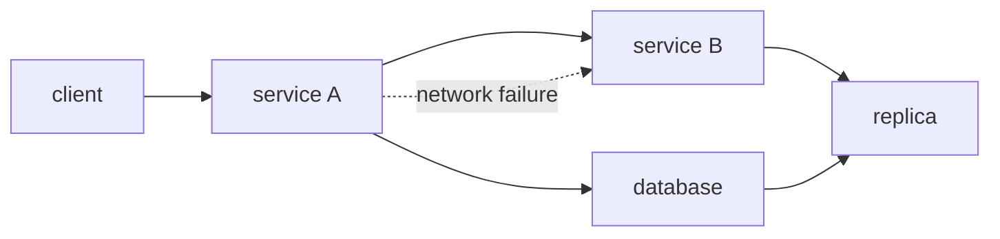

# 분산 시스템이란 무엇인가?

이 글은 Distributed Systems 101 시리즈의 첫 번째 글입니다.

## 이 글에서 다룰 문제

- 분산 시스템은 정확히 무엇이며 단일 머신 프로그램과 무엇이 다를까요?
- 지연, 장애, 조정이라는 세 축은 왜 분산 시스템의 기본 언어일까요?
- 분산 컴퓨팅의 8가지 허상은 왜 지금도 반복될까요?
- 전형적인 분산 시스템 토폴로지는 어떻게 생겼을까요?
- 이 시리즈 전체는 어떤 그림으로 이어질까요?

> 분산 시스템은 단순히 컴퓨터가 여러 대인 상태가 아닙니다. 지연, 장애, 조정이라는 세 가지 차이가 단일 머신에서 통하던 직관을 근본부터 꺾는 환경입니다.

## 왜 중요한가

오늘 만드는 거의 모든 서비스는 사실상 분산 시스템입니다. 복제본이 하나라도 붙은 데이터베이스는 이미 분산 시스템이고, 두 개의 마이크로서비스가 서로 통신하는 순간도 분산 시스템입니다. 즉시 응답한다, 항상 성공한다, 시계는 하나다 같은 단일 머신의 직관으로 작성한 코드는 실제 트래픽을 만나면 곧바로 흔들립니다.

> 분산 시스템은 단일 머신 프로그램의 가정이 깨지는 정확한 지점에서 시작됩니다.

## 한눈에 보는 개념



이 그림의 화살표 하나하나는 지연과 부분 장애, 그리고 응답 불확실성을 품고 있습니다. 이것이 단일 함수 호출과 본질적으로 다른 점입니다.

## 핵심 용어

- **분산 시스템**: 독립적으로 동작하는 여러 노드가 메시지 전달을 통해 협력하는 시스템입니다.
- 지연: 메시지가 상대편에 도달하는 데 걸리는 시간입니다.
- 장애: 노드, 네트워크, 디스크가 일부 또는 전체로 멈추는 현상입니다.
- 조정: 여러 노드가 하나의 결정을 함께 맞추는 과정입니다.
- **부분 장애**: 어떤 노드는 살아 있고 어떤 노드는 죽어 있는 상태입니다. 분산 환경의 대표적인 조건입니다.

## Before / After

**Before — 단일 머신 직관**

```text
calls finish instantly / always succeed / there is one clock
```

**After — 분산 환경**

```text
calls take ms to s / can fail in part / each node has its own clock
```

이 단순한 전환이 이 시리즈의 거의 모든 주제를 만듭니다. 재시도, 타임아웃, 합의는 모두 여기서 출발합니다.

## 실습: 차이를 몸으로 느껴 보기

### 1단계 — 로컬 함수 호출

```python
# 1_local.py
def add(a, b):
    return a + b

print(add(1, 2))  # 3, instantly
```

이 호출은 마이크로초 수준에서 끝납니다. 실패를 따로 걱정할 이유도 없습니다.

### 2단계 — 같은 머신의 다른 프로세스 호출(HTTP)

```python
# 2_local_http.py
# pip install fastapi uvicorn requests
from fastapi import FastAPI
app = FastAPI()
@app.get("/add")
def add(a: int, b: int): return {"r": a + b}
# run: uvicorn 2_local_http:app --port 8001
```

```python
# 2_client.py
import requests
print(requests.get("http://127.0.0.1:8001/add", params={"a":1,"b":2}, timeout=1).json())
```

같은 머신 안인데도 지연은 밀리초 단위로 뛰어오릅니다. 이것이 첫 번째 분리의 비용입니다.

### 3단계 — 서버를 죽여 보기

```bash
# after killing the server with ctrl+c
python3 2_client.py
# requests.exceptions.ConnectionError
```

호출자는 서버의 실제 상태를 알지 못합니다. 이런 종류의 오류는 단일 머신 함수 호출에서는 나타나지 않았습니다.

### 4단계 — 응답이 느리면 어떻게 될까요?

```python
# 4_slow.py
@app.get("/slow")
def slow():
    import time; time.sleep(5)
    return {"ok": True}
```

```python
requests.get("http://127.0.0.1:8001/slow", timeout=1)
# requests.exceptions.ReadTimeout
```

타임아웃이 없으면 호출은 5초 동안 그대로 붙잡힙니다. 분산 시스템에서 타임아웃은 옵션이 아니라 기본 장치입니다.

### 5단계 — 노드 간 시계 어긋남

```python
# 5_clock.py
import time
print("server time:", time.time())
# run the same code on another machine and the two values
# will not match exactly even with NTP (millisecond-level drift)
```

실제 순서를 벽시계 시간으로 결정하면 안 됩니다. 6편의 합의와 8편의 메시지 순서 이야기가 이 문제를 직접 다룹니다.

## 이 코드에서 먼저 봐야 할 점

- 네트워크가 끼는 순간 같은 호출도 전혀 다른 종류의 오류를 갖게 됩니다.
- 타임아웃, 재시도, 멱등성은 단일 머신에서는 거의 의식하지 않던 개념입니다.
- 시계는 정확히 일치하지 않습니다.
- 성공과 실패 사이에 모름이라는 상태가 새로 생깁니다.

## 자주 하는 실수 5가지

1. **타임아웃 없이 호출합니다.** 응답이 영원히 오지 않을 수 있습니다.
2. **멱등성 없이 재시도합니다.** 대표적인 결과가 중복 결제입니다.
3. **벽시계 시간으로 순서를 정합니다.** 노드마다 보는 시간이 다릅니다.
4. **부분 장애를 무시합니다.** 실제 운영에서 가장 흔한 상태입니다.
5. **단일 머신 지연으로 용량을 계산합니다.** 네트워크 지연이 전체 예산을 지배합니다.

## 실무에서는 이렇게 드러납니다

현실의 거의 모든 웹 백엔드는 분산 시스템입니다. 복제와 장애 조치를 갖춘 관계형 데이터베이스도 그렇고, Redis Cluster, Kafka, Cassandra는 더 말할 것도 없습니다. 클라우드의 AZ 이중화, 멀티 리전 배치, CDN도 모두 분산 시스템 설계의 일부입니다.

## 시니어 엔지니어는 이렇게 생각합니다

- 단일 머신의 직관을 의도적으로 의심합니다.
- 타임아웃, 재시도, 멱등성을 첫 줄부터 설계합니다.
- 시스템 모델 안에 모름 상태를 반드시 넣습니다.
- 벽시계는 표시용으로만 보고, 단조 증가 시계를 더 신뢰합니다.
- 굳이 분산이 필요 없는 상황에서는 단일 머신으로 끝내는 선택도 합니다.

## 체크리스트

- [ ] 분산 시스템을 한 문장으로 정의할 수 있는가?
- [ ] 지연, 장애, 조정이라는 세 축을 설명할 수 있는가?
- [ ] 부분 장애가 단일 머신의 장애와 어떻게 다른지 말할 수 있는가?
- [ ] 왜 타임아웃이 필수인지 설명할 수 있는가?
- [ ] 벽시계와 단조 증가 시계의 차이를 알고 있는가?

## 연습 문제

1. 외부 API를 타임아웃 없이 호출하는 코드를 하나 찾아 타임아웃을 추가해 보세요.
2. 재시도해도 안전한 연산과 위험한 연산을 각각 두 가지씩 적어 보세요.
3. 같은 메시지를 두 번 처리해도 결과가 같아지도록 멱등성 키 설계를 해 보세요.

## 정리와 다음 글

분산 시스템은 지연, 장애, 조정이라는 세 축에서 단일 머신 프로그램과 본질적으로 다릅니다. 다음 글에서는 그중 장애를 더 정밀하게 다루기 위해 crash, omission, Byzantine 같은 장애 모델을 살펴봅니다.

<!-- toc:begin -->
- **분산 시스템이란 무엇인가? (현재 글)**
- failure model (예정)
- RPC와 message passing (예정)
- consistency와 CAP (예정)
- replication (예정)
- consensus와 Raft (예정)
- leader election (예정)
- message queue와 event sourcing (예정)
- distributed transaction (예정)
- 운영 가능한 분산 시스템 패턴 (예정)
<!-- toc:end -->

## 참고 자료

- [Distributed computing (Wikipedia)](https://en.wikipedia.org/wiki/Distributed_computing)
- [Fallacies of distributed computing (Wikipedia)](https://en.wikipedia.org/wiki/Fallacies_of_distributed_computing)
- [Designing Data-Intensive Applications — Martin Kleppmann](https://dataintensive.net/)
- [Distributed Systems for Fun and Profit](http://book.mixu.net/distsys/)

Tags: Computer Science, Distributed Systems, Fundamentals, Latency, Failure, Coordination
