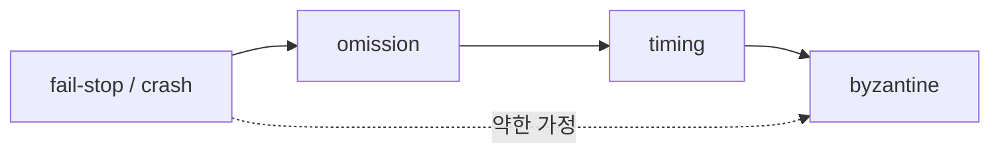

# failure model

> Distributed Systems 101 시리즈 (2/10)

<!-- a-grade-intro:begin -->

**핵심 질문**: "서버가 죽었다"는 건 정확히 무슨 뜻인가요? 종류가 몇 가지나 될까요?

> 분산 시스템 설계는 "어떤 종류의 failure를 가정할 것인가"에서 시작합니다. crash, omission, byzantine은 그 가정을 정리한 표준 어휘입니다.

<!-- a-grade-intro:end -->

## 이 글에서 배울 것

- failure model이란 무엇이고 왜 모델링하는가
- crash, omission, byzantine의 차이
- network partition이 왜 별도 카테고리인가
- timeout이 왜 failure detection의 근사인가
- 실무에서 어떤 모델을 채택하는가

## 왜 중요한가

알고리즘이 "노드가 어떻게 망가지느냐"를 가정하지 않으면 정확성도 비용도 알 수 없습니다. Raft, Paxos, BFT 알고리즘이 다른 이유는 가정한 failure model이 다르기 때문입니다. 이 단어를 모르면 논문이나 docs를 읽을 수 없습니다.

> failure model은 알고리즘과 시스템의 가격표입니다.

## 개념 한눈에 보기



오른쪽으로 갈수록 더 험한 세상을 가정합니다. 더 험할수록 알고리즘이 비싸지고 노드 수가 더 필요합니다.

## 핵심 용어 정리

- **Crash (fail-stop)**: 노드가 멈추면 영원히 멈춘다고 가정.
- **Omission**: 메시지를 가끔 빠뜨릴 수 있음.
- **Timing**: 응답이 너무 늦을 수 있음.
- **Byzantine**: 노드가 거짓을 말하거나 임의로 동작할 수 있음.
- **Network partition**: 노드들 사이의 링크만 끊어진 상태.

## Before/After

**Before — "그냥 죽었다고 가정"**

```text
모든 failure가 동일하다고 보면 알고리즘이 과도하게 비싸진다
```

**After — 명시적 failure model**

```text
crash만 가정 → Raft / Paxos
byzantine 가정 → BFT (수십 배 비쌈)
```

가정이 다르면 비용도 다릅니다.

## 실습: 각 failure 모사하기

### 1단계 — crash 모사

```python
# 1_crash.py
import os, sys
def handler():
    print("doing work")
    os._exit(1)  # 깔끔히 죽음
handler()
```

이 모델에서 다른 노드는 "죽었으면 영원히 죽었다"고 가정합니다. failure detector가 단순합니다.

### 2단계 — omission 모사

```python
# 2_omission.py
import random
def send(msg):
    if random.random() < 0.1:
        return  # 10% 확률로 메시지 drop
    transport.send(msg)
```

이때부터 retry, sequence number, acknowledgement가 필요해집니다.

### 3단계 — timing(slow) 모사

```python
# 3_slow.py
import time, random
def handle(req):
    if random.random() < 0.05:
        time.sleep(10)  # 5% 확률 매우 느림
    return process(req)
```

"느린 노드"와 "죽은 노드"는 외부에서 구분하기 어렵습니다. 이게 timeout 기반 failure detector의 한계입니다.

### 4단계 — byzantine 모사

```python
# 4_byzantine.py
def vote(question):
    # 노드가 거짓말을 한다
    real_answer = compute(question)
    return not real_answer if is_malicious() else real_answer
```

이 모델에선 다수결도 충분치 않고, 동일 메시지에 서명을 붙이거나 (3f+1) 노드를 둬야 합니다.

### 5단계 — network partition 모사

```bash
# 5_partition.sh (linux)
# 두 IP 사이 트래픽을 막아 partition을 만든다
sudo iptables -A INPUT -s 10.0.0.5 -j DROP
sudo iptables -A OUTPUT -d 10.0.0.5 -j DROP
# 복구
sudo iptables -F
```

partition은 "노드는 살아 있는데 서로 못 본다"는 특수한 상태입니다. 4편에서 CAP 트레이드오프가 여기서 등장합니다.

## 이 코드에서 주목할 점

- 같은 "에러"라도 종류가 다르고 대응이 다릅니다.
- omission/timing은 timeout으로만 구분 가능합니다 (정확하지 않음).
- byzantine은 비용이 한 자리수 더 커집니다.
- partition은 노드 단위가 아니라 링크 단위 사고입니다.

## 자주 하는 실수 5가지

1. **모든 failure를 crash로 가정한다.** 네트워크가 partial로 깨질 때 알고리즘이 잘못 수렴합니다.
2. **timeout을 너무 짧게 잡는다.** 살아있는 노드를 죽었다고 오판합니다 (false suspicion).
3. **byzantine 모델을 모든 곳에 쓴다.** 비용이 폭발합니다.
4. **partition을 무시한다.** 클라우드에서 일상적인 사건입니다.
5. **failure detector의 정확성을 가정한다.** 100% 정확한 detector는 비동기 모델에선 불가능합니다.

## 실무에서는 이렇게 쓰입니다

대부분의 인터넷 서비스는 crash + partition을 가정합니다 (CFT). 금융, 블록체인은 byzantine까지 가정합니다 (BFT, PBFT, Tendermint). Kubernetes, Spanner, Cassandra의 알고리즘 선택을 보면 모두 어떤 failure model을 가정했는지를 명시합니다.

## 시니어 엔지니어는 이렇게 생각합니다

- 가장 약한 가정으로 충분한 알고리즘을 고릅니다 (필요 이상의 BFT 안 씀).
- failure detector는 항상 근사임을 의식합니다.
- partition을 일상의 사건으로 봅니다.
- timeout 값은 네트워크 측정에서 나오게 합니다.
- 모델을 명시한 docs/RFC만 신뢰합니다.

## 체크리스트

- [ ] crash와 omission의 차이를 한 줄로 말할 수 있는가?
- [ ] byzantine이 왜 비용이 더 큰지 설명할 수 있는가?
- [ ] network partition이 노드 failure와 어떻게 다른지 답할 수 있는가?
- [ ] timeout 기반 detector가 왜 부정확한지 아는가?
- [ ] 우리 시스템이 어떤 model을 가정하는지 답할 수 있는가?

## 연습 문제

1. 우리 서비스가 crash, omission, byzantine 중 어떤 모델을 가정하는지 적어 보세요.
2. timeout 값을 정할 때 측정해야 할 두 가지 지표를 적어 보세요 (예: p99 latency).
3. partition 발생 시 cluster가 split-brain 되지 않는 메커니즘을 한 가지 조사해 보세요.

## 정리 및 다음 단계

failure model은 알고리즘 선택과 운영 비용을 결정하는 첫 결정입니다. 다음 글에서는 이 위에서 노드들이 메시지를 주고받는 방식 — RPC와 message passing — 을 다룹니다.

<!-- toc:begin -->
- [분산 시스템이란 무엇인가?](./01-what-is-a-distributed-system.md)
- **failure model (현재 글)**
- RPC와 message passing (예정)
- consistency와 CAP (예정)
- replication (예정)
- consensus와 Raft (예정)
- leader election (예정)
- message queue와 event sourcing (예정)
- distributed transaction (예정)
- 운영 가능한 분산 시스템 패턴 (예정)
<!-- toc:end -->

## 참고 자료

- [Failure model — Wikipedia](https://en.wikipedia.org/wiki/Failure_semantics)
- [Byzantine fault (Wikipedia)](https://en.wikipedia.org/wiki/Byzantine_fault)
- [Network partition (Wikipedia)](https://en.wikipedia.org/wiki/Network_partition)
- [Designing Data-Intensive Applications — chapter 8](https://dataintensive.net/)

Tags: Computer Science, Distributed Systems, Failure Models, Crash, Byzantine, Reliability
