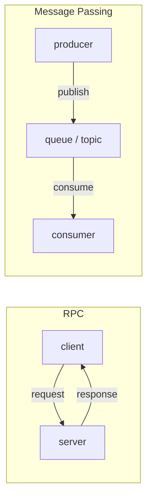

# RPC와 message passing

> Distributed Systems 101 시리즈 (3/10)

<!-- a-grade-intro:begin -->

**핵심 질문**: 함수처럼 부르는 RPC와 메시지를 보내는 queue, 두 방식은 같은 일을 하는데 왜 사용처가 갈릴까요?

> RPC는 동기적 함수 호출의 직관, message passing은 비동기적 우편함의 직관을 따릅니다. 이 직관 차이가 latency, coupling, 회복력의 큰 차이를 만듭니다.

<!-- a-grade-intro:end -->

## 이 글에서 배울 것

- RPC와 message passing의 정의와 차이
- 동기 vs 비동기, request/response vs publish/subscribe
- 각 모델의 장단점과 적합한 use case
- "함수처럼 보이는" RPC가 숨기는 것들
- 두 모델을 섞어 쓰는 패턴

## 왜 중요한가

서비스를 쪼개기로 결정하면, 다음 결정은 "어떻게 통신할까?"입니다. 이 결정이 latency 예산, 장애 격리, 운영 복잡도를 좌우합니다. 잘못 고르면 RPC 사슬이 길어져 한 노드가 죽으면 전 시스템이 멈추거나, 메시지가 어디 있는지 추적할 수 없는 시스템이 됩니다.

> 통신 모델은 시스템의 결합도를 결정합니다.

## 개념 한눈에 보기



RPC는 양방향 약속, message passing은 중간 저장소를 두는 단방향 흐름입니다.

## 핵심 용어 정리

- **RPC (Remote Procedure Call)**: 원격 함수를 호출하듯 부르는 모델. gRPC, JSON-RPC.
- **Message passing**: producer가 broker에 메시지를 두면 consumer가 가져가는 모델. Kafka, RabbitMQ.
- **Synchronous**: 응답을 기다림.
- **Asynchronous**: 응답을 기다리지 않음.
- **At-least-once / exactly-once**: 메시지 전달 보장 수준.

## Before/After

**Before — 모든 통신이 RPC**

```text
service A → B → C → D 사슬에서 D가 느려지면 A의 응답이 늦어짐
```

**After — 중요한 결합은 message passing**

```text
A는 메시지만 던지고 끝, 처리는 비동기로 D가 따라감
```

장애 격리와 latency 예산이 좋아집니다.

## 실습: 두 모델을 한 화면에서

### 1단계 — RPC (FastAPI)

```python
# 1_rpc_server.py
from fastapi import FastAPI
app = FastAPI()
@app.post("/charge")
def charge(amount: int):
    # 동기적으로 결제 처리
    return {"ok": True, "id": "txn_1"}
```

```python
# 1_rpc_client.py
import requests
r = requests.post("http://127.0.0.1:8000/charge", json={"amount": 100}, timeout=2)
print(r.json())
```

응답이 와야 다음 줄로 갑니다. 함수 호출과 거의 같습니다.

### 2단계 — Message passing (간단한 in-memory queue)

```python
# 2_queue.py
from queue import Queue
import threading, time

q = Queue()

def consumer():
    while True:
        msg = q.get()
        time.sleep(0.5)
        print("processed:", msg)

threading.Thread(target=consumer, daemon=True).start()
q.put({"amount": 100, "id": "txn_1"})
print("producer returned immediately")
```

producer는 즉시 끝나고, 처리는 consumer가 자기 속도로 합니다.

### 3단계 — RPC chain의 위험

```python
# 3_chain.py (의사코드)
def order():
    inv = rpc_inventory()    # 100ms
    pay = rpc_payment()      # 200ms
    ship = rpc_shipping()    # 150ms
    return ok                # 합 450ms + retry/timeout
```

각 단계가 살아 있어야만 응답이 옵니다. 하나라도 늦으면 전체가 늦습니다.

### 4단계 — async + queue로 분리

```python
# 4_async.py (의사코드)
def order():
    save_order_local()
    publish("order.created", payload)
    return "accepted"  # 즉시 응답
# 별도 worker가 inventory/payment/shipping 처리
```

응답이 빨라지고, 한 단계가 늦어도 사용자는 영향을 안 받습니다.

### 5단계 — 전달 보장

```python
# 5_dedup.py
seen = set()
def consume(msg):
    if msg["id"] in seen:
        return  # idempotent: 중복 무시
    seen.add(msg["id"])
    process(msg)
```

대부분의 broker는 at-least-once입니다. consumer 쪽에서 idempotency key로 중복을 흡수해야 합니다.

## 이 코드에서 주목할 점

- RPC는 응답을 기다리는 만큼 결합이 강합니다.
- message passing은 "지금 받지 않아도 되는 일"에 잘 맞습니다.
- chain이 깊을수록 RPC는 위험해집니다.
- exactly-once는 거의 항상 거짓말이며 idempotent consumer가 정답입니다.

## 자주 하는 실수 5가지

1. **모든 호출을 RPC로 만든다.** chain이 길어져 latency와 장애가 폭발합니다.
2. **모든 호출을 queue로 만든다.** 사용자 응답이 필요한 일까지 비동기로 만들면 UX가 망가집니다.
3. **exactly-once를 믿는다.** broker 보장 + idempotent consumer 조합이 현실입니다.
4. **idempotency key를 안 쓴다.** 재전송 한 번에 중복 결제가 됩니다.
5. **timeout/retry를 client에만 둔다.** broker 쪽 DLQ(dead letter queue)도 설계해야 합니다.

## 실무에서는 이렇게 쓰입니다

사용자 경로(즉시 응답 필요)는 RPC, 긴 작업(메일 발송, 영수증 처리, 분석)은 queue로 보냅니다. Microservices에서는 같은 회사 안에서도 모듈 사이를 RPC로, 도메인 경계 사이는 message로 나누는 패턴이 흔합니다. event sourcing/CQRS는 이 message 모델을 끝까지 밀어붙인 형태입니다.

## 시니어 엔지니어는 이렇게 생각합니다

- "동기 응답이 정말 필요한가?"를 먼저 묻습니다.
- chain의 깊이를 limit으로 둡니다 (예: 3단 이내).
- idempotency key를 첫 줄부터 박습니다.
- broker는 at-least-once라고 가정합니다.
- DLQ와 retry policy를 운영 책임으로 봅니다.

## 체크리스트

- [ ] RPC와 message passing의 차이를 한 줄로 설명할 수 있는가?
- [ ] chain이 깊은 RPC가 왜 위험한지 답할 수 있는가?
- [ ] at-least-once와 exactly-once의 의미를 아는가?
- [ ] idempotency key를 설계해 본 적 있는가?
- [ ] DLQ가 무엇이고 언제 쓰는지 답할 수 있는가?

## 연습 문제

1. 우리 서비스에서 RPC를 message로 바꿀 만한 호출 한 가지를 찾아 보세요.
2. idempotency key를 사용하는 결제 API의 동작을 한 문단으로 설명해 보세요.
3. broker가 at-least-once일 때 consumer가 안전하게 동작하기 위한 조건 세 가지를 적어 보세요.

## 정리 및 다음 단계

RPC와 message passing은 동기/비동기, 결합도, 회복력의 트레이드오프를 결정하는 두 모델입니다. 다음 글에서는 데이터를 여러 노드에 나눌 때 마주치는 가장 큰 트레이드오프 — consistency와 CAP — 를 다룹니다.

<!-- toc:begin -->
- [분산 시스템이란 무엇인가?](./01-what-is-a-distributed-system.md)
- [failure model](./02-failure-model.md)
- **RPC와 message passing (현재 글)**
- consistency와 CAP (예정)
- replication (예정)
- consensus와 Raft (예정)
- leader election (예정)
- message queue와 event sourcing (예정)
- distributed transaction (예정)
- 운영 가능한 분산 시스템 패턴 (예정)
<!-- toc:end -->

## 참고 자료

- [Remote procedure call (Wikipedia)](https://en.wikipedia.org/wiki/Remote_procedure_call)
- [Message passing (Wikipedia)](https://en.wikipedia.org/wiki/Message_passing)
- [gRPC documentation](https://grpc.io/docs/)
- [Apache Kafka — documentation](https://kafka.apache.org/documentation/)

Tags: Computer Science, Distributed Systems, RPC, Messaging, Async, Idempotency
