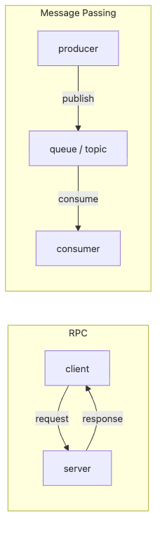

# RPC와 메시지 전달

서비스를 나누고 나면 다음 질문은 거의 항상 같습니다. "이 둘은 어떻게 말하게 할 것인가?" 응답을 기다리는 RPC를 쓸지, 큐를 사이에 둔 비동기 흐름을 쓸지에 따라 지연 예산과 장애 전파 범위가 완전히 달라집니다.

이 글은 Distributed Systems 101 시리즈의 세 번째 글입니다.

여기서는 RPC와 메시지 전달을 각각 하나의 통신 계약으로 보고, 어느 경계에서 어떤 방식을 택해야 하는지 선택 기준을 세웁니다.

## 이 글에서 다룰 문제

- RPC와 메시지 전달은 각각 무엇이며 어떻게 다를까요?
- 동기와 비동기, 요청-응답과 발행-구독은 어디서 갈릴까요?
- 두 모델은 각각 어떤 장단점이 있고 어디에 어울릴까요?
- 함수 호출처럼 보이는 RPC가 실제로는 무엇을 숨기고 있을까요?
- 두 모델을 함께 섞어 쓸 때 어떤 패턴이 필요할까요?

> RPC는 동기 함수 호출의 직관을 따르고, 메시지 전달은 비동기 우편함의 직관을 따릅니다. 이 한 가지 직관 차이가 지연, 결합도, 회복력의 큰 차이를 만듭니다.

## 왜 중요한가

서비스를 분리한 뒤 가장 먼저 내려야 하는 결정 중 하나는 어떻게 통신할 것인가입니다. 이 선택이 지연 예산, 장애 전파 범위, 운영 복잡도를 함께 결정합니다. 잘못 고르면 한 노드의 지연이 전체 RPC 체인을 잡아끌고, 반대로 추적 불가능한 메시지 흐름이 생길 수도 있습니다.

> 통신 모델은 시스템의 결합도를 결정합니다.

## 한눈에 보는 개념



*RPC와 메시지 전달의 통신 모델 비교*

RPC는 양방향 계약이고, 메시지 전달은 중간 저장소를 둔 단방향 흐름입니다.

## 핵심 용어

- **RPC (Remote Procedure Call)**: 원격 함수를 로컬 함수처럼 호출하는 방식입니다. gRPC, JSON-RPC가 대표적입니다.
- **Message passing**: 생산자가 브로커에 메시지를 넣고 소비자가 나중에 가져가는 방식입니다. Kafka, RabbitMQ가 대표적입니다.
- **Synchronous**: 응답이 올 때까지 기다립니다.
- **Asynchronous**: 응답을 기다리지 않고 다음 작업으로 넘어갑니다.
- **At-least-once / exactly-once**: 브로커가 제공하려는 전달 보장 수준입니다.

## Before / After

**Before — 모든 호출을 RPC로 설계**

```text
service A -> B -> C -> D: if D slows down, A's response slows
```

**After — 중요한 경계는 메시지로 분리**

```text
A drops a message and returns; D processes asynchronously
```

이 전환으로 장애 전파 범위를 줄이고 사용자 응답 예산을 더 촘촘히 관리할 수 있습니다.

## 실습: 두 모델을 한 화면에 놓고 보기

### 1단계 — RPC(FastAPI)

```python
# 1_rpc_server.py
from fastapi import FastAPI
app = FastAPI()
@app.post("/charge")
def charge(amount: int):
    # process payment synchronously
    return {"ok": True, "id": "txn_1"}
```

```python
# 1_rpc_client.py
import requests
r = requests.post("http://127.0.0.1:8000/charge", json={"amount": 100}, timeout=2)
print(r.json())
```

응답이 도착해야 다음 줄이 실행됩니다. 실제로는 거의 함수 호출과 같은 감각입니다.

### 2단계 — 메시지 전달(메모리 큐)

```python
# 2_queue.py
from queue import Queue
import threading, time

q = Queue()

def consumer():
    while True:
        msg = q.get()
        time.sleep(0.5)
        print("processed:", msg)

threading.Thread(target=consumer, daemon=True).start()
q.put({"amount": 100, "id": "txn_1"})
print("producer returned immediately")
```

생산자는 즉시 반환되고, 소비자는 자기 속도로 큐를 비웁니다.

### 3단계 — RPC 체인의 위험

```python
# 3_chain.py (pseudocode)
def order():
    inv = rpc_inventory()    # 100ms
    pay = rpc_payment()      # 200ms
    ship = rpc_shipping()    # 150ms
    return ok                # total 450ms plus retry/timeout
```

모든 단계가 살아 있어야 응답 하나가 돌아옵니다. 한 노드가 느려지면 전체 호출이 함께 느려집니다.

### 4단계 — 비동기와 큐로 분리

```python
# 4_async.py (pseudocode)
def order():
    save_order_local()
    publish("order.created", payload)
    return "accepted"  # respond immediately
# separate workers handle inventory/payment/shipping
```

사용자는 빠른 응답을 받고, 느린 하위 단계는 뒤에서 처리됩니다.

### 5단계 — 전달 보장과 중복 처리

```python
# 5_dedup.py
seen = set()
def consume(msg):
    if msg["id"] in seen:
        return  # idempotent: ignore duplicates
    seen.add(msg["id"])
    process(msg)
```

대부분의 브로커는 at-least-once를 전제로 하므로, 소비자는 멱등성 키로 중복을 흡수해야 합니다.

## 이 코드에서 먼저 봐야 할 점

- RPC는 기다림 자체가 강한 결합을 만듭니다.
- 메시지 전달은 지금 당장 끝낼 필요가 없는 작업에 잘 맞습니다.
- 체인이 깊어질수록 RPC의 위험은 커집니다.
- exactly-once는 거의 항상 허상이고, 현실적인 답은 멱등적 소비자입니다.

## 자주 하는 실수 5가지

1. **모든 것을 RPC로 만듭니다.** 체인이 길어지며 지연과 장애 면적이 폭발합니다.
2. **모든 것을 큐 기반으로 만듭니다.** 즉시 응답이 필요한 사용자 경로가 불편해집니다.
3. **exactly-once를 그대로 믿습니다.** 현실은 브로커 보장과 멱등성 소비자의 조합입니다.
4. **멱등성 키를 생략합니다.** 재시도 한 번이 중복 결제로 이어질 수 있습니다.
5. **타임아웃과 재시도를 클라이언트에만 둡니다.** 브로커 쪽 DLQ와 재시도 정책도 함께 필요합니다.

## 실무에서는 이렇게 드러납니다

즉시 응답이 필요한 사용자 경로는 RPC를 사용하고, 메일 발송이나 분석처럼 오래 걸리는 작업은 큐로 넘깁니다. 많은 마이크로서비스 아키텍처는 내부 모듈 간 호출은 RPC로, 도메인 경계는 메시지로 나눕니다. Event sourcing과 CQRS는 이 메시지 모델을 끝까지 밀어붙인 설계라고 볼 수 있습니다.

## 시니어 엔지니어는 이렇게 생각합니다

- 정말 동기 응답이 필요한지부터 먼저 묻습니다.
- RPC 체인의 깊이를 제한합니다.
- 첫 커밋부터 멱등성 키를 설계에 넣습니다.
- 브로커는 기본적으로 at-least-once라고 가정합니다.
- DLQ와 재시도 정책을 운영 책임의 일부로 봅니다.

## 체크리스트

- [ ] RPC와 메시지 전달의 차이를 한 줄로 설명할 수 있는가?
- [ ] 깊은 RPC 체인이 왜 위험한지 설명할 수 있는가?
- [ ] at-least-once와 exactly-once의 의미를 알고 있는가?
- [ ] 멱등성 키를 설계해 본 적이 있는가?
- [ ] DLQ가 무엇이며 언제 쓰는지 말할 수 있는가?

## 연습 문제

1. 현재 서비스에서 RPC를 메시지로 바꿀 만한 호출 하나를 찾아 이유를 설명해 보세요.
2. 멱등성 키를 사용하는 결제 API를 한 단락으로 설계해 보세요.
3. at-least-once 전달에서 안전한 소비자가 갖춰야 할 조건 세 가지를 적어 보세요.

## 정리와 다음 글

RPC와 메시지 전달은 동기와 비동기, 결합도와 회복력을 서로 다르게 교환하는 두 모델입니다. 다음 글에서는 데이터가 여러 노드에 놓이는 순간 바로 등장하는 가장 큰 트레이드오프, 일관성과 CAP를 다룹니다.

<!-- toc:begin -->
- [분산 시스템이란 무엇인가?](./01-what-is-a-distributed-system.md)
- [failure model](./02-failure-model.md)
- **RPC와 message passing (현재 글)**
- consistency와 CAP (예정)
- replication (예정)
- consensus와 Raft (예정)
- leader election (예정)
- message queue와 event sourcing (예정)
- distributed transaction (예정)
- 운영 가능한 분산 시스템 패턴 (예정)
<!-- toc:end -->

## 참고 자료

- [Remote procedure call (Wikipedia)](https://en.wikipedia.org/wiki/Remote_procedure_call)
- [Message passing (Wikipedia)](https://en.wikipedia.org/wiki/Message_passing)
- [gRPC documentation](https://grpc.io/docs/)
- [Apache Kafka documentation](https://kafka.apache.org/documentation/)

Tags: Computer Science, Distributed Systems, RPC, Messaging, Async, Idempotency
