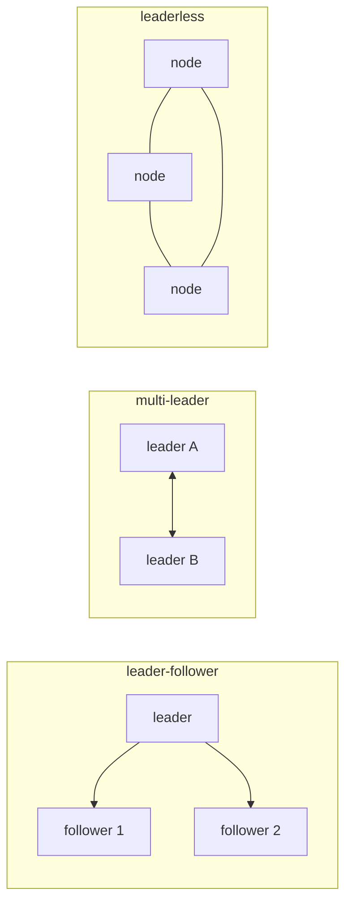

# 복제

이 글은 Distributed Systems 101 시리즈의 다섯 번째 글입니다.

## 이 글에서 다룰 문제

- 왜 데이터를 복제하며, 어떤 복제 모델이 있을까요?
- leader-follower, multi-leader, leaderless는 어떻게 다를까요?
- 동기 복제와 비동기 복제는 어떤 데이터 손실 위험을 만들까요?
- quorum read/write와 R+W>N은 정확히 무엇을 뜻할까요?
- replication lag은 어떻게 측정하고 다뤄야 할까요?

> 복제는 내구성과 가용성을 위한 가장 기본적인 도구입니다. 하지만 동기냐 비동기냐, 리더가 몇 명이냐, quorum을 어떻게 잡느냐에 따라 사용자가 체감하는 동작은 크게 달라집니다.

## 왜 중요한가

복제는 모든 분산 데이터 시스템의 가장 밑바닥 층입니다. 이 층의 선택이 4편에서 본 일관성 모델을 만들고, 6편에서 볼 합의 비용도 규정합니다. 실무에서 데이터베이스가 왜 이런 식으로 동작하는지 묻는 질문의 답은 대개 복제 설정 안에 있습니다.

> 복제 설정은 안전성과 속도 사이의 환율입니다.

## 한눈에 보는 개념



이 세 가지 토폴로지만 이해해도 현실 시스템의 대부분을 설명할 수 있습니다.

## 핵심 용어

- **Leader/follower**: 쓰기는 하나의 리더가 받고, 읽기는 팔로워로 분산할 수 있는 구조입니다.
- **Multi-leader**: 여러 리더가 동시에 쓰기를 받고 서로를 동기화하는 구조입니다.
- **Leaderless**: 모든 노드가 동등하며 quorum으로 최신 값을 판단하는 구조입니다.
- **Sync replication**: 리더가 팔로워의 확인 응답을 기다린 뒤 쓰기를 완료하는 방식입니다.
- **Quorum (R, W, N)**: N개 복제본 중 R개를 읽고 W개에 쓰며, R+W>N이면 최신값을 읽을 수 있다는 원리입니다.

## Before / After

**Before — 단일 primary와 비동기 replica**

```text
fast write but possible data loss on crash
```

**After — 다수 동기 복제와 리더 읽기**

```text
slower write, near-zero loss, linearizable reads possible
```

같은 시스템이라도 옵션 하나가 바뀌면 시스템이 약속하는 바가 달라집니다.

## 실습: 복제 모델을 코드로 보기

### 1단계 — 비동기 leader-follower

```python
# 1_async.py
import threading, time
leader = []
follower = []
def write(x):
    leader.append(x)
    threading.Thread(target=lambda: (time.sleep(0.5), follower.append(x))).start()
```

쓰기 지연은 짧지만, 리더가 갑자기 죽으면 최근 0.5초의 데이터가 사라질 수 있습니다.

### 2단계 — 동기 leader-follower

```python
# 2_sync.py
def write(x):
    leader.append(x)
    follower.append(x)   # write both before returning
```

쓰기 하나가 두 노드에 모두 닿아야 끝납니다. 지연은 늘지만 손실 가능성은 거의 사라집니다.

### 3단계 — quorum write

```python
# 3_quorum.py
nodes = [[], [], []]   # N=3
def write(x, w=2):
    acks = 0
    for n in nodes:
        n.append(x); acks += 1
        if acks >= w: return "ok"
def read(x_id, r=2):
    seen = []
    for n in nodes:
        if any(item["id"] == x_id for item in n):
            seen.append(n)
            if len(seen) >= r: return "found"
```

R+W>N이면 읽기와 쓰기 집합이 최소 한 노드에서 겹칩니다. Dynamo 계열 시스템의 핵심이 바로 이 점입니다.

### 4단계 — multi-leader(단순 last-write-wins)

```python
# 4_mlw.py
A, B = {}, {}
def write_a(k, v): A[k] = (time.time(), v)
def write_b(k, v): B[k] = (time.time(), v)
def merge():
    for k in set(A) | set(B):
        ta, va = A.get(k, (0, None))
        tb, vb = B.get(k, (0, None))
        winner = (va if ta >= tb else vb)
        A[k] = B[k] = (max(ta, tb), winner)
```

LWW는 단순하지만, 시계가 어긋나면 사용자의 입력을 잃어버릴 수 있습니다.

### 5단계 — replication lag 측정

```python
# 5_lag.py
def lag(): return leader_lsn - follower_lsn
print("replication lag rows:", lag())
```

대부분의 데이터베이스는 LSN, GTID, offset 같은 지표를 노출합니다. lag을 SLO로 관리하면 stale read를 사용자가 보기 전에 잡을 수 있습니다.

## 이 코드에서 먼저 봐야 할 점

- 비동기 복제는 빠르지만 데이터 손실 위험을 남깁니다.
- 동기 복제는 안전하지만 느립니다. 둘 중 하나가 절대적으로 옳은 것이 아니라 워크로드가 기준입니다.
- quorum은 R과 W를 조절해 트레이드오프를 다이얼처럼 다루게 해 줍니다.
- multi-leader에서는 충돌 해결 규칙을 애플리케이션이 직접 정의해야 합니다.

## 자주 하는 실수 5가지

1. **복제본 읽기는 항상 빠르다고 생각합니다.** lag 때문에 stale read가 나옵니다.
2. **유일한 동기 복제본을 한 곳에만 둡니다.** 그 한 곳의 지연이 리더 전체를 막습니다.
3. **multi-leader에서 LWW만 믿습니다.** 시계 어긋남이 곧 데이터 손실로 이어집니다.
4. **R+W>N 규칙을 깨뜨립니다.** 최신값을 읽는 보장이 사라집니다.
5. **lag을 모니터링하지 않습니다.** 사용자가 stale read를 신고한 뒤에야 문제를 압니다.

## 실무에서는 이렇게 드러납니다

PostgreSQL과 MySQL은 기본적으로 leader-follower 복제를 사용합니다. Cassandra와 DynamoDB는 leaderless quorum에 가깝고, CRDT 기반 시스템은 multi-leader 성향이 강합니다. 클라우드의 multi-AZ 데이터베이스는 한 AZ에는 동기로, 다른 AZ에는 비동기로 보내는 혼합형 구성을 자주 씁니다.

## 시니어 엔지니어는 이렇게 생각합니다

- 복제 설정을 문서에 명시적으로 남깁니다.
- 복제본 읽기는 별도 경로로 노출하고 허용 stale 시간도 함께 문서화합니다.
- 단일 느린 지점을 만들지 않도록 동기 복제본을 최소 둘 이상 고려합니다.
- 단순 LWW에 기대지 않고 애플리케이션 수준의 merge 전략을 설계합니다.
- lag을 SLO와 알람으로 관리합니다.

## 체크리스트

- [ ] 동기 복제와 비동기 복제의 차이를 한 줄로 말할 수 있는가?
- [ ] R+W>N의 의미를 설명할 수 있는가?
- [ ] multi-leader 충돌 해결 방법 두 가지를 말할 수 있는가?
- [ ] 현재 데이터베이스의 복제 토폴로지를 그릴 수 있는가?
- [ ] replication lag을 어떻게 측정할지 알고 있는가?

## 연습 문제

1. 현재 서비스에서 stale read가 허용되는 화면 두 개를 골라 보세요.
2. quorum 설정 N=5, W=3, R=3의 가용성과 일관성을 평가해 보세요.
3. multi-leader 시스템에서 같은 키에 대한 동시 쓰기를 어떻게 해석할지 애플리케이션 규칙을 설계해 보세요.

## 정리와 다음 글

복제는 분산 데이터의 토대입니다. 다음 글에서는 여러 노드가 다음 값이 무엇인지 함께 동의하는 문제, 즉 합의와 Raft를 다룹니다.

<!-- toc:begin -->
- [분산 시스템이란 무엇인가?](./01-what-is-a-distributed-system.md)
- [failure model](./02-failure-model.md)
- [RPC와 message passing](./03-rpc-and-message-passing.md)
- [consistency와 CAP](./04-consistency-and-cap.md)
- **replication (현재 글)**
- consensus와 Raft (예정)
- leader election (예정)
- message queue와 event sourcing (예정)
- distributed transaction (예정)
- 운영 가능한 분산 시스템 패턴 (예정)
<!-- toc:end -->

## 참고 자료

- [Replication (computing) — Wikipedia](https://en.wikipedia.org/wiki/Replication_(computing))
- [Quorum (distributed computing) — Wikipedia](https://en.wikipedia.org/wiki/Quorum_(distributed_computing))
- [Amazon Dynamo paper](https://www.allthingsdistributed.com/files/amazon-dynamo-sosp2007.pdf)
- [Designing Data-Intensive Applications — chapter 5](https://dataintensive.net/)

Tags: Computer Science, Distributed Systems, Replication, LeaderFollower, QuorumWrites, Durability
