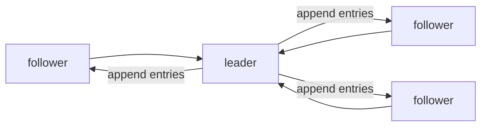

# 합의와 Raft

이 글은 Distributed Systems 101 시리즈의 여섯 번째 글입니다.

## 이 글에서 다룰 문제

- 합의 문제란 무엇이며 어떤 안전성과 진행성 속성을 가질까요?
- Raft의 세 역할인 leader, follower, candidate는 어떻게 나뉠까요?
- term, log, index, commit은 각각 무엇을 뜻할까요?
- 왜 다수결, 즉 quorum이 꼭 필요할까요?
- Paxos와 Raft는 한 줄로 어떻게 비교할 수 있을까요?

> 합의는 분산 시스템에서 가장 어려운 문제이고, Raft는 그 해답을 사람 눈에 읽히게 만든 알고리즘입니다.

## 왜 중요한가

합의 알고리즘은 etcd, ZooKeeper, Consul, CockroachDB 같은 시스템의 중심에 놓여 있습니다. Kubernetes control plane도 etcd 위에 서 있습니다. 합의를 이해하면 왜 시스템이 이런 식으로 동작하는지에 대한 질문 절반은 자연스럽게 풀립니다.

> 합의는 분산 시스템에서 동의가 갖는 가치입니다.

## 한눈에 보는 개념



하나의 leader가 로그를 받고 follower에게 복제합니다. 다수에게 도달한 엔트리만 commit으로 인정됩니다.

## 핵심 용어

- **Consensus**: N개의 노드가 하나의 값에 동의하는 문제입니다.
- **Term**: 단조 증가하는 epoch입니다. 새 리더가 뽑히면 새 term이 시작됩니다.
- **Log**: index로 식별되는 엔트리들의 순서 있는 목록입니다.
- **Commit**: 다수가 받은 엔트리가 더 이상 사라지지 않는 약속 상태입니다.
- **Quorum**: 보통 2f+1 중 f+1, 즉 다수를 뜻합니다.

## Before / After

**Before — 리더 혼자 결정**

```text
fast, but consistency breaks if the leader lies
```

**After — 다수의 동의로 결정**

```text
slightly slower, but safe even if a node dies or lies
```

다수결은 분산 시스템의 핵심 안전장치입니다.

## 실습: 짧은 코드로 보는 Raft의 핵심

### 1단계 — 상태 정의

```python
# 1_state.py
from dataclasses import dataclass, field
@dataclass
class Node:
    role: str = "follower"
    term: int = 0
    log: list = field(default_factory=list)
    commit_index: int = -1
    voted_for: int | None = None
```

term, log, commit_index는 Raft 논문의 첫 장을 여는 핵심 상태 변수입니다.

### 2단계 — 선거(단순화)

```python
# 2_election.py
def election_timeout(self, peers):
    self.term += 1
    self.role = "candidate"
    self.voted_for = self.id
    votes = 1
    for p in peers:
        if p.request_vote(self.term, self.id):
            votes += 1
    if votes > len(peers) // 2 + 1:
        self.role = "leader"
```

가장 먼저 타임아웃에 도달한 노드가 candidate가 되어 표를 모읍니다. 다수를 얻으면 leader가 됩니다.

### 3단계 — 로그 복제

```python
# 3_replicate.py
def append_entries(self, term, prev_index, entries):
    if term < self.term: return False
    if prev_index >= 0 and self.log[prev_index]["term"] != term:
        return False  # mismatch
    self.log = self.log[:prev_index+1] + entries
    return True
```

leader는 자신의 로그를 follower에게 보내고, follower는 이전 index와 term이 맞지 않으면 거부합니다. 로그 일관성은 바로 이 쌍으로 지켜집니다.

### 4단계 — commit

```python
# 4_commit.py
def maybe_commit(self, peers):
    for i in range(self.commit_index + 1, len(self.log)):
        acks = 1 + sum(1 for p in peers if p.match_index >= i)
        if acks > len(peers) // 2 + 1:
            self.commit_index = i
```

다수가 해당 엔트리를 갖게 되는 순간 commit됩니다. 이 시점부터 그 엔트리는 더 이상 사라지지 않습니다.

### 5단계 — 파티션 시나리오

```python
# 5_partition.py (pseudocode)
# 5 nodes, only 2 (leader included) on one side of a partition
# - that side has no majority -> cannot elect a new leader -> cannot accept writes
# - the other side has 3 nodes -> majority -> elects a new leader -> keeps working
```

다수를 잃은 쪽이 의도적으로 멈추는 설계가 split-brain을 막는 핵심입니다.

## 이 코드에서 먼저 봐야 할 점

- term은 단조 증가합니다. 예전 term의 메시지는 거절됩니다.
- 로그는 순서 자체가 본질이며, 일치는 index와 term 쌍으로 검증합니다.
- commit은 모두가 받았다는 뜻이 아니라 다수가 받았다는 약속입니다.
- 파티션된 쪽이 멈추는 것이 오히려 정답입니다.

## 자주 하는 실수 5가지

1. **리더 한 명만 있으면 안전하다고 생각합니다.** 안전성은 올바른 선거에서 나옵니다.
2. **리더가 받으면 commit이라고 생각합니다.** commit은 다수가 받았을 때입니다.
3. **모든 노드에 같은 타임아웃을 둡니다.** split vote가 자주 납니다.
4. **로그 일치 검사를 생략합니다.** 잘못된 엔트리가 commit될 수 있습니다.
5. **파티션된 쪽이 계속 써도 된다고 생각합니다.** 다수가 없으면 멈춰야 합니다.

## 실무에서는 이렇게 드러납니다

etcd, Consul, ZooKeeper의 ZAB, CockroachDB, TiKV는 모두 합의 알고리즘 위에 서 있습니다. 데이터베이스의 leader election, 분산 락, 설정 저장소는 전형적인 합의 사용 사례입니다.

## 시니어 엔지니어는 이렇게 생각합니다

- 합의는 비싸므로 자주 호출하지 않고 메타데이터 수준에만 씁니다.
- 타임아웃은 측정값을 바탕으로 무작위화합니다.
- 노드 수는 3, 5, 7처럼 홀수로 유지합니다.
- 리더 교체 중에도 안전한 클라이언트 재시도를 설계합니다.
- 읽기를 leader-only로 둘지 lease 기반으로 풀지 의도적으로 결정합니다.

## 체크리스트

- [ ] 합의를 한 줄로 정의할 수 있는가?
- [ ] term, log, commit의 관계를 설명할 수 있는가?
- [ ] 5노드 클러스터에서 몇 개까지 장애를 견디는지 말할 수 있는가?
- [ ] split vote를 어떻게 줄이는지 알고 있는가?
- [ ] etcd가 합의 위에 있다는 사실을 설계 판단에 반영하고 있는가?

## 연습 문제

1. 3노드와 5노드 클러스터의 장애 허용 능력을 비교해 보세요.
2. Raft의 randomized election timeout이 split vote를 줄이는 이유를 설명해 보세요.
3. etcd를 사용해 분산 락을 만드는 방식을 한 단락으로 적어 보세요.

## 정리와 다음 글

합의는 분산 시스템의 가장 단단한 문제이고, Raft는 그 문제를 사람이 읽을 수 있게 정리한 형태입니다. 다음 글에서는 합의 위에서 실제 리더를 안전하게 뽑고 교체하는 문제, 즉 leader election을 다룹니다.

<!-- toc:begin -->
- [분산 시스템이란 무엇인가?](./01-what-is-a-distributed-system.md)
- [failure model](./02-failure-model.md)
- [RPC와 message passing](./03-rpc-and-message-passing.md)
- [consistency와 CAP](./04-consistency-and-cap.md)
- [replication](./05-replication.md)
- **consensus와 Raft (현재 글)**
- leader election (예정)
- message queue와 event sourcing (예정)
- distributed transaction (예정)
- 운영 가능한 분산 시스템 패턴 (예정)
<!-- toc:end -->

## 참고 자료

- [Raft consensus algorithm](https://raft.github.io/)
- [In Search of an Understandable Consensus Algorithm (Raft paper)](https://raft.github.io/raft.pdf)
- [Paxos (Wikipedia)](https://en.wikipedia.org/wiki/Paxos_(computer_science))
- [etcd documentation](https://etcd.io/docs/)

Tags: Computer Science, Distributed Systems, Consensus, Raft, Paxos, Replication
