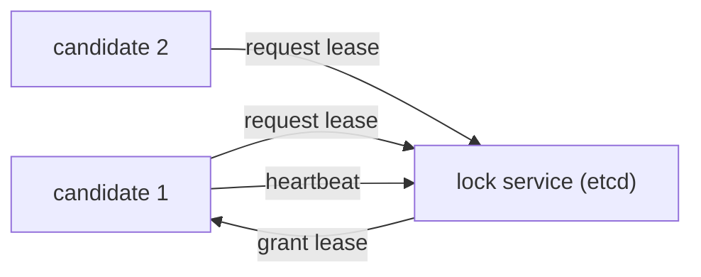

# 리더 선출

이 글은 Distributed Systems 101 시리즈의 일곱 번째 글입니다.

## 이 글에서 다룰 문제

- 왜 리더 선출이 필요하며 어떤 안전 조건이 필요할까요?
- lease와 heartbeat는 각각 어떤 역할을 할까요?
- fencing token은 왜 이전 리더를 막는 핵심 장치일까요?
- split-brain은 어떤 시나리오에서 생기며 어떻게 막을 수 있을까요?
- etcd나 ZooKeeper로 리더를 선출하는 실전 패턴은 어떤 모습일까요?

> 리더 선출은 단순히 누가 리더인지 정하는 문제가 아닙니다. 이전 리더의 영향력을 안전하게 끊어 내는 문제까지 포함합니다.

## 왜 중요한가

분산 시스템에서 치명적인 버그 상당수는 두 리더가 동시에 존재하는 순간 발생합니다. 두 리더가 같은 자원에 동시에 쓰기 시작하면 데이터는 곧바로 깨집니다. 올바른 리더 선출은 어떤 시점에도 하나의 리더만 권한을 가진다는 약속을 만들어 냅니다.

> 좋은 리더 선출은 리더가 둘인 순간이 없다는 약속입니다.

## 한눈에 보는 개념



여러 후보가 lock service에 lease를 요청하고, 한 후보만 리더가 되어 heartbeat로 lease를 갱신합니다.

## 핵심 용어

- **Leader**: 특정 시점에 쓰기 권한을 가진 노드입니다.
- **Lease**: TTL이 지나면 자동 만료되는 임시 권한입니다.
- **Heartbeat**: lease를 연장하기 위해 주기적으로 보내는 신호입니다.
- **Fencing token**: 이전 리더의 요청을 거부하기 위해 단조 증가하는 ID입니다.
- **Split-brain**: 두 노드가 동시에 자신이 리더라고 믿는 상태입니다.

## Before / After

**Before — heartbeat만으로 리더 판단**

```text
an old leader stalled by GC pause comes back and writes to the same resource
```

**After — lease + fencing token**

```text
the old leader's request is rejected by a smaller token; only the new leader passes
```

토큰 비교 한 줄이 split-brain을 차단합니다.

## 실습: 선출과 fencing

### 1단계 — lease 기반 선출(의사코드)

```python
# 1_lease.py
import time
class Lease:
    def __init__(self, ttl): self.ttl, self.expires = ttl, 0
    def acquire(self, now):
        if now >= self.expires:
            self.expires = now + self.ttl
            return True
        return False
```

만료된 lease만 새로 획득할 수 있습니다. TTL 자체가 안전 경계입니다.

### 2단계 — heartbeat로 갱신

```python
# 2_heartbeat.py
def renew(lease, now):
    lease.expires = now + lease.ttl
```

리더는 보통 TTL의 3분의 1 주기로 갱신합니다. 한두 번의 지연을 흡수할 마진이 필요합니다.

### 3단계 — fencing token

```python
# 3_fence.py
counter = 0
def grant_leader():
    global counter
    counter += 1
    return counter   # monotonically increasing token
```

새 리더가 선출될 때마다 토큰은 증가합니다. 자원 서버는 더 작은 토큰의 요청을 거부하면 됩니다.

### 4단계 — 자원 서버의 거부 로직

```python
# 4_resource.py
last_token = 0
def write(token, data):
    global last_token
    if token < last_token:
        return "rejected (stale leader)"
    last_token = token
    return "ok"
```

이 한 줄이 예전 리더의 쓰기를 막아 냅니다.

### 5단계 — split-brain 시나리오

```python
# 5_split.py (pseudocode)
# old leader A: token=5, GC pause 30s
# meanwhile new leader B: token=6 issued
# A wakes up and tries to write with token=5 -> resource server rejects
# B's write with token=6 succeeds
```

토큰이 없는 설계였다면 A의 쓰기가 실제로 반영되어 데이터가 망가졌을 것입니다.

## 이 코드에서 먼저 봐야 할 점

- lease는 자동 만료되므로 네트워크 파티션을 자연스럽게 다룹니다.
- heartbeat는 TTL보다 충분히 자주 보내야 합니다.
- token의 본질은 단조 증가에 있습니다.
- 거부 판단은 클라이언트가 아니라 자원 서버가 내려야 합니다.

## 자주 하는 실수 5가지

1. **heartbeat만으로 충분하다고 생각합니다.** GC pause와 네트워크 지연이 반영되지 않습니다.
2. **TTL을 너무 짧게 잡습니다.** false failover가 자주 납니다.
3. **token 검증을 자원 서버에 넣지 않습니다.** 이전 리더가 쓰기를 성공시킵니다.
4. **token을 랜덤 값으로 만듭니다.** 비교 가능한 순서가 사라집니다.
5. **split-brain 복구를 수동 절차에 맡깁니다.** 설계가 자동으로 막아야 합니다.

## 실무에서는 이렇게 드러납니다

Kubernetes의 `kube-controller-manager`와 `kube-scheduler`는 etcd lease를 사용해 리더를 선출합니다. ZooKeeper의 ephemeral znode도 본질적으로 같은 패턴입니다. Kafka controller, HDFS NameNode HA, 분산 cron 역시 lease와 fencing의 변형으로 볼 수 있습니다.

## 시니어 엔지니어는 이렇게 생각합니다

- TTL은 최대 GC pause와 네트워크 RTT를 넉넉히 넘겨 잡습니다.
- 선출 이벤트를 메트릭으로 내보내고, 잦은 선출을 버그 신호로 봅니다.
- fencing token을 자원 서버 API의 첫 번째 인자로 취급합니다.
- 리더 교체 중 진행 중이던 요청이 어떻게 처리되는지 명세에 남깁니다.
- split-brain 시나리오를 테스트로 강제로 재현합니다.

## 체크리스트

- [ ] lease와 heartbeat의 역할을 한 줄로 설명할 수 있는가?
- [ ] fencing token이 왜 단조 증가해야 하는지 말할 수 있는가?
- [ ] split-brain 시나리오를 한 문장으로 적을 수 있는가?
- [ ] TTL을 정하는 기준이 있는가?
- [ ] etcd나 ZooKeeper 위에서 리더 선출을 구현하는 그림이 떠오르는가?

## 연습 문제

1. TTL이 5초인 시스템에서 GC pause가 8초 동안 일어나면 어떤 일이 벌어지는지 분석해 보세요.
2. fencing token 없이도 안전한 리더 선출이 가능한 조건이 무엇인지 한 줄로 적어 보세요.
3. etcd lease 위에 분산 cron을 구현하는 의사코드를 써 보세요.

## 정리와 다음 글

리더 선출은 lease와 fencing을 이용해 한 시점에 한 리더라는 약속을 유지하는 작업입니다. 다음 글에서는 리더 없이도 작업을 분배하고 시간을 축으로 설계하는 도구, 메시지 큐와 이벤트 소싱을 살펴봅니다.

<!-- toc:begin -->
- [분산 시스템이란 무엇인가?](./01-what-is-a-distributed-system.md)
- [failure model](./02-failure-model.md)
- [RPC와 message passing](./03-rpc-and-message-passing.md)
- [consistency와 CAP](./04-consistency-and-cap.md)
- [replication](./05-replication.md)
- [consensus와 Raft](./06-consensus-and-raft.md)
- **leader election (현재 글)**
- message queue와 event sourcing (예정)
- distributed transaction (예정)
- 운영 가능한 분산 시스템 패턴 (예정)
<!-- toc:end -->

## 참고 자료

- [Leader election — Wikipedia](https://en.wikipedia.org/wiki/Leader_election)
- [How to do distributed locking — Martin Kleppmann](https://martin.kleppmann.com/2016/02/08/how-to-do-distributed-locking.html)
- [etcd lease and leader election](https://etcd.io/docs/v3.5/learning/lock/)
- [Kubernetes leader election library](https://pkg.go.dev/k8s.io/client-go/tools/leaderelection)

Tags: Computer Science, Distributed Systems, LeaderElection, Lease, Coordination, Liveness
