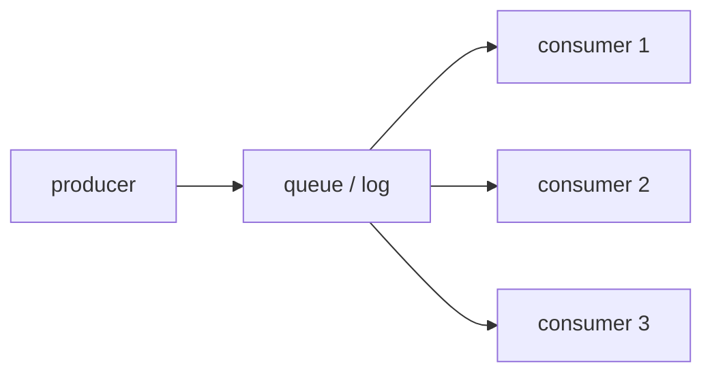

# message queue와 event sourcing

> Distributed Systems 101 시리즈 (8/10)


## 이 글에서 다룰 문제

서비스 간 직접 호출은 가용성과 응답 시간을 강하게 묶습니다. 큐를 사이에 두면 한쪽이 잠시 죽어도 다른 쪽은 동작합니다. event sourcing은 한 발 더 나아가 시스템의 "상태"를 "사건의 합"으로 정의해 추적과 재생을 가능하게 합니다.

> 큐는 시간을, 이벤트는 진실을 분리합니다.

## 개념 한눈에 보기



producer는 큐에 쓰고 consumer는 자기 속도로 읽습니다. 한 메시지를 여러 consumer가 처리할 수 있습니다.

## Before/After

**Before — 직접 호출**

```text
주문 -> 결제 -> 재고 -> 알림  (한 곳이 죽으면 전체가 멈춤)
```

**After — 큐로 분리**

```text
주문 -> queue
        -> 결제 consumer
        -> 재고 consumer
        -> 알림 consumer
```

각 consumer가 자기 속도로 처리하고, 죽으면 큐가 메시지를 기다려 줍니다.

## 실습: 큐와 이벤트 소싱

### 1단계 — 메모리 큐로 시작

```python
# 1_queue.py
from collections import deque
q = deque()
def produce(msg): q.append(msg)
def consume():
    if q: return q.popleft()
```

가장 단순한 in-memory queue. 다음 단계들이 이걸 분산 환경으로 확장한 것입니다.

### 2단계 — 영속 큐 (append-only log)

```python
# 2_log.py
import json
def produce(path, msg):
    with open(path, "a") as f: f.write(json.dumps(msg) + "\n")
def consume(path, offset):
    with open(path) as f:
        lines = f.readlines()
    return lines[offset], offset + 1
```

큐를 파일로 만들면 죽었다 살아나도 메시지가 남습니다. Kafka의 본질이 이것입니다.

### 3단계 — at-least-once + idempotent consumer

```python
# 3_idem.py
processed = set()
def consume_once(msg):
    if msg["id"] in processed: return "skip"
    processed.add(msg["id"])
    return "process"
```

큐가 같은 메시지를 두 번 줘도 안전합니다 — id 기반으로 중복을 제거합니다.

### 4단계 — event sourcing 상태 재구성

```python
# 4_event.py
events = [
    {"type": "deposit", "amount": 100},
    {"type": "withdraw", "amount": 30},
]
def balance(events):
    b = 0
    for e in events:
        if e["type"] == "deposit": b += e["amount"]
        elif e["type"] == "withdraw": b -= e["amount"]
    return b
print(balance(events))  # 70
```

상태를 저장하지 않고 사건의 합으로 계산합니다. 과거의 어느 시점이든 재현 가능.

### 5단계 — CQRS read model

```python
# 5_cqrs.py
read_model = {"balance": 0}
def project(event):
    if event["type"] == "deposit": read_model["balance"] += event["amount"]
    elif event["type"] == "withdraw": read_model["balance"] -= event["amount"]
```

write는 이벤트로, read는 미리 만들어둔 모델로. 두 경로가 분리되면 각자 최적화가 쉬워집니다.

## 이 코드에서 주목할 점

- 큐가 파일이 되는 순간 메시지의 운명이 바뀝니다 — 영속성과 재생.
- exactly-once는 "큐"가 아니라 "큐 + idempotent consumer"의 조합입니다.
- event sourcing은 history가 본질, snapshot은 최적화입니다.
- read model은 throwaway — 언제든 events에서 다시 만들 수 있습니다.

## 자주 하는 실수 5가지

1. **exactly-once를 broker만으로 보장한다고 본다.** consumer의 idempotency가 함께 필요합니다.
2. **partition 수를 너무 많이 둔다.** rebalance 비용과 메타데이터 폭증.
3. **event를 mutable하게 본다.** 한번 쓴 사건은 절대 수정하지 않습니다.
4. **snapshot 없이 백만 개 이벤트를 매번 재생한다.** 주기적 snapshot이 필요합니다.
5. **read model을 source of truth로 본다.** 진실은 항상 event log.

## 실무에서는 이렇게 쓰입니다

Kafka는 분산 append-only log로 가장 널리 쓰이는 스트리밍 백본입니다. RabbitMQ, AWS SQS는 전통적 메시지 큐. event sourcing은 금융 거래, 주문 시스템, audit 요구가 있는 도메인에서 자주 채택됩니다. CQRS는 read와 write의 부하 패턴이 크게 다른 시스템에 적합합니다.

## 체크리스트

- [ ] at-most-once / at-least-once / exactly-once를 한 줄씩 설명할 수 있는가?
- [ ] event sourcing이 audit에 강한 이유를 답할 수 있는가?
- [ ] consumer group과 partition의 관계를 설명할 수 있는가?
- [ ] CQRS의 read와 write 경로를 분리한 이유를 말할 수 있는가?
- [ ] idempotency를 어떻게 보장할지 머릿속에 한 가지 패턴이 있는가?

## 정리 및 다음 단계

큐와 event sourcing은 분산 시스템의 시간을 다루는 도구입니다. 다음 글에서는 여러 노드에 걸친 트랜잭션 — distributed transaction — 의 어려움과 현실적 해법을 봅니다.

<!-- toc:begin -->
- [분산 시스템이란 무엇인가?](./01-what-is-a-distributed-system.md)
- [failure model](./02-failure-model.md)
- [RPC와 message passing](./03-rpc-and-message-passing.md)
- [consistency와 CAP](./04-consistency-and-cap.md)
- [replication](./05-replication.md)
- [consensus와 Raft](./06-consensus-and-raft.md)
- [leader election](./07-leader-election.md)
- **message queue와 event sourcing (현재 글)**
- distributed transaction (예정)
- 운영 가능한 분산 시스템 패턴 (예정)
<!-- toc:end -->

## 참고 자료

- [Apache Kafka documentation](https://kafka.apache.org/documentation/)
- [Event Sourcing — Martin Fowler](https://martinfowler.com/eaaDev/EventSourcing.html)
- [CQRS — Martin Fowler](https://martinfowler.com/bliki/CQRS.html)
- [Designing Data-Intensive Applications — chapter 11](https://dataintensive.net/)

Tags: Computer Science, Distributed Systems, MessageQueue, EventSourcing, Kafka, CQRS
